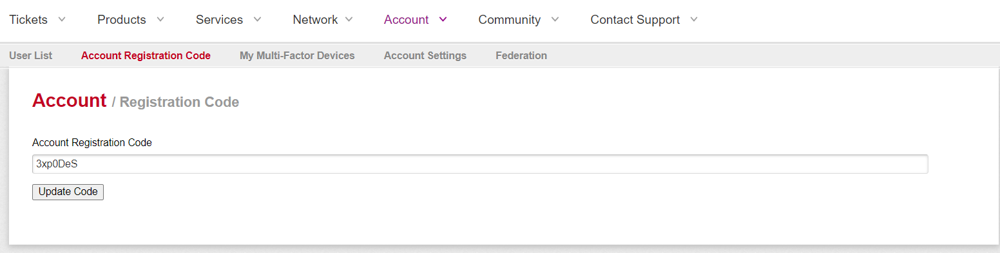

Rackspace uses an _Account Registration Code_ to verify new users on an account, much like two-factor authentication. 

If an account administrator adds you as a new user, an account registration code is generated for your new user account and you receive an email notification that walks you through how to log in to the [Cloud Control Panel](https://login.rackspace.com) for the first time. Your first login is the only time that you need the
registration code, unless you forget your user name.

The primary contact on the account is the only person who can change this code. When the primary contact adds a new user, the new user receives a registration code. The primary contact must give the new user their code.

If you are the primary contact on the account and you forget the code and need to reset your login, contact your Account Manager or Rackspace Support.
