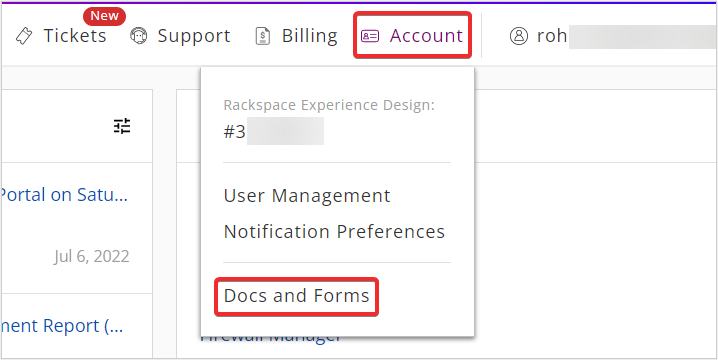
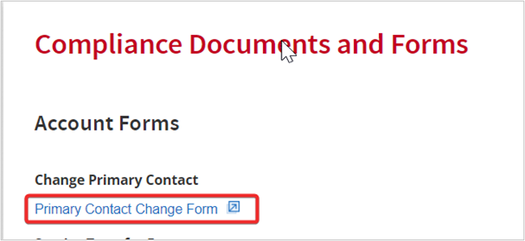
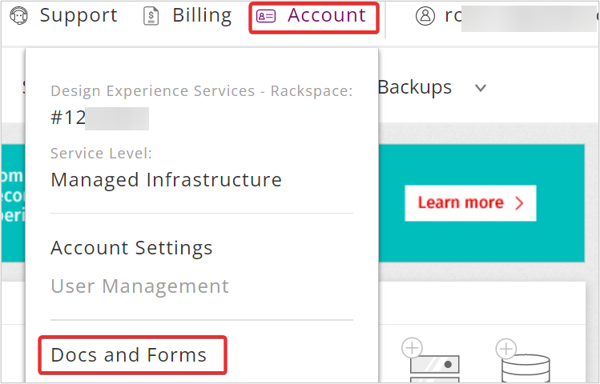
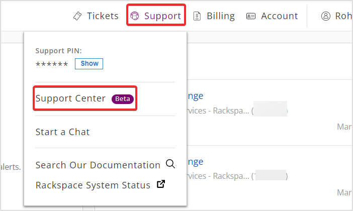
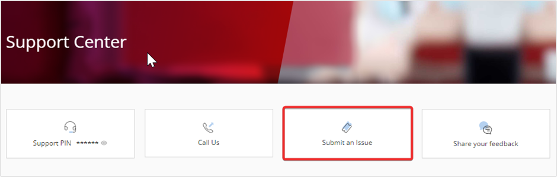
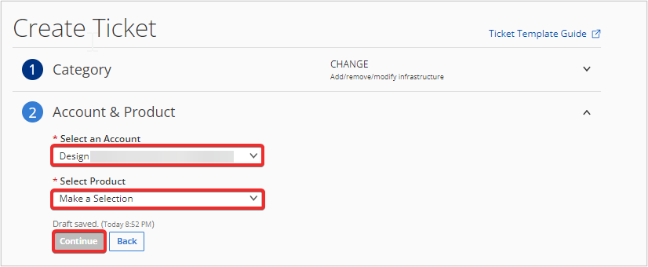
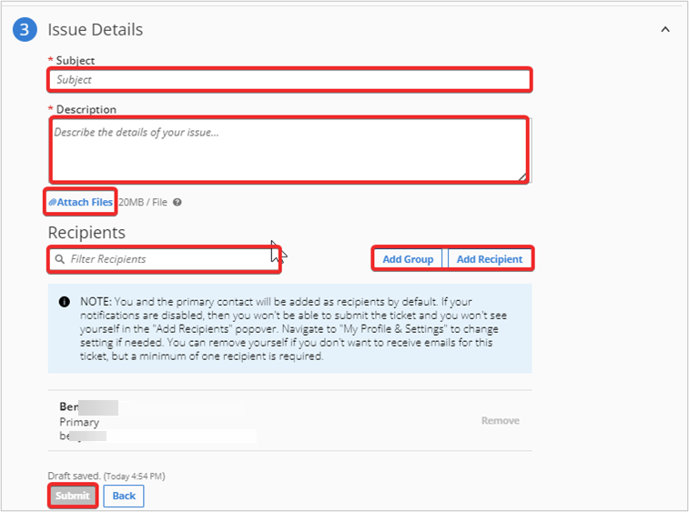

This article describes the various administrative account changes that you can
request and the appropriate steps needed to complete them.

### Dedicated Customers

You can download the **Primary Contact Change** form by using the following steps: 

**Step 1.** Log in to the Rackspace Technology Portal <https://login.rackspace.com/>.

**Step 2.** In the top navigation panel, click **Account >> Docs and Forms**.

**Step 3.** Under **Compliance Documents and Forms** click **Primary Contact Change Form**. Download the **Primary Contact Change Form** and save it. 

You can request the **Service Transfer** form from your account manager.

### Cloud Customers

Cloud customers can find links to the forms described in this article by using the following steps:

**Step 1.** Log in to the Rackspace Technology Portal <https://login.rackspace.com/>. 

**Step 2.** In the top navigation panel, select **Account >> Docs and Forms**.

### Service Transfer form requirements

The Billing team has strict requirements for processing the Service Transfer
form for a Rackspace account. Use the following information for processing the
submission quickly and efficiently:

**Page 1 - Account details**

-   **Transferring Customer / Assignor**: Provide the current account
    information.
-   **Accepting Customer / Assignee**: Provide the new account information.

**Page 2 - Signatures**

-   Signatures *must* be from the owner or an officer of the company. No
    exceptions are allowed.
-   **Transferring Customer / Assignor**: Provide the signature of the
    current primary contact on the account.
-   **Accepting Customer / Assignee**: Provide the signature of the new
    contact or the existing contact if that is not changing.



Do not fill out the **RACKSPACE US, INC.** section. A Rackspace
representative will complete this section.

**Page 3 - Consolidated and / or Linked Cloud Accounts (Exhibit A)**

In the **Cloud Account Number** and the **New Cloud Account Name** columns,
provide the following information:

- **Cloud Account Number**: Enter the account number.
- **New Cloud Account Name**: Enter the new name of the account. Leave
  this blank if there is no change.

### Best practices for legal change forms

The **Service Transfer Change forms** and **Primary Contact Change forms** have many required
fields that must be completed before the Billing team can process the forms.
After you have completed the form, create a Custom Ticket on Support Center and attach the scanned copy of your form. 

You can create a **Custom Ticket** on **Support Center** by using the following steps:   
    
**Step 1.** Log in to the Rackspace Technology Portal <https://login.rackspace.com/>.   
    
**Step 2.** In the top navigation panel, click **Support >> Support Center**.    

    
**Step 3.** In the **Support Center** page, click **Submit an Issue**.
    

    
**Step 3.** In **Create Ticket** page, select the appropriate **Account** and **Product** and click **Continue**.
    

    
**Step 4.** In **Issue Details**, provide the appropriate details and attach your file in **Attach Files**. Click **Submit** and your ticket will be created. 

    
To avoid form rejection, use the following tips while completing the
form:

- The signatures on the **Service Transfer** form *must* come
  from an officer or an owner of the company.
- The owner or officer must initial any changes regarding an increase
  in MMR or added devices or domains that are made to the form after
  the initial submission.
- No blank fields are allowed on any form, except where indicated. You
  cannot type **Same** in any field.

