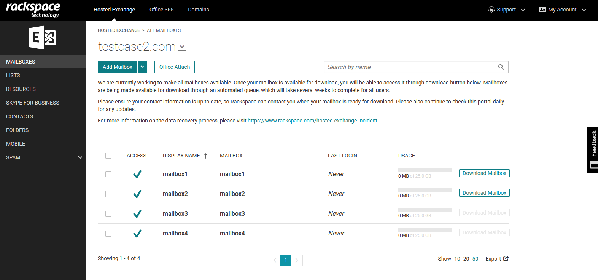
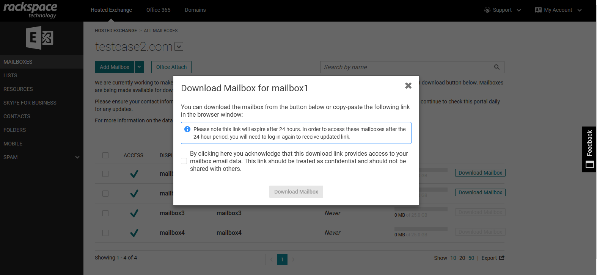

This article describes how to download your Hosted Exchange mailbox data. Hosted Exchange mailbox data is available in PST format and can be downloaded using the **Rackspace Cloud Office Control Panel**. 

Prerequisites
--------------------------------------------

 - Applies to: Cloud Office Administrator
 - Difficulty: Moderate
 - Tools required: Cloud Office Control Panel

 For more information about prerequisite terminology, see [Cloud Office support terminology](https://docs.rackspace.com/support/how-to/cloud-office-support-terminology/).
	
Downloading Hosted Exchange Mailbox using the Cloud Office Control Panel
-----------------------------------------------------------------

**Step 1.**
Log in to the Rackspace 
[Cloud Office Control Panel](https://cp.rackspace.com/)

**Note** If you typically access your account using the [MyRackspace Portal](https://login.rackspace.com/login), follow the below steps to log in to the Cloud Office Control Panel:
 **i**.  In the top navigation bar, click **Select a Product>>Dedicated Hosting**.
 **ii**.	Click **Products>>Cloud Office**.
 **iii**. In the Cloud Office window, click **Open Cloud Office Control Panel**.

**Step 2.**  Click **Mailboxes** under the **Hosted Exchange** section.

**Step 3.** Search for the mailbox you wish to download and click the **Download Mailbox** button.

**Note:** The download links will be available for mailboxes as soon as they're ready. We will
continue to work on making mailbox data available for download and the links will appear as
soon as the mailbox data is ready for download. Check back later to see if the mailbox has
become available for download.

**Step 4.** Click the checkbox to agree to the terms and press the **Download Mailbox** button

**Step 5.** Your browser will download the PST file to the local device. For information on next steps and other questions related to the download process, please reviewthe [FAQs here](https://www.rackspace.com/sites/default/files/2022-12/Data-Recovery-FAQs-1.pdf)

**Video** [How to download your Hosted Exchange mailbox from the Rackspace Cloud Office control panel](https://youtu.be/LTpSK-6GvTA)
<!-- YouTube video embed for https://youtu.be/LTpSK-6GvTA -->

