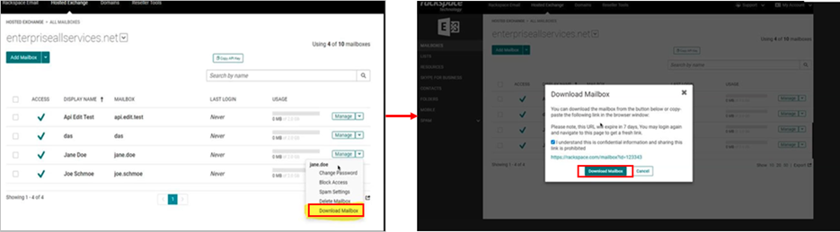

Hosted Exchange Mailbox Download & FAQ
========================================
This article describes how to download your Hosted Exchange mailbox data. Hosted Exchange mailbox data is available in PST format and can be downloaded using the **Rackspace Cloud Office Control Panel** or the **Manage Office 365 at Rackspace Control Panel**. 

Important Considerations for downloading
--------------------------------------------

Before you proceed to download your Hosted Exchange mailbox data, consider the following points:

 - Ensure that you have Cloud Office Administrator access

 -	Ensure that you have Cloud Office Control Panel & Office 365 Administrator access.

**Note :**
	You can refer prerequisite terminology, see [Cloud Office support terminology](https://docs.rackspace.com/support/how-to/cloud-office-support-terminology/).
	
Downloading Hosted Exchange Mailbox using the Cloud Office Control Panel
-----------------------------------------------------------------
**Procedure**

**Step 1.**
Log in to the Rackspace 
[Cloud Office Control Panel](https://cp.rackspace.com/identity/Account/Login?ReturnUrl=%2Fidentity%2Fconnect%2Fauthorize%2Fcallback%3Fclient_id%3Dcp3%26redirect_uri%3Dhttps%253A%252F%252Fcp.rackspace.com%252Foidc-login%26response_mode%3Dform_post%26response_type%3Dcode%2520id_token%26scope%3Dopenid%2520offline_access%2520profile%2520email%2520account%26state%3DOpenIdConnect.AuthenticationProperties%253Ddjsyglgcx7CTX136xbcAFZq3XrxRKGal8ikEeE6mBEXEo1repzsQe_I7vu16ypXRrEXWpCZNkW4jxeDQtkvpp0xO53rgIvQtduKp8N-GGjKFptvmgnO1dwVQiCR7zr39uq2WJw%26nonce%3D638069485684794887.Mzg4YzM1MWItOGVkNy00ZjE1LTk5MTgtZDQzZDFkNWFiY2I1ZjU5Y2U2OTctY2VmZi00ZTYzLWEwZmUtZDZkN2ZlZDc4MjRl%26post_logout_redirect_uri%3Dhttps%253A%252F%252Fcp.rackspace.com%252F%26x-client-SKU%3DID_NET451%26x-client-ver%3D5.3.0.0/)
and Click **Mailboxes** under the **Hosted Exchange** section.

To access Cloud Office Control Panel, using [MyRackspace Portal](https://login.rackspace.com/login), follow the below steps:

**i**.  In the top navigation bar, click **Select a Product>>Dedicated Hosting**.

**ii**.	Click **Products>>Cloud Office**.

**iii**. In the Cloud Office window, click **Open Cloud Office Control Panel**.

**Step 2.** Click **Manage** drop-down menu, next to each mailbox and select **Download Mailbox**. In the Download Mailbox window, enable checkbox to accept the terms and click **Download Mailbox button.**

Download Hosted Exchange Mailbox using the Manage Office 365 at Rackspace Control Panel
-------------------------------------------------

**Step 1**. Log in to [Manage Office 365 at Rackspace Control Panel](https://manage365.rackspace.com/login?ReturnUrl=%2F) with the account's **Global Admin** credentials. 

**Step 2**. In the home page, if the mailbox data is ready for download, click the **Mail Recovery** button to view the Mail Recovery download page.

**Note:** If the mailbox data is not ready for download, the home page will display the following message requesting to check back later.

**Step 3**. The list of Hosted Exchange mailboxes will appear on the Mail Recovery page. You can also search for the users based on name. Click the **Download .pst** link next to each mailbox to download that user's PST file.

**Note:** Once a user's mailbox has been downloaded, a green check-mark icon will appear next to the specific user’s download link.

FAQ
============

**Q.** **Will the Hosted Exchange mailboxes be back up and running at some point?**

**A.** TBD

---------------------------------------------------------------------------------------------
**Q.** **How long does each download take?**

**A.** TBD

----------------------------------------------------------------------------------
**Q.** **How long will the downloads be available?**

**A.** TBD.

-------------------------------------------------------------------------------------------
**Q.** **What about Public Folders? Will Public Folder data be available for download?**

**A.** TBD.

---------------------------------------------------------------------------------------------
**Q.** **What about Resource mailboxes? Will Resource data be available for download?**

**A.** TBD.

---------------------------------------------------------------------------------------------------
**Q.** **How large are the PST files?**

**A.** This depends on the size of the mailbox. They could range anywhere from 0 MB ~ X GB.
Is there a "Download All" or bulk download option?
At this time, no. Each user will need to be downloaded one at a time.

------------------------------------------------------------------------------------------------------
**Q.** **Is there any file type besides PST available?**

**A.** No. PST is the only download option available.

-----------------------------------------------------------------------------------------------------------
**Q.** **Can the PST file be downloaded more than once?**

**A.** Yes. There is no limit to the number of downloads for each PST file.

-----------------------------------------------------------------------------------------------------------
**Q..** **What if I already deleted the Hosted Exchange mailboxes from the Control Panel? Can I still download the PSTs?**

**A** If you've added Microsoft 365 to your account, then you can still access the download links using the [Manage Office 365 at Rackspace Control Panel](https://manage365.rackspace.com/login?ReturnUrl=%2F).

----------------------------------------------------------------------------------------------------------
**Q.** **How can I tell if someone has already downloaded a user's mailbox?**

**A.** Once an admin has downloaded a mailbox from the Cloud Office Control Panel, this action will be logged in the [Audit Logs](http://cp.rackspace.com/myaccount/auditlogs) 

---------------------------------------------------------------------------------------------------------------------------------
**Q.** **I've downloaded all of my mailbox PSTs. Now what?**

**A.** If you've moved your Hosted Exchange mailbox to a different provider, you will need to use Microsoft Outlook in order to import the data to your new mailbox.
 
 - [Import email address data into Outlook 2016 for Windows](https://docs.rackspace.com/support/how-to/import-email-address-data-into-outlook-2016-for-windows).
 
 - [Import email address data into Outlook 2013 for Windows](https://docs.rackspace.com/support/how-to/import-email-address-data-into-outlook-2013-for-windows).

If you have moved your mailbox to an external mail provider, you may need to reach out to that other provider for additional information on configuring Microsoft Outlook and importing PST data into your mailbox.

If you have moved your mailbox to Microsoft 365, you can follow the import instructions in the following article: (LINK)

---------------------------------------------------------------------------------------------------------------------------------------
**Q.** **I have requested to have mail forwarding enabled on my Hosted Exchange mailbox. What can I do with the PST file once I’ve downloaded it?**

**A.** If you wish to continue to have mail forwarding enabled on your mailbox, you should download and save the PST file. Once downloaded, you will need to use Microsoft Outlook in order to import or access the mailbox data. 

You can also choose to set up a new Microsoft 365 tenant and import your PST data into your newly created Microsoft 365 mailboxes.

For more information on creating a new Microsoft 365 tenant, see [How to set up O365 via your Cloud Office Control Panel](https://docs.rackspace.com/support/how-to/how-to-set-up-O365-via-your-cloud-office-control-panel). 

For more information on importing your PST file into your Microsoft 365 mailbox, see (LINK)

