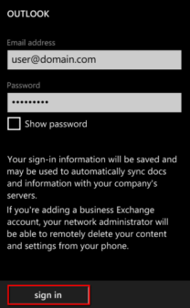
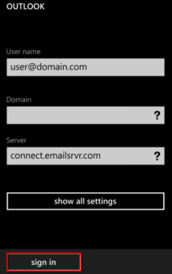

The following steps are required to configure Microsoft Exchange
ActiveSync on a Windows Phone:

1. Locate the **Settings** options from within your application menu.

   

2. Select **Email + Accounts**.

   

3. Select **Add an Account**.

   

4. Select the option for **Advanced Setup**.

   

5. Enter your full email address and password for your account.
   Then press the **sign in** button.

   

6. Select **Exchange ActiveSync**.

   

7. Ensure your email address remains correct.  
   Leave the **Domain** field blank.
   Enter the following address for **Server**: **connect.emailsrvr.com.**

   

8. Select the **sign in** button. Once connected, you will see a
   new icon within your settings menu with the name of your new email
   account.

   
