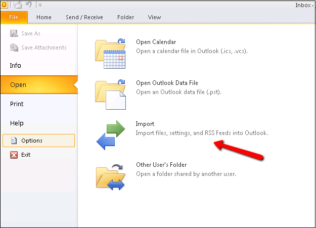
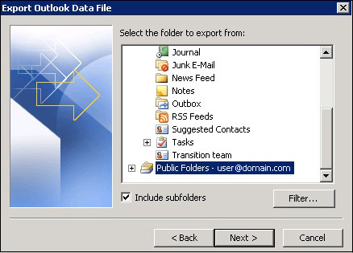
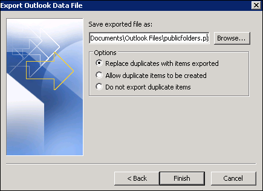

This article describes how to migrate Public
Folder data via Outlook 2010.

The migration procedure combines an import and an export procedure:

1. Export from Public Folder to .PST

2. Import from .PST to Public Folder

Public Folder data from your previous Exchange mailbox should be
exported to .PST format.  To do this, Outlook must be connected
to your source environment with appropriate permissions for the Public
Folder that you will be migrating.

### Export Public Folder data to .PST

1. Open Outlook 2010 while connected to your previous email environment.

2. Click **File &gt; Open &gt; Import**

   

3. The first dialog of the Import and Export wizard will appear.  Select
   **Export to a file &gt; Next**.

   

4. In the next wizard dialog, Select **Outlook Data File (pst) &gt; Next**.

   

5. The **Export Outlook Data File** box will appear.  

   **Note:** To export
   Public Folders, scroll down to select the public folders from the list
   (see the example below). Select **Include Subfolders &gt; Next**.

   

6. Browse to the location where you would like to save the file.
   Click **Finish**.

   

7. A password is not required and may be left blank. Click **OK.**

   

### Import .PST into Public Folder

1. Open Outlook 2010 while connected to your previous email environment.

2. Click **File &gt; Open &gt; Open Outlook Data File**.

   

3. You will not see the file listed in the Outlook folder tree.  
   Expand the Outlook folder tree
   and select the folder in question.

   

   **Note:** If you don't see it, make sure that Folder View is enabled.

   

4. Expand the current public folders: **All Public Folders &gt;
   Root \#\#\# &gt; Domain.com.**

   

5. Right-click on the domain.com public folder and select **New
   Folder.**

   

6. Enter the name of the folder and select the **Folder Contains** drop
   down to select the folder type.

   

7. Select all items from the .pst file (simultaneously hold CTRL and
   A); drag and drop the items to the Public Folder. You may also copy and paste
   them if you prefer.

   

8. Allow some time for the newly imported emails to upload to the
   server. At this point, the migration process is complete.  

**Note:** Based on the
way Public Folders replicate across the environment, we recommend
waiting 15-20 minutes before verifying that all other users can see the data.
