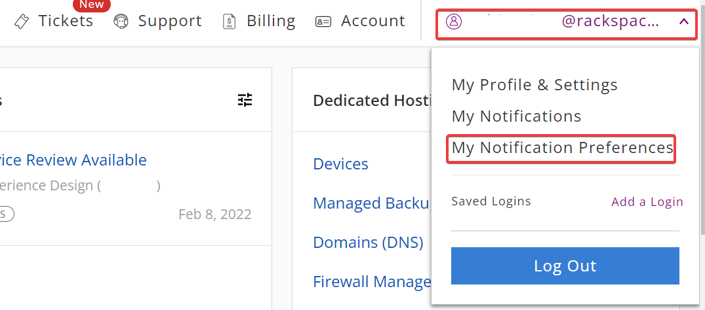
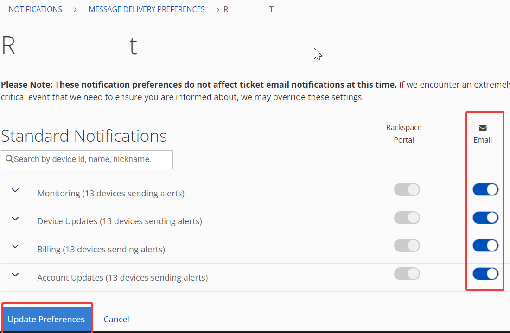

Managing Notifications
================================
**Step 1**. Login to https://manage.rackspace.com

**Step 2**. In the top right navigation panel, click **User Email Id** >> **My Notification-Prferences**.

**Step 3**. From the list of Standard Notifications, toggle on the **Email Notification** for the required alert. 

**Step 4**. Click **Update Preferences** to save the changes.

