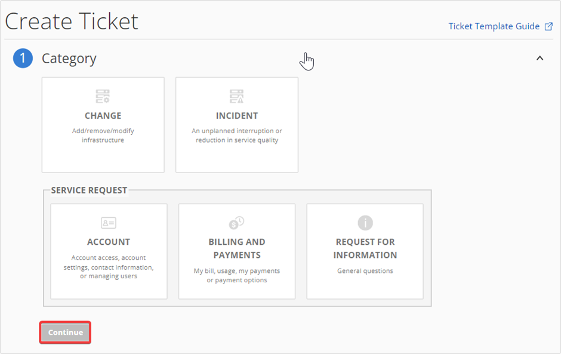

# Azure V2 Upgrade
=======================================

## How to access Azure Subscriptions

**Step 1.** Access the URL https://manage.rackspace.com/

**Step 2.** Enter your Login credentials and click **Log In**.The application Home Page opens.

**Step 3.** In the top navigation panel, click **Account** >> **Switch Account**.

**Step 4.** Select a specific **Manage Cloud Account** from the list and click **Switch Account**. The selected account can be **Set to Default** by selecting the **Checkbox**.

**Note: You can search for and view any Azure subscriptions by clicking the arrow icon next to the Managed Cloud account or typing in the filter accounts box**

**Step 5.** In the top navigation panel, click **My Accounts** >> **Microsoft Azure**.

**Step 6.** Under **Microsoft Azure**, you can see the list of **Azure Subscriptions**. 

## Accessing Dedicated Hosting Portal

**Note**: The Dedicated Hosting Portal (MyRackspace) will only be accessible when the user is currently in a Dedicated Hosting Account.

### How to switch into Dedicated Hosting Account

**Step 1.** In the top navigation panel, click **Account** >> **Switch Account**.

**Step 2.** Select the **Rackspace Dedicated** Account from the list and click **Switch Account**. The selected account can be **Set to Default** by selecting the **Checkbox**.

**Step 3.** In the top navigation panel, click **My Accounts** >> **Rackspace Dedicated**.

## Managing Permissions

### How to manage Azure Permissions

**Step 1.** In the top navigation panel, click **My Accounts** >> **Rackspace Dedicated**.

**Note: If Rackspace Dedicated is grayed out and not clickable, this indicates that you are currently in the Managed Cloud account. To access the Rackspace Dedicated, you will need to switch back into the dedicated hosting account.**

**Step 2.** In the MyRackspace navigation bar, click **Account** >> **Permissions**.

**Step 3.** In the **Permissions page**, you can manage the permission of user groups two ways:

**i.**	In the **User Groups** section, expand the **user group** and click **Edit Group**.

**ii.**	In the top menu bar, navigate **Manage Groups** then select the **User Group** which you want to edit. 

**Step 4.** **Select/Deselect** the **Checkboxes** to manage the members of the User Groups and click **Save Changes**.

## Managing Tickets for Azure v2

**You can View, Update and Create tickets by following the procedures below**:

### Viewing Azure v2 Tickets

#### How to view Azure v2 Tickets

**Step 1.** In the top navigation panel, click **Account** >> **Switch Account**.

**Step 2.** Select a specific **Manage Cloud Account** from the list and click **Switch Account**. The selected account can be **Set to Default** by selecting the **Checkbox**.

**Step 3.** In the top menu bar, click **Tickets** >> **Ticket List**.

**Step 4.** The **Ticket List** opens and you can view either the most recently created ticket or last modified ticket at the top. 

**Note: For additional functionality and features, please click [here](https://docs.rackspace.com/support/how-to/fabric-ticketing) to review the Fabric Ticketing overview document.**

### Creating a Ticket for Azure v2 Subscriptions

#### How to Create a Ticket

**Step 1.** Ensure that you are currently in the correct Managed Cloud account by selecting the account dropdown. This will show you the account name and number of your current account.

**Step 2.** In the top menu bar, click **Tickets** >> **Create Ticket**. 

Note: You can also Create a ticket by navigating **Ticket List** >> **Create Ticket**. 

**Step 3.** In **Create Ticket** page, select the appropriate **Category** from Category section and click **Continue**.

**Step 4.** In **Account & Product** section, click **drop-down** and select the appropriate **Account**, **Product**, and **Severity** and click **Continue** as shown in the below image.

**Step 5.** In **Issue Details** section, fill in details of Subject, Description, and Recipient(s). Optionally you can upload attachments up to 20MB per file. Click **Submit** and your ticket will be created.

         

