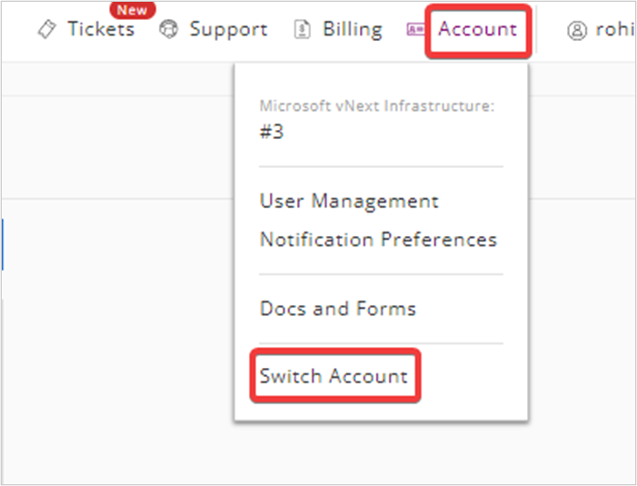

Customer Experience | Azure V1 to V2 Migration
=======================================

**Follow the below procedure to access Azure Accounts** 

**Step 1.** Login to https://manage.rackspace.com/

**Step 2.** In the top navigation panel, click **Account** >> **Switch Account**.

**Step 3.** Under **Switch Account**, select a specific **Manage Cloud Account** from the list and click **Switch Account**.

**Step 4**. In the top navigation panel, click **My Accounts** >> **Microsoft Azure**.

**Step 5**. Under **Microsoft Azure**, you can see the list of **Azure Subscriptions**. 

Accessing Dedicated Hosting Portal
--------------------------------------------

**Note**: The Dedicated Hosting Portal (MyRackspace) will not be accessible unless the user switches back to the Dedicated Hosting Account.

**Follow the below procedure to switch into your Dedicated Hosting Account**

Step 1. In the top navigation panel, click **Account** >> **Switch Account**.

**Step 2**. Under **Switch Account**, select the **Rackspace Dedicated** Account from the list and click **Switch Account**.

**Step 3**. In the top navigation panel, click **My Accounts** >> **Rackspace Dedicated**.

Managing Permissions
-----------------------------

**Follow the below procedure to Manage Permissions**

**Step 1**. In the top navigation panel, click **My Accounts** >> **Rackspace Dedicated**.

**Step 2**. In the top menu bar under **Rackspace Dedicated**, click **Account** >> **Permissions**.

**Step 3**. In the **Permissions page**, you can manage the permission of user groups using below two methods:

**i**.	In the **User Groups** section, expand the **user group** and click **Edit Group**.

**ii**.	In the top menu bar, navigate **Manage Groups** and select the **User Group** which you want to edit. 

**Step 4**. **Select/Deselect** the **Checkbox** to manage the User Groups and click **Save Changes**.

