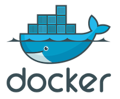
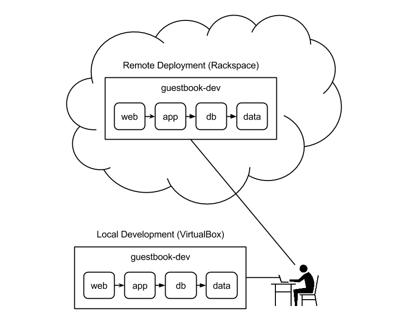

The goal of this post is to develop an application in an environment that's as close to your remote deployment environment as possible. Let's do this using Docker Machine and Compose to move an app from local development to remote deployment.

<!--more-->

### Docker Docker Docker

First we need to install Docker. This post uses all of the latest and greatest Docker components at the time of writing.

1. [Docker](https://docs.docker.com/installation/) 1.7.0
1. [Docker Machine](https://docs.docker.com/machine/#installation) 0.3.0
1. [Docker Compose](https://docs.docker.com/compose/install/) 1.3.0

I'll assume that you're running Docker in VirtualBox for the remainder of the post.

### Sign our guestbook please

The application we're going to deploy is a simple guestbook. It's enough to demonstrate a basic 3 tier app. We'll start with a local development environment where we'll develop a web app using the following technologies:

* Nginx for the web server
* For the app server:
  * Python for the programming language
  * Flask for the web framework
  * Gunicorn for the WSGI server
* MySQL for the database

We'll be working out of a repo on GitHub so let's start by cloning that repo.

```bash
git clone https://github.com/rackerlabs/guestbook.git -b dmc guestbook
cd guestbook
```

It's also pretty easy to lose track of what Docker host you're using below. I recommend setting this alias to help you easily find out what host you're talking to.

```bash
alias de='env | grep DOCKER_'
```

Now you can just type `de` to see what Docker environment variables are set.

Here's what the final result of moving our application from local development to remote deployment will look like.



### Local development

Our local development environment (dev env) is pretty simple because we don't have to setup credentials or worry about security. We'll suffix all of our dev env stuff with "-dev" just to keep it distinct from our remote deployment.

#### Initialize the environment

We'll use docker-machine to create a Docker host for our containers. Then we configure Docker to use that host. Finally, docker-compose will bring up our entire dev env.

```bash
docker-machine create --driver virtualbox guestbook-dev
docker-machine ip guestbook-dev # note the Guestbook Dev IP Address
eval "$(docker-machine env guestbook-dev)"
docker-compose up
```

While that's running, read through [docker-compose.yml](https://github.com/rackerlabs/guestbook/blob/dmc/docker-compose.yml) to get a feel for what it's doing for us. It's well commented so it should be self-explanatory. Note how it extends [docker-compose-common.yml](https://github.com/rackerlabs/guestbook/blob/dmc/docker-compose-common.yml) as its basis for the common components. You can find the full description of the Docker Compose file format in the [docker-compose.yml reference](https://docs.docker.com/compose/yml/).

Once everything has downloaded and is running, we need to initialize the database. We'll use a one-off container run of our app to run a python command that creates the table in our database.

Open a new terminal and change to the guestbook dir.

```bash
eval "$(docker-machine env guestbook-dev)"
docker-compose run --rm --no-deps app python app.py create_db
```

Why go to the trouble of running a one-off container for this? Because docker-compose automatically injects the environment variables we need to connect to the database. No configuration for us to do.

Now open your browser and go to the Guestbook Dev IP Address you noted above. Sign our guestbook please.

#### Make a change

Let's make sure we can continue to develop our application code rapidly. There are a couple of key config options in [docker-compose.yml](https://github.com/rackerlabs/guestbook/blob/dmc/docker-compose.yml) that allow us to do so. Re-read the comments for volumes and command in the app service.

Open app/templates/index.html in your favourite text editor. Make a change and save it. Go back to your browser and reload. Voila!

### Remote Deployment

This part is trickier because we have to setup credentials and worry about security. If you don't have a Rackspace account, you can get free credit by [signing up for developer+](https://developer.rackspace.com/signup/). Once your account is ready, you need to [find your API key](https://support.rackspace.com/how-to/view-and-reset-your-api-key/). Set the following environment variables in your terminal.

```bash
export OS_USERNAME=your-rackspace-username
export OS_API_KEY=your-rackspace-api-key
export OS_REGION_NAME=IAD
```

#### Initialize the environment

We'll use docker-machine to create a Docker host for our containers.

```bash
docker-machine create --driver rackspace guestbook
docker-machine ip guestbook # note the Guestbook IP Address
```

#### Secure the environment

Disclaimer: This is not even close to the most secure configuration possible. This script is only intended to be more secure than the default configuration. No promises are made about this script preventing your server from getting owned or your bike getting stolen. The bad guys are still out to get you. And running this script does not excuse you from writing secure application code!

Install [fail2ban]( https://www.fail2ban.org/) to prevent brute force login attempts on your server and setup a firewall with [ufw](https://help.ubuntu.com/community/UFW) to only allow the ports we need. Note that no output appears until the command is completely done so a bit of patience is required.

```bash
docker-machine ssh guestbook "apt-get update"
docker-machine ssh guestbook "apt-get -y install fail2ban"
docker-machine ssh guestbook "ufw default deny"
docker-machine ssh guestbook "ufw allow ssh"
docker-machine ssh guestbook "ufw allow http"
docker-machine ssh guestbook "ufw allow 2376" # Docker
docker-machine ssh guestbook "ufw --force enable"
```

#### Continue to initialize the environment

Before we have Docker Compose build out our remote deployment, we need to set some environment variables for our database. These environment variables are used by the docker-compose-prod.yml file. We do this to prevent ourselves from committing sensitive data to GitHub.

```bash
export MYSQL_USER=guestbook-admin
export MYSQL_PASSWORD=$(hexdump -v -e '1/1 "%.2x"' -n 32 /dev/random)
export MYSQL_ROOT_PASSWORD=$(hexdump -v -e '1/1 "%.2x"' -n 32 /dev/random)

echo "MYSQL_USER=$MYSQL_USER"
echo "MYSQL_PASSWORD=$MYSQL_PASSWORD"
echo "MYSQL_ROOT_PASSWORD=$MYSQL_ROOT_PASSWORD"
```

Now we configure Docker to use that host. Finally, docker-compose will build and run our containers in the background so we won't see any colourful log messages like we did in local development.

```bash
eval "$(docker-machine env guestbook)"
docker-compose --file docker-compose-prod.yml build
docker-compose --file docker-compose-prod.yml up -d
```

While that's running, read through [docker-compose-prod.yml](https://github.com/rackerlabs/guestbook/blob/dmc/docker-compose-prod.yml) to get a feel for what it's doing for us. Note how it's given the default docker-compose.yml file name so we don't have to include the file name in the docker-compose commands. It's well commented so it should be self-explanatory. It too extends [docker-compose-common.yml](https://github.com/rackerlabs/guestbook/blob/dmc/docker-compose-common.yml) as its basis for the common components.

Once everything is built and running, we need to initialize the database. We'll use a one-off container run of our app to run a python command that creates the table in our database.

```bash
docker-compose --file docker-compose-prod.yml run --rm --no-deps app python app.py create_db
```

Now open your browser and go to the Guestbook IP Address you noted above. Sign our guestbook please.

#### Make a change

We wouldn't want to develop our application code in the remote environment but we do want to easily deploy changes there.

Open app/templates/index.html in your favourite text editor. Make a change and save it. Go back to your browser to the Guestbook **Dev** IP Address and reload. Make sure it's changed as expected in your local development environment.

Now we deploy that change to the remote environment by running a couple of familiar commands.

```bash
docker-compose --file docker-compose-prod.yml build
docker-compose --file docker-compose-prod.yml up -d
```

Go back to your browser to the Guestbook IP Address and reload. Voila! Your change has appeared and your data is intact to boot.

### What's next?

What would you do next to take this one step further?

Your data is the most important part of your application. You need to make sure it's safe. Start with a backup plan. You could roll your solution and have a cron job store database dumps in [Cloud Files](https://www.rackspace.com/cloud/files). Or you could go the easy route and use [Cloud Backup](https://www.rackspace.com/cloud/backup). Finally, you could go all out and create a highly available [Cloud Database](https://www.rackspace.com/cloud/databases) and change docker-compose.yml to use that instead.

### Conclusion

I hope you've learned how to develop an application in an environment that's as close to your remote deployment environment as possible. If you've run into any problems, please let us know in the comments below.
