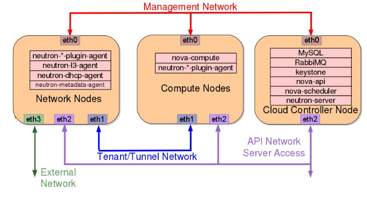

Installing OpenStack has always been challenging. Due to the complexity and
varity of design choices involved in setting up OpenStack, automated installers
are rare. For those who need a small but realistic setup, to be used either for
development or learning, a manual installation using the desired distribution's
packages has been the typical solution. Distribution packages simplify the process,
however they come with compromises.

<!--more-->

First, packages are only updated monthly, so the wait for patches is slow. Additionally so far the QA process for the various distributions is a little spotty, so the if a package is broken when the update occurs is may be a month until the problem is fixed.  Secondly applying a much needed patch from source may break a package installation or have the patch overwritten when a package update occurs.

For those testing or developing OpenStack, using a package based install would be impossible, since the packagers place files in difference locations and make it impossible to push source files to the OpenStack github based repos.  For this most developer use devstack as their install vehicle. Devstack is a great tool to get a simple OpenStack environment running but It can be cranky and difficult to get multi-machine OpenStack environments running.

The choice is to install OpenStack from source. For most folks, source installs are undesirable and messy, but since OpenStack is completely written in python, source installs eliminate the temperamental and slow compilation step. Additionally since each service also has its own python requirements file, the python installer uses pip to install any python dependencies. This greatly simplifies the installation process and results in an install that can be used for either development or production. It is worth noting that some newer OpenStack installer projects such as stackforge's os-ansible-deployment have moved to source installs. Currently it is located at [this stackforge GitHub repository](https://github.com/stackforge/os-ansible-deployment). The ansible installer is now part of the OpenStack big tent efforts and shortly will be located at [a repository within the openstack organization](https://github.com/openstack/openstack-ansible).

This discussion demonstrates how to install OpenStack from source onto three machines using Ubuntu 14.04 LTS as the base OS. The three nodes consist of compute, network and controller nodes, using separate control and data planes, an access/API network and one external network connection. Each node needs at least 3 NIC cards (the network node needs 4). Users are able to create simple legacy routers and an external provider router. The following diagram gives a physical representation of the final OpenStack system.

This install uses KVM, running through libvirt, for virtualization, but it can be easily modified to use QEMU for those who have hardware that doesn't fully support virtualization. The compute nodes needs to be tested to verify that the CPU(s) can support KVM by running:

    egrep -c '(vmx|svm)' /proc/cpuinfo

The output should be 1 or higher to be able to use KVM for virtualization. An output of 0 means you have to use QEMU for virtualization.

The basic source install process for each node is straightforward and similar for each service that runs on a node. To install an OpenStack service we need to complete the following for each:

1. For proper security each service will run as a separate non-root user
  1. create users for each service
  2. create home directories for the service and other needed directories, i.e. log, lib, and etc.
  3. set proper ownership of the directories and files

2. Clone the OpenStack service's repository
  1. copy any provided sample configuration files to the etc directory
  2. edit the configuration files setting any needed parameters
  3. install the service using the provided python install script
3. Configure the service and create upstart scripts to start/stop the service
4. Lastly start the service.

Let's get started installing keystone on the controller node.

Begin by updating all three of your nodes. On all nodes run:

    apt-get update; apt-get dist-upgrade -y;reboot

Set some initial shell variables which are used in the installation to simplify the install process. `MY_IP` and `MY_PRIVATE_IP` should be the IP for the NIC card on the controller to which the the management plane is assigned. Again perform this on all three nodes.

    cat >> .bashrc << EOF
    MY_IP=10.0.1.4
    MY_PRIVATE_IP=10.0.1.4
    MY_PUBLIC_IP=10.0.0.4
    EOF

    source .bashrc

Install RabbitMQ and set rabbit to only listen on the control plane interface:

    apt-get install -y rabbitmq-server

    cat >> /etc/rabbitmq/rabbitmq-env.conf <<EOF
    RABBITMQ_NODE_IP_ADDRESS=$MY_PRIVATE_IP
    EOF
    chmod 644 /etc/rabbitmq/rabbitmq-env.conf

    service rabbitmq-server restart

Install mysql and set it to listen on the control plane interface (set the mysql root password to mysql for this example. Use a more complex password in production.):

    apt-get install -y mysql-server

    sed -i "s/127.0.0.1/$MY_PRIVATE_IP\nskip-name-resolve\ncharacter-set-server = utf8\ncollation-server = utf8_general_ci\ninit-connect = 'SET NAMES utf8'/g" /etc/mysql/my.cnf

    restart mysql

Use `mysql_secure_installation` to remove the anonymous user:

    mysql_secure_installation

Create the database for keystone and set access permissions for the keystone user:

    mysql  -u root -pmysql -e "create database keystone;"
    mysql  -u root -pmysql -e "GRANT ALL PRIVILEGES ON keystone.* TO 'keystone'@'localhost' IDENTIFIED BY 'keystone';"
    mysql  -u root -pmysql -e "GRANT ALL PRIVILEGES ON keystone.* TO 'keystone'@'%' IDENTIFIED BY 'keystone';"

Install additional needed apt dependencies and needed pip packages:

    apt-get install -y python-dev libmysqlclient-dev libffi-dev libssl-dev
    pip install python-glanceclient python-keystoneclient python-openstackclient
    pip install repoze.lru pbr mysql-python

Create the various users and directories needed for the OpenStack services. The following script creates these for each of the services on the controller node and should be run using bash (not sh): (a similar script is available for the network and compute nodes with fewer services)

    for SERVICE in keystone glance neutron nova cinder
    do
    useradd --home-dir "/var/lib/$SERVICE" \
        --create-home \
        --system \
        --shell /bin/false \
        $SERVICE

    #Create essential dirs

    mkdir -p /var/log/$SERVICE
    mkdir -p /etc/$SERVICE

    #Set ownership of the dirs

    chown -R $SERVICE:$SERVICE /var/log/$SERVICE
    chown -R $SERVICE:$SERVICE /var/lib/$SERVICE
    chown $SERVICE:$SERVICE /etc/$SERVICE

    #Some neutron only dirs

    if [ "$SERVICE" == 'neutron' ]
      then
        mkdir -p /etc/neutron/plugins/ml2
        mkdir -p /etc/neutron/rootwrap.d
        chown -R neutron:neutron /etc/neutron/plugins
    fi
    done

Clone the keystone github repo move into the newly created keystone directory and use the python install process to install keystone: ( this can be changed to point to any release by changing the `kilo` in the next line, or to install from trunk by removing the `-b stable/kilo`)

    git clone https://github.com/openstack/keystone.git -b stable/kilo
    cp -R keystone/etc/* /etc/keystone/
    cd keystone
    python setup.py install
    EOF

Copy the sample keystone conf file provided by the keystone project and set the database and token info within the file:
Note: For a production system, set a more complex token than what is used in this example.

    mv  /etc/keystone/keystone.conf.sample /etc/keystone/keystone.conf
    sed -i "s|database]|database]\nconnection = mysql://keystone:keystone@$MY_IP/keystone|g" /etc/keystone/keystone.conf
    sed -i 's/#admin_token = ADMIN/admin_token = SuperSecreteKeystoneToken/g' /etc/keystone/keystone.conf
    cd ~

Use the keystone tools to create the tables within the keystone database:

    keystone-manage db_sync

Set keystone for proper log rotation:

    cat >> /etc/logrotate.d/keystone << EOF
    /var/log/keystone/*.log {
        daily
        missingok
        rotate 7
        compress
        notifempty
        nocreate
    }
    EOF

OpenStack does not provide any start up scripts for the services. The script needed depends on the distribution and whether an upstart or a systemd script is needed. For Ubuntu 14.04, an upstart script is needed.  The following is an upstart script that starts the keystone service (this is a slightly modified version from the Ubuntu operating system package install):

Keystone Upstart script

    cat > /etc/init/keystone.conf << EOF
    description "Keystone API server"
    author "Soren Hansen <soren@linux2go.dk>"

    start on runlevel [2345]
    stop on runlevel [!2345]

    respawn

    exec start-stop-daemon --start --chuid keystone --chdir /var/lib/keystone --name keystone --exec /usr/local/bin/keystone-all -- --config-file=/etc/keystone/keystone.conf  --log-file=/var/log/keystone/keystone.log
    EOF

    start keystone

Verify that keystone started:

    ps aux|grep keystone

If for some reason keystone doesn't start, the following can be used to try to start keystone for troubleshooting: (only run this if the previous step doesn't show a keystone process running)

    sudo -u keystone /usr/local/bin/keystone-all --config-file=/etc/keystone/keystone.conf  --log-file=/var/log/keystone/keystone.log

Create the credentials files used by the openstack commands to authenticate to keystone:

    cat >> openrc_admin << EOF
    export OS_SERVICE_TOKEN=SuperSecreteKeystoneToken
    export OS_SERVICE_ENDPOINT=https://$MY_IP:35357/v2.0
    EOF

    cat >> openrc << EOF
    export OS_USERNAME=admin
    export OS_PASSWORD=secrete
    export OS_TENANT_NAME=demo
    export OS_AUTH_URL=https://$MY_IP:35357/v2.0
    export OS_REGION_NAME=RegionOne
    EOF

Set up the keystone's PKI infrastructure:

    keystone-manage pki_setup --keystone-user keystone --keystone-group keystone

Load the shell variables needed to access keystone and verify that it is responding:

    source openrc_admin
    keystone tenant-list

Initialize some shell variables used by the sample_data script that populates keystone with its initial data:

    export CONTROLLER_PUBLIC_ADDRESS=$MY_IP
    export CONTROLLER_ADMIN_ADDRESS=$MY_IP
    export CONTROLLER_INTERNAL_ADDRESS=$MY_IP

Use the supplied sample data script to populate keystone with initial service information and endpoints:

    ./keystone/tools/sample_data.sh

Verify that there is valid data in keystone:

    keystone tenant-list
    keystone user-list
    keystone service-list
    keystone endpoint-list

Congratulations, keystone should now be installed and running. In the next article of this series, we will install glance and neutron on the controller node.
