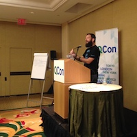
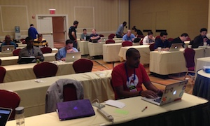

Running a successful developer workshop (aka tutorial) is really difficult. I've attended enough workshops that have gone poorly to know that for a fact. Participating in such a workshop can be very frustrating and a huge turn off for whatever technology is being presented. That translates directly into losing developer mindshare. I think we, as an industry, can do a better job of running developer workshops.

<!--more-->

I've run workshops at Gluecon, QCon, SXSW, the OpenStack Summits, and internally at Rackspace. They've gone well enough that I've come up with a set of principles I follow in an attempt to give developers a better experience. I'll layout the general principles and the tools/techniques I typically use to implement them.

### Principles for a successful developer workshop

1. [Know your audience](#know-your-audience)
1. [Share your content first](#share-your-content-first)
1. [Start from a clean environment](#start-from-a-clean-environment)
1. [Walk-through sign ups](#walk-through-sign-ups)
1. [Be explicit](#be-explicit)
1. [Make it accessible](#make-it-accessible)
1. [Get help](#get-help)
1. [Get feedback](#get-feedback)
1. [Do less](#do-less)
1. [Empathy](#conclusion)

### Know your audience

This is the most important and likely the most difficult one. At many conferences it's impossible to know exactly who is going to show up to your workshop, much less what their skill set is. Ask the conference organizers for the demographics and try to understand who might show up and what they might want to get out of your workshop.

You can also attempt to know your audience at the outset and during the workshop. As people walk in, introduce yourself and ask them what they hope to get out of your workshop and why they chose it. Don't assume any knowledge whatsoever beyond the pre-requisites laid out in your abstract. They may not even have a solid foundation in those pre-requisites.

Put everyone on the same page by starting out with some slides on the basics of your pre-requisites. At the very least it will set a common terminology for the rest of the workshop. Do "hands up" surveys of the audience by asking them what they know about the technologies already and adjust emphasis accordingly.

One of the best ways to know your audience as the workshop progresses is the Sticky Notes technique. It's a great way for you to see how your audience is doing visually and for them to provide feedback. You can read more about it from Software Carpentry's ["What Are the Sticky Notes For?"](https://software-carpentry.org/workshops/operations.html#sign-in).

### Share your content first

Given that your audience will have a wide variety of skill levels, provide the materials beforehand. This is crucial because those that are a bit slower picking up the material can follow along at their own pace and catch up during the breaks. Those that are a bit quicker can leap ahead and won't get bored (one caveat on this below).

My preferred method for sharing code and the presentation is to put everything in a single GitHub repository. It's important to keep everything in a single repo because the content of the presentation often depends heavily on the code. For the slides I use [reveal.js](https://github.com/hakimel/reveal.js/) and then use [GitHub Pages](https://pages.github.com/) to publish them. A couple of examples are:

* [app-on-openstack](https://github.com/everett-toews/app-on-openstack) ([presentation](https://everett-toews.github.io/app-on-openstack/presentation/))
* [a-restful-adventure](https://github.com/everett-toews/a-restful-adventure) ([presentation](https://everett-toews.github.io/a-restful-adventure/presentation/))

Provide a shortened URL to the presentation at the start of the workshop and also write it down on a whiteboard or somewhere for latecomers. _Bonus points_: Since it's a GitHub repo, encourage people to file issues during the workshop as another channel for feedback.

_Caveat_: When you need the quicker people to definitely stop and wait for everyone else to catch up, make it explicit [like this](https://everett-toews.github.io/app-on-openstack/presentation/#/stop) and explain it.

### Start from a clean environment

Teaching developers a new technology often involves installing some software. Typically teachers want to install this software on the attendees laptops. This is a big mistake for a number of reasons:

1. You don't know what they already have or don't have on their laptop. It's so much more difficult to give clear and concise instructions when you don't know the starting point. _Hint_: Even if you told people to install some software in your pre-requisites, 90% will have not done that.
1. You're probably assuming they're using a particular operating system. They could be using a Mac, Linux, or (gasp) Windows.
1. You're polluting their laptop. Dependencies/Settings in your software may conflict with dependencies/settings on their laptop. It's a problem for them during and after the workshop.
1. If your software involves a big download, the conference Wi-Fi won't be able to handle it, especially when an entire room of people are trying to do the same download at the same time. And creating and handing out USB sticks is painful for everyone involved.

Instead start from a clean environment. We live in the age of cloud. Use it to your advantage. Have VMs in the cloud all ready to go for your attendees. You can have those VMs configured exactly how you need them to be and everyone is on the same page right from the start. Then they just ssh or do a Remote Desktop Connection to the VM and away you go.

Naturally my preferred cloud is [Rackspace](https://www.rackspace.com/cloud). :) I can start [Cloud Servers](https://www.rackspace.com/cloud/servers) for everyone, create [sub-users with role based access control](https://support.rackspace.com/how-to/overview-role-based-access-control-rbac/) that they can use to create their own VMs, or encourage people to sign up for our [developer+ program](https://developer.rackspace.com/signup/).

### Walk-through sign ups

Speaking of sign ups, walk-through sign ups. The technology you're teaching may involve asking the developers to sign up for some account. It's usually free within some limits or has some credits associated with it. Asking them to sign up for something free is okay and is becoming pretty commonplace.

What isn't okay is not completely walking them through the sign up. Of course you already have an account on the service. You probably haven't had to sign up in ages. You might not be aware of the current sign up process or any steps that might trip up your audience. So walk-through the entire sign up process in front of your audience. Every. Single. Step. Enter your credit card, where you went to high school, and your first pet's name. Then just delete that account after the workshop is over.

### Be explicit

Be explicit in all things. If you catch yourself saying "As you probably already know" or any like that, you're doing it wrong. People are there because they don't already know. Here are just a few things you can be explicit about:

* Don't use short parameters on the command line interface. e.g. Prefer 1 over 2.
 1. `docker run --volume=$(pwd):/srv/jekyll --tty=true --publish 4000:4000 jekyll/pages jekyll serve`
 2. `docker run -v=$(pwd):/srv/jekyll -t -p 4000:4000 jekyll/pages jekyll s`
* Use diagrams. Diagrams are very explicit to visual thinkers. I find [Google Drawings](https://support.google.com/docs/topic/1360903?hl=en&ref_topic=1397170) pretty usable and it's easy to collaborate with others.
* Be a bit verbose when it comes to naming things like files, variables, classes, etc.

Always be asking yourself how you can be more explicit. You already know all of the shortcuts but your audience doesn't even know the fundamentals yet.

### Make it accessible

If your audience can't read/see your presentation, it's very frustrating. Make your content accessible by making sure it's readable and clearly presented without distraction.

1. Contact the conference organizers and find out the projector resolution and aspect ratio, and adjust your presentation accordingly.
1. Know how to zoom text in and out with your browser.
1. Know how to maximize (not full-screen) a window quickly. _Mac Tip_: I use [SizeUp](https://www.irradiatedsoftware.com/sizeup/) to easily maximize and put windows side-by-side.
1. If you're working in a terminal that's displayed by the projector, people at the back of the room won't be able to see what's happening at the bottom of the screen, which is where everything happens. Move the prompt to the top of the screen often. _Mac Tip_: I use [iTerm2](https://www.iterm2.com/) and command+R to do this.
1. Hide browser toolbars and extensions unnecessary for the workshop.
1. Turn off anything that can distract the audience like chat notifications, calendar notifications, etc.
1. Turn off your screen saver. _Mac Tip_: I use [Caffeine](https://lightheadsw.com/caffeine/) for this.

### Get help

It's dangerous to go alone! Get help if at all possible. You can't possibly be at the front teaching and be giving hands on help in the audience at the same time. And people will need hands on help.

Have colleagues act as teaching assistants. Depending on the audience, you may want to make an effort to have at least one teaching assistant familiar with Windows. If your colleagues can't make it to the conference, seriously consider reaching out to others you know (or may not know so well) who are attending the conference. Those Developer Advocate/Evangelist/Relations types tend to be a helpful bunch. :) Also, you can always encourage attendees to help each other.

### Get feedback

It's usually pretty obvious when a workshop teacher hasn't practiced. The timing is off, the presentation doesn't flow very well, there are bugs in the code, the presentation doesn't match the code, etc.

Get feedback from yourself. Practice alone, practice in front of a rubber duck, practice in front of your cat, whatever it takes. Just get some practice.

Get feedback from others. Practice in front of other people and get their hands on the keyboard. Work on the timing, work on the flow, and hammer out bugs.

### Do less

The temptation is to fit as much as possible into the workshop. You only have a half/full day and you want to cram as much in there as possible. I've definitely been guilty of this one.

Try to do a bit less. If you find yourself running very close to the maximum amount of time during practice, you should seriously consider taking something out. It always takes longer to do it during the workshop. That also gives you more time to pace yourself, to go off on the occasional tangent that particular audience might find interesting, and to take breaks.

If there's more material you want people to get into, give them a "What's Next" section at the end of the presentation. Point them in the direction you want them to go after the workshop. Something they can do to take the material you've given them one step further than what you've taught them.

### Conclusion

It all boils down to empathy. Can you understand and feel what your audience is going through as they take your workshop? Can you feel their frustration when they don't understand something that has been poorly presented? Can you share their aha moment when the material finally clicks?

Put yourself in your audience's shoes. Literally envision yourself taking your own workshop. You already know the material so well that it's particularly hard to do this, which is why it is all the more necessary. Ask yourself if you really understand what these people are going through.
