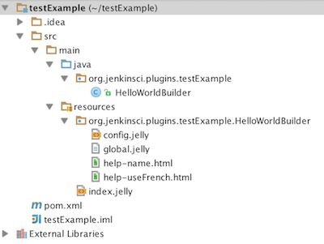
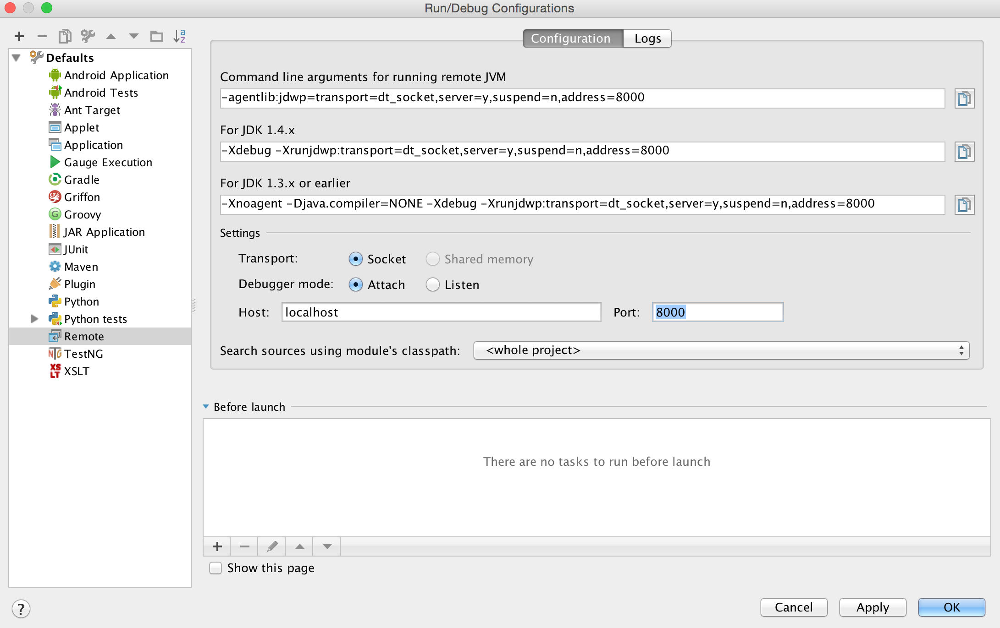
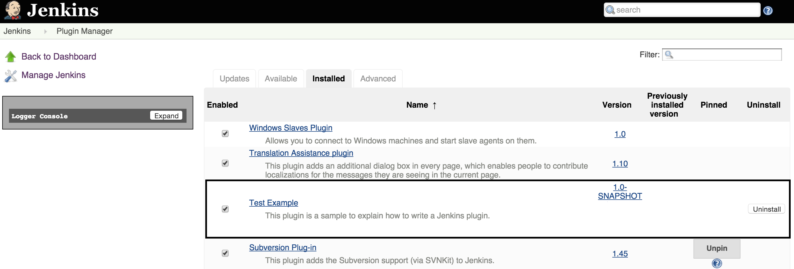
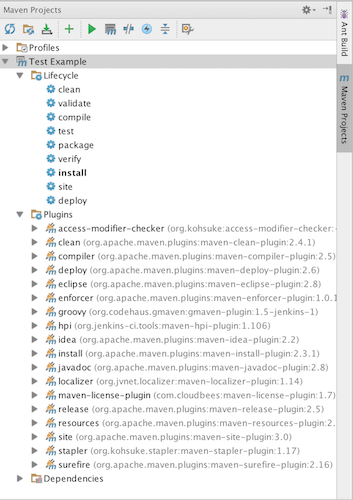

This is the first part of a two-part tutorial series to develop a Jenkins plugin
(specifically, Jenkins post-build plugin). Jenkins is a very popular continuous-integration tool and with the small amount of (scattered) information present
 out there, it is really hard for a beginner to dive in this amazing area of extending
 it - Plugins!

<!--more-->

I am [Priti Changlani](https://www.linkedin.com/in/pritichanglani), a summer intern at
Rackspace US, Inc. and a Computer Science graduate student at
University of Florida. At Rackspace, I have worked as a Quality Engineer in teams like
[Solum](https://github.com/stackforge/solum), [Repose](https://github.com/rackerlabs/repose)
and [Containers](https://wiki.openstack.org/wiki/ContainersTeam). As part of my job, I enhanced the process of quality engineering
as a whole and to that effect, I developed a Jenkins plugin -
[API Coverage](https://github.com/rackerlabs/api-coverage) for QEs to
measure the ability of their test-suites to cover the entire API contract. In the
process, I found many resources were hard to follow, and some were quite out of
date. I realized the need for an updated, easy, and dedicated tutorial on this
topic and therefore decided to write one myself.

This part of the tutorial talks about Jenkins plugins as a whole - what projects are
they, how they are created, what do they depend on, how do you run them and so on.
We will concentrate more on the technical aspects of the plugins so that next time
you have an extension idea, you won't wait on Jenkins, but, instead, write a plugin yourself.

Let's get started.

1. [Setting up](#setting-up)
1. [Creating the plugin](#creating-the-plugin)
1. [Understanding the project structure](#understanding-the-project-structure)
1. [Debugging the plugin](#debugging)
1. [More with Maven](#more-with-maven)
1. [Introduction to part 2](#intro-to-part-2)

### Setting up

Jenkins plugins are basically [Maven](https://maven.apache.org/) projects
with Java modules, and, therefore, the main requirement is to
have compatible JDK and Maven versions.

For this tutorial, we need the following installations:

JDK: [jdk1.7.0_79.jdk](https://www.oracle.com/technetwork/java/javase/downloads/jre7-downloads-1880261.html)

Maven: [apache-maven-3.3.3](https://maven.apache.org/download.cgi)

Jenkins: [Installation](https://wiki.jenkins-ci.org/display/JENKINS/Installing+Jenkins)

IDE: [IntelliJ IDEA 14.1.4](https://www.jetbrains.com/idea/download/)

Next, we configure Maven for the user. Navigate to your
`${user.home}/.m2/settings.xml` and add the following <localRepository> tag to
 the `<settings>` block.

    <localRepository>/path/to/local/repo/</localRepository>

 This path is the directory where all the Maven dependencies are
 downloaded. As a good practice, set the default path `${user.home}/.m2/repository/`.

For developing a Jenkins plugin, developers need to have a `<pluginGroup>` and a
jenkins `<profile>` in the `${user.home}/.m2/settings.xml`. After these
additions, the `settings.xml` should look like:

    <settings>
      <localRepository>/path/to/local/repo/</localRepository>
      <pluginGroups>
        <pluginGroup>org.jenkins-ci.tools</pluginGroup>
      </pluginGroups>

      <profiles>
        <!-- Give access to Jenkins plugins -->
        <profile>
          <id>jenkins</id>
          <activation>
            <activeByDefault>true</activeByDefault> <!-- change this to false, if you don't like to have it on per default -->
          </activation>
          <repositories>
            <repository>
              <id>repo.jenkins-ci.org</id>
              <url>https://repo.jenkins-ci.org/public/</url>
            </repository>
          </repositories>
          <pluginRepositories>
            <pluginRepository>
              <id>repo.jenkins-ci.org</id>
              <url>https://repo.jenkins-ci.org/public/</url>
            </pluginRepository>
          </pluginRepositories>
        </profile>
      </profiles>
    </settings>

The changes in the `settings.xml` also enable us to use a shorter command for creating the plugin in lieu of the longer version:

    mvn org.jenkins-ci.tools:maven-hpi-plugin:<plugin-version>:create

### Creating the plugin

To start with the plugin source code creation, use the terminal to type:

    mvn hpi:create

When prompted to enter a groupId, select the default structure - `org.jenkinsci.plugins`

    Enter the groupId of your plugin [org.jenkins-ci.plugins]: org.jenkinsci.plugins

Then provide an artifactId for the plugin. This id becomes the
package name for the project. As a good practice, keep the package
name same as the plugin name (that the end users would see). The suffix
'-plugin' is unnecessary, because it is implied that this is a Jenkins plugin.
For the example here, we would name the plugin 'testExample'.

    Enter the artifactId of your plugin (normally without '-plugin' suffix): testExample

You should now have a directory 'testExample' at the path where the above command
was executed.

### Understanding the project structure

Opening the project in IntelliJ IDEA should display the project structure in the left
pane.

Notice how the `groupId` is appended with the `artifactId` and forms a directory under the
`java` directory. The Java code resides here. Creating a project,
by default, generates a `HelloWorldBuilder.java` file. The resources for this class,
if any, should be included under the same directory structure under `resources`
folder, that
is, `resources/<groupId>/<artifactId>/<class name>`. This would hold true for all the
future classes you may write for the plugin.

In `pom.xml`, we will change the following two tag values from 'TODO Plugin' to our
plugin name and description.

    <name>Test Example</name>
    <description>testExample</description>

**Tip:**

Go through the files under **resources/org/jenkinsci/plugins/testExample/HelloWorldBuilder**
to see which part of the UI they render. The file **resources/index.jelly**
renders the view on the **Installed Plugins** page under **Manage Plugins**.

### Debugging the plugin

In IntelliJ IDEA, navigate to **Run>Edit Configurations>Remote** and set the
port to 8000, which is the default mvnDebug port. Click **Apply**.

In the terminal, type the following command:

    user@localhost:~/testExample$ mvnDebug hpi:run
    Preparing to Execute Maven in Debug Mode
    Listening for transport dt_socket at address: 8000

This starts the listener on port 8000. As the message states, Maven is ready in
Debug mode. This makes debugging pretty easy. How? We'll see this when we run the plugin.

Next, install the plugin. Enter the following command in a different
terminal window, in the project directory:

    user@localhost:~/testExample$ mvn install
    .
    . <wait for the processing>
    .
    [INFO] ------------------------------------------------------------------------
    [INFO] BUILD SUCCESS
    [INFO] ------------------------------------------------------------------------

This command installs all the Maven dependencies (if not installed already)
specified in `pom.xml` and generates the `target` and the `work` directories. It also
generates the `target/testExample.hpi` file which is a complete package for the plugin
code. To debug, you could just import this file in Jenkins (Manage Jenkins>Manage
Plugins>Advanced), however there is a much simpler way shown below to do this without the
import.

Use the following command to run the plugin:

    user@localhost:~/testExample$ mvn hpi:run
    .
    .<wait for the processing>
    .
    INFO: Jenkins is fully up and running

When you see the preceding info message, type
**https://localhost:8080/jenkins/pluginManager/installed** in your browser and notice that
the plugin is now present in the installed plugin list. This is where the debugger,
running in the background, performed its magic!

### More with Maven

A developer can do much more with Maven without having to remember all the commands.
Clicking on 'Maven Projects' on the right side panel expands all the available options
for the developer. Double-clicking on any of these options executes the command.

While a lifecycle state can be executed with the command:

    mvn <state>

a Maven plugin can be used as:

    mvn <plugin>:<action>

Using the preceding, you just execute `mvn hpi:hpi` to generate the **.hpi** file.

Note: The `mvn hpi:hpi` command does not run any tests in the project.

### Introduction to part 2

The auto-generated testExample project is an example of a Jenkins build plugin
and you can see that the class `HelloWorldBuilder.java` extends the class
`hudson.tasks.Builder`. However, in the upcoming part 2 of this tutorial, we will
create a post-build plugin and, therefore, extend the class `hudson.tasks.Recorder`
and make the `Extension` class `DescriptorImpl` extend the class
`BuildStepDescriptor<Publisher>` instead of `BuildStepDescriptor<Builder>`.

