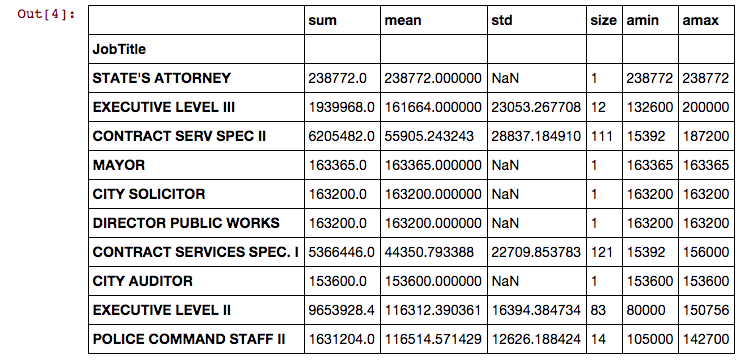
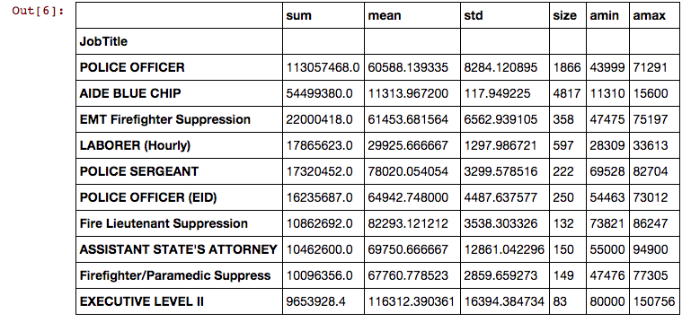
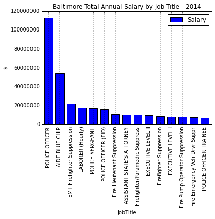

Wes McKinney started working on Pandas in 2008. Since then, Pandas has become one of the most popular and useful software components for the data scientist. For good reason; using Python, Pandas and iPython/Jupyter notebooks makes it simple and quick to perform analysis on various datasets.

In this post, we perform some basic analysis on the City of Baltimore employee salary data from data.gov, but this technique can be used on a wide variety of data sets very easily.

Pandas and Jupyter notebooks make this work quick. It may be surprising to see where the money goes!

<!--more-->

### Getting the raw data

The first step is to get the raw data. Data.gov is a great resource for public datasets, because it's catalog has a wide variety of things to explore. In this case, we are exploring Baltimore City data. The [Baltimore City Employee Salaries FY2014](https://catalog.data.gov/dataset/baltimore-city-employee-salaries-fy2014-5924b) dataset is a simple csv compilation of job titles and salaries for 2014. The data is cataloged on data.gov, but the data itself can be downloaded right from the Baltimore city website at [data.baltimorecity.gov](https://data.baltimorecity.gov/api/views/2j28-xzd7/rows.csv?accessType=DOWNLOAD).

### Using Jupyter notebooks

Jupyter notebooks (previously ipython notebooks) are a great mechanism for exploring and sharing datasets.
In this case, we spun up our own instance of Jupyter on Rackspace, but any instance of ipython notebooks will work. We are running a multi-user server, but this analysis doesn't really require it. Another option would be a [temporary server](https://lambdaops.com/ipythonjupyter-tmpnb-debuts/).

For reference, the entire project is in [nbviewer](https://nbviewer.ipython.org/github/kgorman/notebooks/blob/master/Baltimore_Salaries.ipynb) or direcly in [Github](https://github.com/kgorman/notebooks/blob/master/Baltimore_Salaries.ipynb).

The Rackspace Jupyter server has one prerequisite not already installed - the requests module. You can install python for the requests package right in Jupyter:

```
!pip install requests
```

### Python and Pandas

Python is a widely popular language for data science. [Pandas](https://pandas.pydata.org) is the "Python Data Analysis Library" and facilitates working with datasets. Pandas is especially good at columnar style data and provides a host of simple methods to help visualize and organize data. In this case, we will be grouping and sorting data using Pandas.

The first step is to do some housekeeping and loading of libraries we will be using:

```python

%matplotlib inline
import pandas as pd
import requests
import StringIO as StringIO
import numpy as np

```

Now let's load up the data. We will directly reference the CSV data directly on the webserver over SSL. This technique is very useful for fetching remote data sources without needing an interim fileserver or other infrastructure. Lastly we make the data available as a file for pandas.

```python

url = "https://data.baltimorecity.gov/api/views/2j28-xzd7/rows.csv?accessType=DOWNLOAD"
r = requests.get(url)
data = StringIO.StringIO(r.content)

```

Now lets load the data into a dataframe. A dataframe is a 2-dimensional labeled [data structure]((https://pandas.pydata.org/pandas-docs/version/0.16.1/dsintro.html#dataframe)) in Pandas. It has a suite of nice methods for loading data into it. In this case, our source is a CSV file. In the previous step we convert the resulting string into of type FILE, which is required by the method as the input datatype.

```python

dataframe = pd.read_csv(data,header=0)

```
Now we have everything loaded into a dataframe, we can start manipulating it with various methods to clean, normalize, group and sort the data. First, we want to remove the dollar signs in the AnnualSalary field and assign it as a float. This enables us to perform some aggregation on it.

```python

dataframe['AnnualSalary'] = dataframe['AnnualSalary'].str.lstrip('$')
dataframe['AnnualSalary'] = dataframe['AnnualSalary'].astype(float)

```

Next step is to group the data, and aggregate with sum, mean, etc. Then we can sort and display.

```python
# group the data
grouped = dataframe.groupby(['JobTitle'])['AnnualSalary']
aggregated = grouped.agg([np.sum, np.mean, np.std, np.size, np.min, np.max])

# sort the data
pd.set_option('display.max_rows', 10000000)
output = aggregated.sort(['amax'],ascending=0)
output.head(15)

```


Ok, this is interesting. It shows that the State Attorney gets paid the most in the city, followed by executive roles, the Mayor, etc. I guess this isn't very surprising. But these are only individual jobs, not the entire spend by job role. After all, there is only 1 State Attorney. A better approach might be to group by JobTitle.


```python
output = aggregated.sort(['sum','size'],ascending=[0,1])
output.head(15)
```



Hey now! Now we are getting somewhere. The salary for Police Officers looks pretty high compared to other roles. It also has 1866 employees fitting this role. Let's graph it. First, let's prepare the data as we want to see it in the graph. Specifically we want the sum of salary, sorted descending.

```python
aggregated = grouped.agg([np.sum])
output = aggregated.sort(['sum'],ascending=0)
output = output.head(15)
output.rename(columns={'sum': 'Salary'}, inplace=True)
```

Then setup for a nice display and graph it:

```python
from matplotlib.ticker import FormatStrFormatter

myplot = output.plot(kind='bar',title='Baltimore Total Annual Salary by Job Title - 2014')
myplot.set_ylabel('$')
myplot.yaxis.set_major_formatter(FormatStrFormatter('%d'))
```



The graph makes the drastic jump in spending for just a couple JobTitle's very obvious. If I was the City Controller I might start to dig deeper into these roles to see why the spending is so high, and determine if we can afford to make some changes. Pandas to the rescue.

The entire notebook is in my [Github repository](https://github.com/kgorman/notebooks/blob/master/Baltimore_Salaries.ipynb).
