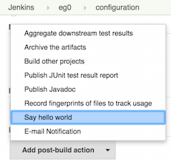

Welcome to part 2 of the Jenkins post-build plugin development tutorial. This
post talks in detail about the plugin project entities and their interactions
with each other. To brush up on the previous post, please visit [Jenkins
post-build plugin - part 1](https://developer.rackspace.com/blog/jenkins-post-build-plugin-part-1/).

<!--more-->

In part 1 of the tutorial, we created a plugin project which generates an example `HelloWorld` builder plugin. We
now continue working on the same project and turn it into a post-build plugin. The main difference between the two
is best shown as:

                            	| Build Plugin                       	| Post-build Plugin
:------------------------------:|:-------------------------------------:|:---------------------------------:
 Builder Class Extends       	| `hudson.tasks.Builder`            	| N/A
 Publisher Class Extends    	| N/A                               	| `hudson.tasks.Recorder`
 Descriptor Class Extends   	| `BuildStepDescriptor<Builder>`    	| `BuildStepDescriptor<Publisher>`

**Tip:** I would highly recommend going through the comments in `HelloWorldBuilder.java` before delving further because
those comments are extremely detailed and give the reader a good insight into working of Jenkins core.

Before we start, let's rename the `HelloWorldBuilder` class, its references and its `resources` to
`TestExamplePublisher`. Next, make the class `TestExamplePublisher` extend `hudson.tasks.Recorder`. This extension
also requires overriding of the abstract method `getRequiredMonitorService()`. Make the method return
`BuildStepMonitor.NONE`. More can be read on this method [here]
(https://javadoc.jenkins-ci.org/hudson/tasks/BuildStep.html#getRequiredMonitorService()).

Next, make the inner class `DescriptorImpl` extend `BuildStepDescriptor<Publisher>`. Notice the `@Extension`
annotation before this class. This annotation lets Jenkins know that this is a plugin extension of the Jenkins core.
The `DescriptorImpl` class acts as a configuration object for the outer plugin class. When the outer class
`TestExamplePublisher` calls its `getDescriptor()` method, a `DescriptorImpl` object is returned.

1. [Understanding the descriptorImpl class](#descriptorimpl)
1. [Know thy publisher class](#publisher-class)
1. [Build action class](#build-action)
1. [Project action class](#project-action)
1. [Conclusion](#conclusion)

### Understanding the descriptorImpl class

The `DescriptorImpl` class implements the abstract method `getDisplayName()` declared in the `Descriptor` class . This
method returns an alias-string for the user to click on when he first decides to use this plugin
in his Jenkins job. Because this is a post-build
plugin, this option is shown when the 'Add post-build action' drop-down is clicked on the job's configuration page.

The naming convention of this class can be confusing for beginners so the image on the right shows where this is
displayed.

This class is also the place where any global configurations reside. Global configurations are the ones configured
at the plugin level rather than each job/build/project level. Parameters of this class can act as
globally configurable fields, e.g. checkboxes, text-fields, radio-buttons, etc.

Look at the boolean `useFrench` class parameter. The method `public boolean configure(...)` in the `Descriptor` class
is overridden to set this field to `true` if the user checks in the checkbox on the Manage Jenkins>Configure System
page.  Place the resources to render any such global configurations in `global.jelly`.

The configurations local to each job/build/project are specified as class parameters in the outer plugin class. Look
at the field `name` in `TestExamplePublisher`. This field is set with any value that the user fills in the text-field
on the job's configuration page. As a good practice, you can restrict the user from entering any values that are
clearly invalid. The `doCheckName()` method restricts the user from leaving this field blank. It would
allow the user to set a value less than four characters but not without a warning message - "Isn't the name too
short?" In the exact same way, a developer can write any `doCheck<field-name>()` methods to add checks on the
corresponding fields in the class.

### Know thy publisher class

The essence of the plugin lies in the `TestExamplePublisher` class. The parameters of this class are set by
the `config.jelly` file. When the user saves any value for these fields on the job's UI (text-fields, checkboxes
radio-boxes, etc.), the value is assigned to the corresponding parameters via the `DataBoundConstructor`. It is,
therefore, necessary to have the same names for the parameters in the `config.jelly` file as in the
`DataBoundConstructor`. To get these parameters, the getter methods are implemented.

You need to override the `public boolean perform(...)` method to write your plugin code. This method is the point
where the plugin execution begins. As an example, instead of saying hello in the job's console output, let's display
the same on the job's build page. In addition, let's display greetings of all the builds within the project on a
project page.

### Build action class

To make a new page entry in Jenkins side-panel, you just need to create a class that implements
`hudson.model.Action` interface. Let's create a new `TestExampleBuildAction` class that implements this. To
create a new page, provide three entities to Jenkins through this interface. These are a [URL name]
(https://javadoc.jenkins-ci.org/hudson/model/Action.html#getUrlName()) to access this page, a [display name]
(https://javadoc.jenkins-ci.org/hudson/model/Action.html#getDisplayName()) and an [icon]
(https://javadoc.jenkins-ci.org/hudson/model/Action.html#getIconFileName()) for the side-panel entry. Let's have the
page located at 'testExampleBuild' (url name), with the display name 'Test Example Build Page', and provide an icon
file located at the `src/main/webapp/img/<iconFileName>.png`. There are two ways to return the `getIconFileName()`
string:

1. Having your own icon file: This file needs to be present at `src/main/webapp/img/` and the return string can
    be a relative path: `"/plugin/testExample/img/<iconFileName>.png"`
1. Using an existing icon from the target/work/webapp/images/24x24 : For this, just return the string
    `"<iconFileName>.png"`, and it will automatically be fetched from this location

Because we pass the "Hello \<name\>"/"Bonjour \<name\>" string from the publisher to the build-action, we need a
string parameter to store this in the latter. We also need to pass the `AbstractBuild build` to the
`TestExampleBuildAction` class to let Jenkins know that everything implemented in `TestExampleBuildAction` is build
related. The best way to do this is through the build-action class constructor. Notice how an object of this class is
instantiated in the `perform(...)` method.

### Project action class

The structure of the Project Action class is very similar to the Build Action. In the publisher class, override the
`getProjectAction(...)` method to return a parametrized object of your `TestExampleProjectAction` class. When the
plugin is run, this
associates the project and all the corresponding builds to each other. Apart from the
implementation of the `Action` interface, we need the list of messages from all the builds. This is simply done by
iterating through all the builds in the project and retrieving their message as can be seen [here]
(https://github.com/pritic/testExample/blob/master/src/main/java/org/jenkinsci/plugins/testExample/TestExampleProjectAction.java#L40).
The [resources]
(https://github.com/pritic/testExample/blob/master/src/main/resources/org/jenkinsci/plugins/testExample/TestExampleProjectAction/index.jelly#L7)
 of this class give a good example of how lists can be iterated to retrieve values in jelly.

### Conclusion

With the implementation of these two classes , we have finished coding the plugin. The following illustration shows
how the build page should look after you install and run the plugin:

 and this is how the project page should look:

The source code for this plugin has been made available on [GitHub](https://github.com/pritic/testExample). I hope
this tutorial has been a fun project and a good starting point for beginners in Jenkins plugin development.

Happy coding!