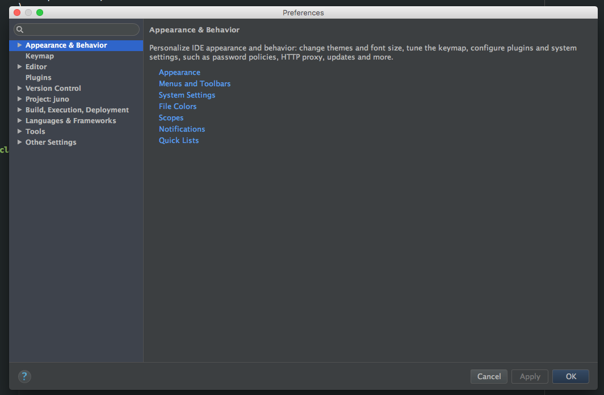
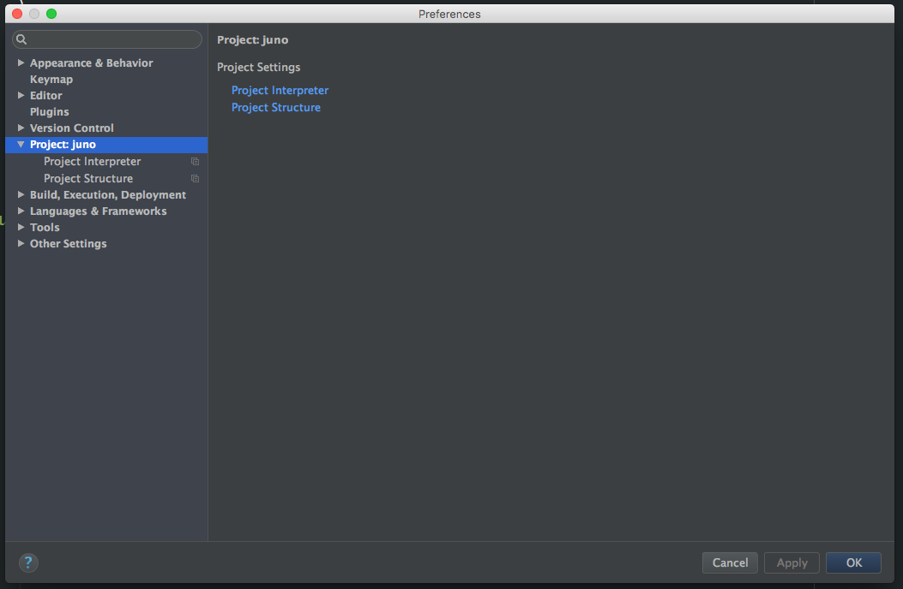
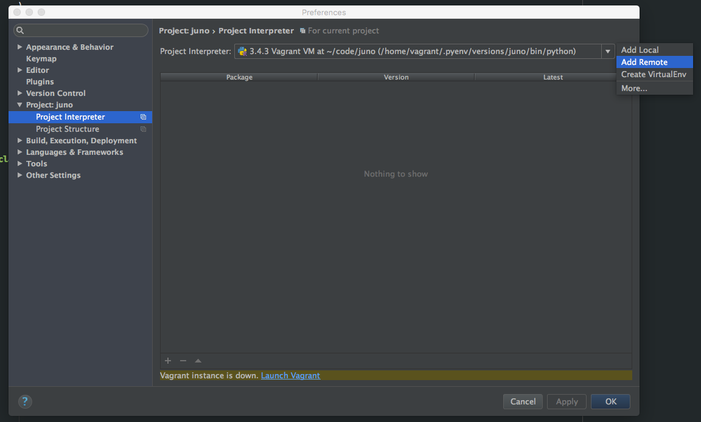
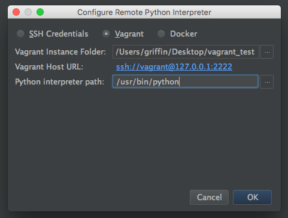

I have spent the majority of my career as a Java developer.  As a result, I learned to be more productive using an IDE instead of an editor like Vi.  Even though Vi is still my editor of choice when I’m in a Linux shell, I don’t believe it’s practical when managing large Java projects.

<!--more-->

Recently, I accepted an opportunity within the company to do some Python development for the first time.  After using the IntelliJ IDE for Java for many years, I was excited to see that the same company offered an IDE for Python called PyCharm.  However, in addition to that, I also learned that the Python community uses a variety of different configurations on their machines for app development, so initially I wasn’t sure which method I wanted to use.  So far, I have experimented with a number of different editors like Atom, Sublime Text, and Vi again.  Other unknowns to me when I was getting started were dependency management and app deployment/testing. At first, I managed project dependencies with `virtualenv` and then went through the process of deploying my app on my local OS to test code changes.  Unfortunately, I began running into problems with some of the project dependencies that didn’t play well with OS X, and I didn't want to invest a lot of time and energy hacking on my environment to get it working.  After some minor trial and error, I decided it would be worth attempting to run everything on Linux instead, so I created a virtual machine (VM) running the Ubuntu operating system using VirtualBox and began developing and deploying my app in this manner.  Even though this approach was successful, I have never enjoyed using Linux as my desktop OS as much as I have OS X.  Switching between the two operating systems felt strange, so I decided to keep looking for a better way.  I had two problems I was trying to solve:

  1) Run the application on Linux, and
  2) Continue using an IDE for development while using OS X as my desktop OS.

That’s when I learned that PyCharm works with Vagrant.  According to Vagrant’s website, “Vagrant provides easy to configure, reproducible, and portable work environments built on top of industry-standard technology and controlled by a single consistent workflow to help maximize the productivity and flexibility of you and your team.”  In other words, Vagrant allows you to easily build development environments while also making it easy to dispose of these environments when you no longer need them.  Vagrant does this by creating virtual machines using VirtualBox, VMware, AWS, and other providers.  Once the VM is created, you can use things like shell scripts, Chef, and Puppet to install software onto it, all while being completely isolated from your computer’s main operating system.  There are some huge benefits to this.  First, it saves you the hassle of manually installing software on your computer.  Second, it eliminates inconsistencies between your environment and production, colleague’s environments, etc. because you can version control your Vagrant configuration that can be used by other developers on your team.  For more information on how Vagrant works, I will refer you to Vagrant’s official website since this goes beyond the scope of this tutorial.

## Prerequisites

You will need a few things to go through this tutorial: Vagrant, VirtualBox, and PyCharm. All three of these can be downloaded for free. Instructions for installing them can be found on their respective websites.

- Vagrant. Download
  [here](https://www.vagrantup.com/).
- VirtualBox. Download
  [here](https://www.virtualbox.org).
- PyCharm. Download
  [here](https://www.jetbrains.com/pycharm/download).

## Create a Vagrantfile

A Vagrantfile file is a text file that Vagrant reads to setup the environment.  You
can use an existing Vagrantfile that outlines a specific environment configuration,
or you can run Vagrant for the first time and it will create a Vagrantfile for you.  In this example, I’m going to use the following Vagrantfile:


```ruby
# -*- mode: ruby -*-
# vi: set ft=ruby :

# All Vagrant configuration is done below. The "2" in Vagrant.configure
# configures the configuration version (we support older styles for
# backwards compatibility). Please don't change it unless you know what
# you're doing.
Vagrant.configure(2) do |config|
  # The most common configuration options are documented and commented below.
  # For a complete reference, please see the online documentation at
  # https://docs.vagrantup.com.

  # Every Vagrant development environment requires a box. You can search for
  # boxes at https://atlas.hashicorp.com/search.
  config.vm.box = "puphpet/ubuntu1404-x64"
  config.vm.network :forwarded_port, guest: 8080, host: 8080

  # Disable automatic box update checking. If you disable this, then
  # boxes will only be checked for updates when the user runs
  # `vagrant box outdated`. This is not recommended.
  # config.vm.box_check_update = false

  # Create a forwarded port mapping which allows access to a specific port
  # within the machine from a port on the host machine. In the example below,
  # accessing "localhost:8080" will access port 80 on the guest machine.
  # config.vm.network "forwarded_port", guest: 80, host: 8080

  # Create a private network, which allows host-only access to the machine
  # using a specific IP.
  # config.vm.network "private_network", ip: "192.168.33.10"

  # Create a public network, which is generally matched to bridged network.
  # Bridged networks make the machine appear as another physical device on
  # your network.
  # config.vm.network "public_network"

  # Share an additional folder to the guest VM. The first argument is
  # the path on the host to the actual folder. The second argument is
  # the path on the guest to mount the folder. And the optional third
  # argument is a set of non-required options.
  # config.vm.synced_folder "../data", "/vagrant_data"

  # Provider-specific configuration so you can fine-tune various
  # backing providers for Vagrant. These expose provider-specific options.
  # Example for VirtualBox:
  #
  # config.vm.provider "virtualbox" do |vb|
  #   # Display the VirtualBox GUI when booting the machine
  #   vb.gui = true
  #
  #   # Customize the amount of memory on the VM:
  #   vb.memory = "1024"
  # end
  #
  # View the documentation for the provider you are using for more
  # information on available options.

  # Define a Vagrant Push strategy for pushing to Atlas. Other push strategies
  # such as FTP and Heroku are also available. See the documentation at
  # https://docs.vagrantup.com/v2/push/atlas.html for more information.
  # config.push.define "atlas" do |push|
  #   push.app = "YOUR_ATLAS_USERNAME/YOUR_APPLICATION_NAME"
  # end

  # Enable provisioning with a shell script. Additional provisioners such as
  # Puppet, Chef, Ansible, Salt, and Docker are also available. Please see the
  # documentation for more information about their specific syntax and use.
  # config.vm.provision "shell", inline: <<-SHELL
  #   sudo apt-get update
  #   sudo apt-get install -y apache2
  # SHELL
end
```

There’s a lot of information in this Vagrantfie, but one thing I want to point out is a parameter called `config.vm.box`.  Vagrant uses what they refer to as `boxes` to create VMs, which are base images stored in a repository managed by HashiCorp, the creator of Vagrant.  In this example, I’m using a box called `puphpet/ubuntu1404-x64`, which is an Ubuntu Trusty 14.04 LTS x64 VM.

You will notice there is also a parameter called `config.vm.network`.  Here I am specifying that I would like to forward port 8080 on my host operating system to my VM.  This allows me to do things like use a REST client on my host OS to access resources through port 8080 on my VM.

## Installing the VM

Once I have my Vagrantfile in the directory I’d like to run my project in, I can simply run the command:

`vagrant up`

and Vagrant will proceed to create my VM based on the Ubuntu Trusty 14.04 LTS x64 box I specified.  It will take a few minutes to download the box from HashiCorp for the first time.  Subsequent VMs created with this box will not have to re-download the box as long as you don't remove it.

## Logging into the VM

Once the vagrant up process has finished, you can ssh into your VM by typing the command:

`vagrant ssh`

At this point you are logged into your VM and can manage it the same way you would any other Linux server you ssh into.  If you `cd /vagrant`, you will see the Vagrantfile along with any other files in your host OS project directory where you typed `vagrant ssh`.  For example, I have a Python project called "juno" on my host OS in the same directory as my Vagrantfile.  In my Vagrant VM, I see this:

```bash
vagrant@vagrant:/vagrant$ ls -l
total 4
drwxr-xr-x 1 vagrant vagrant 1292 Dec 15 03:55 juno
-rw-r--r-- 1 vagrant vagrant 3158 Dec 15 03:59 Vagrantfile
```

Vagrant allows you to map directories on your host OS to directories on your VM.  They refer to this feature as "synced folders".  When you delete your VM, the files in these directories will not be deleted.

## Configuring PyCharm

I now need to open my project in PyCharm.  Since I'm running my app in a VM, I need to tell PyCharm to use a remote Python interpreter.  This can be accomplished by following these steps:

1. Open the project settings dialog box in PyCharm. (*cmd+comma* shortcut if you are using OS X).

    

2. Expand *Project: juno* on the left side.

    

3. Click on *Project Interpreter*.

4. Click on the cog icon on the upper right side of the window and select *Add Remote*.

    

5. Click on the *Vagrant* radio button.

6. In the *Vagrant Instance Folder* box, select the directory you ran `vagrant up` in earlier.

7. In the *Vagrant Host URL* box, make sure `ssh://vagrant@127.0.0.1:2222` is specified.

    

8. Click OK.

You should now be able to edit your project files on your host OS using PyCharm while running your project in a Linux VM.  If you edit one of the files in PyCharm, you will see the changes immediately in your VM.  I can now deploy my Python app in my VM and since I’ve configured port mapping in my Vagrantfile, I can use applications running on my host OS to interact with the deployed app in my VM such as a browser, database client, and REST client.

## Conclusion

There are many other ways to configure Vagrant that improve this process.  For example, as part of your Vagrantfile you can include a link to a provision script that updates your VM’s package manager, installs `virtualenv`, your favorite shell, etc.  This allows you to version control your Vagrantfile and provision script so new developers on your team can easily setup their development environment.  Vagrant is a powerful tool that has proven itself to be an easy way to create and tear down development environments.  IDEs like PyCharm are an invaluable tool when it comes to software development, and it’s good to know that PyCharm and Vagrant work together so well.
