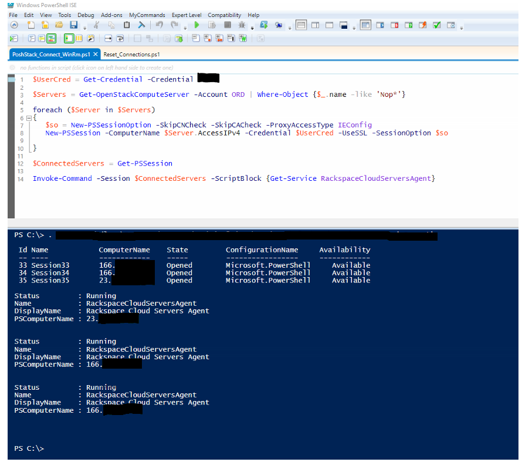

Automation in Windows has historically been a challenge due to lack of built in
tools for remote management.  In the past few years, the enhancements to PowerShell
and WinRM (Windows Remote Management) have forged a path that is now more on par
with other operating systems in regards to remote access.

<!--more-->

One of the primary benefits of using PowerShell is that there is no need to
install a third-party agent. WinRM is configured by most Cloud Providers, and
Rackspace enables an HTTPS listener during provisioning.

### What you need

[PoshStack](https://developer.rackspace.com/blog/Introducing-PoshStack-the-PowerShell-client-for-OpenStack/)
is an excellent set of PowerShell tools that enables us to automate gathering
the information we need to connect to our servers. Built on OpenStack .NET SDK,
we can leverage these functions in PowerShell for many other management tasks as
well.

*Example listing servers by name match*

	 Get-OpenStackComputeServer -Account ORD | Where-Object {$_.name -like 'ServerName*'}

### Challenges in authentication

Microsoft usually assumes you are in an Active Directory Domain utilizing
credentials that can access all servers in your environment.  This may be true
in certain cases however, when utilizing the cloud, it is not a certainty. In
this example, I use a set of credentials that works across all of my devices to
keep the scope of this article simple.

	 $UserCred = Get-Credential -Credential AdminAccount

### Putting it all together to connect

	 $Servers = Get-OpenStackComputeServer -Account ORD | Where-Object {$_.name -like 'ServerName*'}

    foreach ($Server in $Servers)
	 {
	   $so = New-PSSessionOption -SkipCNCheck -SkipCACheck -ProxyAccessType IEConfig
	   New-PSSession -ComputerName $Server.AccessIPv4 -Credential $UserCred -UseSSL -SessionOption $so
	 }

The following code gathers all the connected sessions:

    $ConnectedServers = Get-PSSession

Send a command to all the servers at once with the following code:

	Invoke-Command -Session $ConnectedServers -ScriptBlock {Get-Service RackspaceCloudServersAgent}

This is just a quick primer on how to use PowerShell and remote sessions. WinRM
is the foundation for automation in Windows for DSC(Desired State Configuration)
or Ansible among others.

Look for future articles describing how to leverage these concepts further using DSC.

### Further reading

[PoshStack](https://github.com/rackerlabs/PoshStack)

[PowerShell Sessions](https://technet.microsoft.com/en-us/library/hh849717.aspx)

[DSC - Desired State Configuration](https://blogs.technet.microsoft.com/privatecloud/2013/08/30/introducing-powershell-desired-state-configuration-dsc/)
