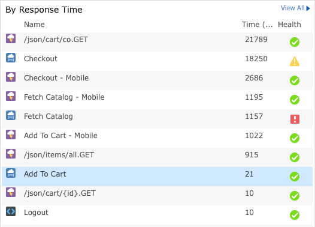

[AppDynamics](https://www.appdynamics.com/) is a powerful Application Performance Management tool that, properly configured, can provide tremendous insight in to application and infrastructure performance bottlenecks and enable operations and development teams to rapidly identify and resolve issues.  Although AppDynamics collects and measures application performance data out of the box, some configuration and customization is necessary in order to reach its full capabilities.  This guide explains best practices around how to identify your application's critical _business transactions_ in order to get the most out of AppDynamics and, ultimately, the most out of your application and infrastructure.

<!--more-->

### Best Practices Derived from Years of Experience

Through years of experience utilizing AppDynamics to support hundreds of varying  customer applications, the Rackspace [Critical Application Services](https://www.rackspace.com/en-us/enterprise-cloud-solutions/critical-applications) team of Application Support Engineers have developed a streamlined way to quickly identify, configure, and start measuring the most important _business transactions_ in any given application.

### Business Transactions Conceptualized

AppDynamics introduces several concepts that are important to grasp in order to ensure that you're getting the most relevant and actionable data including _business applications_, _tiers_, _nodes_ and _business transactions_.  For this guide, we'll be focusing solely on _business transactions_.

In simple terms, a _business transaction_ is the end-to-end process that is taken through your application to serve any given request.  When conceptualizing these transactions, it's best to think of them from a business or end-user perspective (e.g. What is the end-user doing when they execute this transaction?).

### Identifying Critical Business Transactions

With the above information in mind, we can now start to identify our critical _business transactions_.  For example, in an eCommerce application, some critical transactions we'd want to measure might include:

* Home Page
* Browse
* Search
* Category Page
* Product Details
* Add to Cart
* Checkout

Depending on the scope of the application, it may be necessary to involve other teams and stakeholders within your business to ensure that all critical paths through the application have a _business transaction_ defined within AppDynamics.

As you can see in the preceding image and examples, when naming _business transactions_ in AppDynamics, it's important to name them in a conversational way.  For example, we may be defining a _business transaction_ based on the servlet's entry URI (e.g. /store/browse/cat), but this would typically be a poor name for a transaction.  Instead, think if you noticed an issue in the application at 2:00 AM and needed to call a teammate to look in to the issue.  Would you say 'We're having an issue with category pages not serving properly' or would you say 'We're having an issue with _slash store slash browse slash cat_'?

As a final word of caution, we need to be cognizant of the fact that AppDynamics's primary purpose is to further development efforts and to troubleshoot performance issues during load tests or P1 production issues.  Often, when implementing AppDynamics in a new application, we might see what appears to be 60-100+ transactions identified as critical.  It may be counter-intuitive at first, but it's important to try to limit the number of _business transactions_.  Having too many transactions causes confusion for users, results in excessive overhead on your application, and generally muddies the waters if transactions are _too_ granular.  An overabundance of transactions might even cause AppDynamics to miss out on correlating information.  Ideally, we should aim for no more than 10-20 critical _business transactions_ per tier.  Of course, there are always exceptions to rules, but this is a good one to keep in the back of your mind as you go through this process.

Once this process is complete, we should have a solid list of the most important _business transactions_ that need to be configured and profiled in order to provide us with the most appropriate and actionable data.
