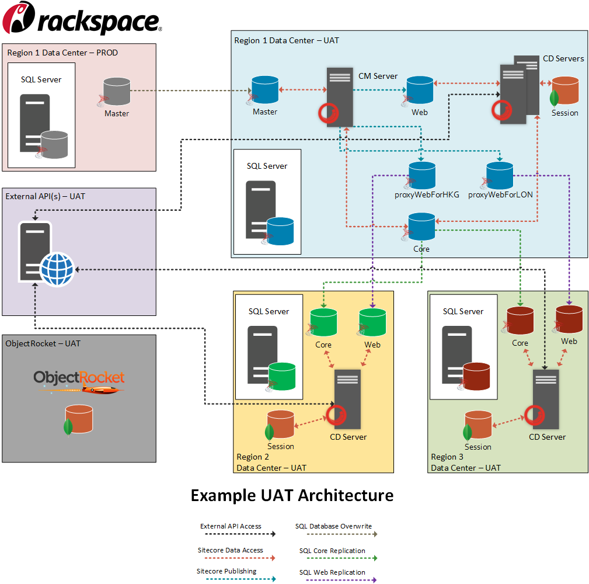

Where do you conduct your User Acceptance Testing (UAT) activities? It's a loaded question that many organizations have challenges addressing as they first need to obtain a clear definition of what what UAT is (and what it isn't) before they even consider where UAT activities should occur. The benefits of a properly instituted UAT environment far outweigh the challenges, and the danger of not having one, but success requires a thoughtful and purposeful approach.

<!--more-->

## What is/What isn't User Acceptance Testing

User Acceptance Testing is intended to be conducted on a production deployable Sitecore site to ensure it meets business requirements. It should not be aimed at defect/bug identification and remediation,, but rather it should validate that the solution built meets the established requirements. To be clear on this point, any bug found during UAT indicates a failure in Unit, Integration, and System testing. Rather than push through "UAT" by patching defects/bugs, UAT should be stopped once the defects/bugs are collected and pushed back to development for resolution and review through the Unit, Integration, and System testing stages prior to re-conducting UAT. While this may seem extreme, failed code will continue to stack and turn UAT into a nightmare for testers, prolonging what should be a solution check into daylong, or even weeklong, bug hunting sessions, instead of reviewing functionality to ensure it meets the usability goals of the system.

UAT is especially critical for Sitecore applications where the public facing nature of a Sitecore site requires a thorough vetting lest a loss of visitors occurs due to a usability revolt. Additionally, developed features may impact the CMS interface, so it is imperative to develop a solid UAT plan both for public facing aspects and also for content editors and administrators.

If properly conducted, UAT yields many game changing benefits for organizations that embrace a strong testing paradigm. Some of the most common ones include:

* Testing a complete system to ensure it meets the stated requirements versus testing in silos where uncertainty of how the entire system integrates will occur.

* Ensuring a "One to One" where deployment to Production can occur with confidence that what is deployed is functional.

* Providing a final safeguard for defects/bugs that can be pushed down to development for resolution before re-conducting UAT and deploying to Production.

* Avoiding live failures by testing outside of the Production environment (aka, NEVER TEST IN PRODUCTION!).

* Avoiding the costs of failed releases.

# The Use Case for a Dedicated Sitecore UAT Environment

Where UAT occurs is just as critical as how it is conducted. Across the spectrum of non-UAT conformity is testing in silos within development environments to testing in Production. Establishing a UAT environment that mirrors the infrastructure architecture of Production ensures that the complete solution can be tested as if it were live, without impacting the actual Sitecore site currently accessed by users (public and content administrators). This, combined with the benefits listed in the previous section, is all the rationale your organization should require to establish a dedicated UAT environment. The benefits, and conversely drawbacks, are simply too great to not embrace this paradigm.

Per managing the actual UAT environment, it should be cared for with the same level of focus as Production. This may include leveraging consolidated monitoring so UAT can be carefully analyzed, benchmarked, and compared the same way one might monitor a Production site as this will quickly uncover development issues.

## Common Challenges

Obtaining and maintaining a strong UAT environment is not without its challenges. Fortunately, most of these come down to "simple blocking and tackling" to ensure a "One to One" of UAT and Production. Others are more complex, such as stakeholder buy-in to construct the UAT environment. Common challenges include and are not limited to:

* **Understanding and selling the ROI of UAT to stakeholders** : Objectifying the value by considering the costs and resources of failed releases and potential customer impact goes a long way in winning over stakeholders.

* **Ad hoc code additions versus centralized deployment** : Development teams should check their code in a centralized code repository for deployment to UAT, preferably by a tool such as [Team Development for Sitecore (TDS)] (https://www.teamdevelopmentforsitecore.com) or [Octopus Deploy] (https://octopus.com).

* **Out of sync content** : Rather than create content in UAT, a pull down of the Master database from Production over the UAT Master database allows content to stay up to date. More on the techniques and tools for this activity are offered later this article.

* **External APIs, connections, and databases tied to Production** : UAT should be a mirror of Production, including external APIs, connections, and databases. Simply imagine the scenario where a tester in UAT enters data and it ends up in production. Sadly, this occurs far too often and can be prevented by creating a UAT version for these aspects.

# Creating a Sustainable UAT Plan

Successful UAT is part infrastructure, part governance. Creating a repeatable and sustainable UAT plan requires some structure but should not be overthought. While your UAT plan may differ, here are some sample steps to consider:

1. Clearly document when UAT activities occur, the UAT refresh process, and the testing process (ex. which servers/regions come first, how users should test and document, etc.).

2. Create Test Cases and ensure that testers understand the business requirements of what they are testing.

3. Have a Test Leader who understands the complete vision of the Sitecore site, as well as serving as both project manager and analyst. They provide oversight and maintain any centralized documentation and communication.

4. Create Testing Teams and rotate them on a regular basis to ensure that the bias towards a feature is removed and that a fresh set of eyes is reviewing the functionality.

5. Conduct UAT by running through the Test Cases and having the Testing Teams, or Test Leader, document any requirements gaps, defects, and bugs.

6. Push down the list of requirements gaps, defects, and bugs to the development team(s) for remediation and have them remediate the issues before running it through Unit, Integration, and System testing.

7. Re-deploy the code to UAT once the remediation and Unit, Integration, and System tests are complete.

8. Repeat Step 5 until all issues are remediated with the expectation that the UAT is focused on business requirements being met versus "bug hunting".

9. Sign off on the UAT, and deploy to Production.

## Example UAT Environment and Refresh Process

The following example offers a sample UAT environment that highlights the data connections and flows across a multi-region Sitecore Farm that mirrors a Production environment in its architecture. Notice that content is refreshed via the Production Master database over the UAT Master database (we will explore options to perform this momentarily). This assumes connections to external APIs that are dedicated to UAT and that it is using Sitecore xDB functionality with [ObjectRocket](https://objectrocket.com/) as the MongoDB backend.

The process for refreshing the UAT environment is as follows:

1. Deploy the code that has successfully passed through Unit, Integration, and System testing to the UAT environment. Centralized deployment via a tool such as Team Development for Sitecore (TDS) or Octopus Deploy is best practice versus multiple sources committing code.

2. Refresh the content in the UAT Master database with the content in the Production Master database. The goal of this refresh is to ensure that you have the content necessary to test functionality. It does not need to remain in constant sync with Production but should be kept reasonably up to date, possibly on a nightly schedule. A few methods to achieve a content refresh are as follows:
    * **[RAZL (Recommended)] (https://www.razl.net):** Cost effective tool to compare and merge Sitecore databases, inclusive of scheduling
    * **[SQL Backup and Restore](https://msdn.microsoft.com/en-us/library/ms190436.aspx):** A full backup and restore will overwrite the user accounts and permissions in UAT with Production, so you need to change the UAT Master database to the correct users and permissions settings post restore
    * **Custom SQL Script or Data Copy (Not Recommended)**

3. Once the content in the UAT Master database is refreshed, perform a full publish to update the remainder of the UAT environment.

4. Verify that any external connections, such as the .config files tied to APIs and ObjectRocket, are targeted to UAT. In normal practice, your UAT build would have the connections targeted for UAT, while the Production build has connections targeted to Production.

## It's Never Too Late to Establish a UAT Environment

So when is the right time to establish a fortified and governed UAT environment? The answer is now, not later, and you are not too late! Start by creating a roadmap that clearly details the business benefits, architecture, and proposed plan for managing UAT Testing in your dedicated UAT environment. In the very least you will have a strong business case to take to your stakeholders with the aim of moving your organization further down the DevOps path towards Continuous Deployment.

If the process of establishing your UAT environment seems overwhelming, you are not alone. Many organizations struggle with both the technical and governance implications of this paradigm shift. Rackspace guides clients through this process from roadmap to realization, working as a full partner to proactively help our customers uncover and resolve potential issues across their Sitecore implementation via a deep team of Sitecore experts.
