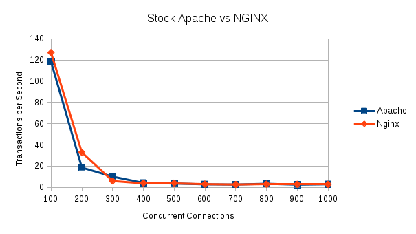

A Performance comparison: Apache vs NGINX and OpenStack Keystone
================================================================

In a previous [article](https://developer.rackspace.com/blog/keystone_horizon_nginx_Ubuntu_1604),  I showed how to configure keystone to run behind NGINX instead of current recommended configuration using Apache. Since its inception, NGINX has enjoyed significant growth in the web server space. Netcraft monthly data web server market share for NGINX has grown significantly since its introduction. Data for May 2016 can be found at: https://news.netcraft.com/archives/2016/05/26/may-2016-web-server-survey.html
<!--more-->

From that data, it is clear that in the OpenStack, Linux based world there are two web server leaders and potential choices to run as an interface for Keystone. In making this choice, there are a number of factors to consider, including ease of set up, security, and server performance.

NGINX is viewed as being easier to configure, however there is a learning curve for those not familiar with it. I wanted to see if there were any significant differences in terms of performance between NGINX and Apache as the interface for Keystone. For those running OpenStack at scale, this could be a significant factor in deciding which server to use.

Currently, the recommended configuration for Keystone uses Apache as the front-end connecting to the Keystone python code using mod_wsgi. Replacing Apache with NGINX requires a wsgi interface. Of the several available, I decided on uwsgi. uwsgi is easy to set up, and published benchmarks show that it performs well.

Goals for the testing: (1) Establish the maximum transaction rate that could be obtained for Keystone running behind Apache, identify what portion of the code would be the performance limiter - keystone or the front end web server. (2) Find the limitations of the default Apache configuration that comes with OpenStack. (3) Test NGINX with a similar configuration. (4) Find if both Apache and NGINX could be tuned to improve performance, especially under heavy loading conditions.

I tested on virtual machines created under OpenStack, Apache and Keystone executed on a dual core server, running Ubuntu 16.04, with 4G RAM. At the time of the testing, no other VM activity in the OpenStack environment affected the test results. Keystone was installed from source, using the Mitaka release. Keystone was the only OpenStack service running on server under test. The database server running MySQL was on a separate server running on a server which had 4 cores with 8G RAM.

Seige (https://www.joedog.org/siege-home/) was used to load test keystone.

The Siege query repeatedly queryed Keystone for a list of projects using an http request including the token as a header in the request. Since only two projects had been created, the complete response fit within a single TCP packet. The test software (Siege) only needed to check the packet size and that there was a 200 response code in the packet. The token was obtained using curl and stored as a shell variable for reuse in each query. The command to obtain a token was:

    export OS_TOKEN=`curl -i -H "Content-Type: application/json" -d '{ "auth": { "identity": { "methods": ["password"], "password": { "user": { "name": "'"$OS_USERNAME"'", "domain": { "id": "default" }, "password": "'"$OS_PASSWORD"'" } } }, "scope": { "project": { "name": "'"$OS_TENANT_NAME"'", "domain": { "id": "default" } } } } }' https://10.0.1.3:5000/v3/auth/tokens|grep "X-Subject"|cut -d' ' -f2`

I have found that a recently started Apache server takes a while to get all of its wsgi processes/threads started and connected to database, so I executed a short siege run to get everything going before I ran the test series.

The warmup run was:

    siege -c 200 -t60s -H "X-Auth-Token: $OS_TOKEN"  https://10.0.1.3:5000/v3/projects

This gets the Apache server loaded before doing the performance testing runs. As a side note, NGINX did not seem to need this preloading, but I did it on NGINX for consistency

The performance tests were run in two parts, first, scale from 10 concurrent connections to 100 connections using the command:

    for II in {10..100..10}; do siege -c $II -t120s -H "X-Auth-Token: $OS_TOKEN"  https://10.0.1.3:5000/v3/projects; sleep 30; done

Next, obtain a new token and sweep from 100 concurrent connections to 1000 connections using this command:

    for II in {100..1000..100}; do siege -c $II -t120s -H "X-Auth-Token: $OS_TOKEN"  https://10.0.1.3:5000/v3/projects; sleep 30; done

Apache2 was installed using the configuration that comes in the Keystone source code, running behind Apache using mod_wsgi. The OpenStack Keystone/Apache reference configuration uses 5 wsgi processes with 1 thread per process. The NGINX configuration from my blog article uses 10 uwsgi processes and 2 threads per process, which I used in my initial comparison. Although these potentially could give vastly different  levels of performance due to the number of additional processes available to NGINX, both NGINX and Apache came very close to each other's maximum number of transactions per second (see the graphs below). This is due to the fact that it the performance limiter is the keystone code and not the web-server code. To establish this, I used `top` to monitor the CPU load while running a load test. For Apache, the wsgi processes completely dominated as the top consumers of the CPU and uwsgi processes for NGINX. These processes are the ones running the Keystone code.

Illustration 1 shows the results from 10 to 100 concurrent connections for both servers, which gave vary similar results. However as seen below, they both ran into problems running from 100 to 1000 concurrent connections (Illustration 2). At 200 concurrent connections, both servers were overwhelmed and started having a large number of failed transactions.

At the higher numbers of concurrent connections, the log files of both servers show 503 errors, happening when the server tried to connect to the wsgi or uwsgi processes running Keystone. The errors occured due to a lack of available connections.

Tuning for both environments:

Increase the number of MySQL connections from 100 (default) to 200.

Apache tuning:

Change the wsgi processes to 38 and threads to 4 (/etc/apache2/sites-enabled/wsgi-keystone.conf)

mpm event tuning: (/etc/apache2/mods-enabled/mpm_event.conf)

    StartServers               2
    ServerLimit               15
    MinSpareThreads          200
    MaxSpareThreads          225
    ThreadLimit              225
    ThreadsPerChild           35
    MaxRequestWorkers        225
    MaxConnectionsPerChild   0

/etc/apache2/sites-enabled/wsgi-keystone.conf

    MaxKeepAliveRequests 100 to 500
    KeepAliveTimeout 5 to 20

NGINX tuning:

Increase the number of NGINX workers:
/etc/nginx/nginx.conf
    worker_rlimit_nofile 30000 (this will have an impact on the number of open files needed)
    worker_connections 7000

/etc/uwsgi-emperor/vassals/keystone-main.ini

    workers = 38
    threads = 5
    listen = 5000 (this provides some buffering between NGINX and uwsgi)

in /etc/sysctl.conf

    net.core.somaxconn = 8196

which sets /proc/sys/net/core/somaxconn to 8192

Setting uwsgi listen to 5000  and the NGINX worker_rlimit_nofile to 3000 requires that the open file limit be raised above the default of 1024.

in /etc/sysctl.conf

    fs.file-max = 2097152

in /etc/security/limits.conf

    * hard nofile 655360
    * soft nofile 655360

After tuning, the 10 to 100 connections chart is virtually identical (Illustration 3) to the stock chart (Illustration 1).

However the 100 to 1000 connects chart shows a different picture. NGINX was able to handle up to 1000 concurrent connections without a problem, but Apache started having failed transactions above 700 concurrent connections. At this point, siege starts reporting failed transactions (503 errors) along with the longest transaction time for Apache growing to over 80 seconds..

Since NGINX uses uwsgi, the uwsgi  listen parameter sets the socket listen queue size. This provides some buffering between NGINX and the uwsi processes, which seems to prevent NGINX from overrunning uwsgi for the loads tested. Apache does not have any such buffer when running wsgi. Perhaps changing Apache to use uwsgi would be helpful in heavily loaded situations.

Looking at the results and watching the server while the performance test while running, it seems clear that the keystone python code is the performance limiting factor rather than Apache or NGINX. Tweaking the number of threads or processes within either Apache or NGINX will deliver very modest gains at best. The fact that NGINX is using uwsgi (and that uwsgi has several tunables) gives it an advantage in heavy load conditions. These tunables allow NGINX to handle a much higher number of concurrent connections than Apache.

I did try running Apache using mod_uwsgi to see what effect that might have. The recommended solution is mod_proxy_uwsgi, but a bug in the current Ubuntu operating system package prevents it working with Unix sockets. Siege had a bug which limited me to a maximum of 1000 concurrent connections. I used Apache Bench to test both Apache and NGINX using uwsgi, and both servers were able to handle up to 2000 concurrent connections with no errors.

Bottom line, the performance of Keystone using either Apache or NGINX was very similar, however uswgi out performed mod_wsgi on Apache under very heavy loads. The web server to use is a matter of preference, but consider using uswgi as opposed to mod_wsgi on Apache.
