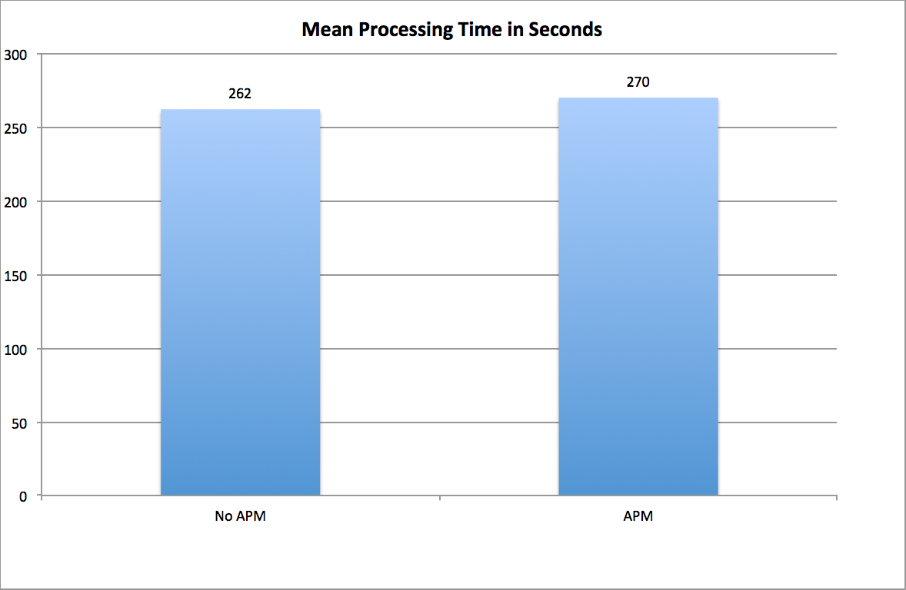

Application Performance Management (APM) tools can provide incredibly valuable insight into the performance of your applications and ultimately your end users' experience.  This insight, however, does not come without its cost.  Because APM tools instrument code at runtime, there is always some level of performance overhead.  In contrast to some older APM tools, modern APM tools are designed to minimize the negative performance impact as much as possible to allow you to safely run them in production without your end users' experience suffering.  In this post, we'll evaluate the overhead introduced on an Adobe Experience Manager (AEM) environment by two popular APM tools: [AppDynamics](https://www.appdynamics.com) and [New Relic](https://www.newrelic.com)

<!--more-->

### The Test

To evaluate the performance impact from introducing these agents, we conducted a series of tests designed to minimize outside variables.  Our testing environment consisted of an AEM 6.2 application running on Rackspace's Managed Virtualization offering.  We used Adobe's [ToughDay](https://docs.adobe.com/docs/en/aem/6-2/develop/test/tough-day.html) tool to execute a simple test case that mimicked an authoring user uploading a large amount of digital assets into the repository.

To prevent any confounding variables (such as AEM maintenance operations, workflow/rendition processing or others), we completely scrubbed the application environment and rebuilt it from the ground up after every test by using the [Rackspace MAS](https://www.rackspace.com/digital/managed-application-services) automation infrastructure.  This ensured consistency and repeatability over our test cases.

We started by executing multiple runs of the test against the environment with no APM tool in place as a control.  Once the results of these tests had been recorded, we repeated the tests an identical number of times with New Relic and AppDynamics Java APM agents in place.  With these numbers in hand, we were able to calculate the performance overhead from loading an APM tool.

### The Results

Before we dive in to the results, it's important to note that the overhead of APM tools varies depending on the application and current usage patterns.  While our tests illustrate (and give us a general idea of) the performance overhead, these results may not match your particular environment.

Our control test case with no APM agents had a mean processing time of 262 seconds, and the tests using APM tools had a mean processing time of 270 seconds.  Overall, the increase is minimal, and it's on the lower end of New Relic's and AppDynamics' advertised performance overhead.

### The Takeaway

While it's true that APM tools *do* have a measurable impact on your application's performance, modern APM tools like New Relic and AppDynamics have all but eliminated this performance overhead.  There is still a trade off, but the amount of insight into your application's performance these tools bring can help you to reduce time to resolution, identify code problems before they hit production, more effectively use your application's infrastructure, and ultimately improve your end user experience.  With that in mind, choosing to instrument your application with an APM tool seems like a pretty clear choice.
