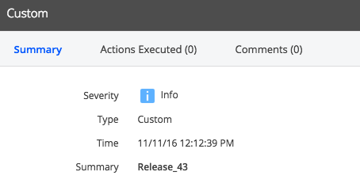
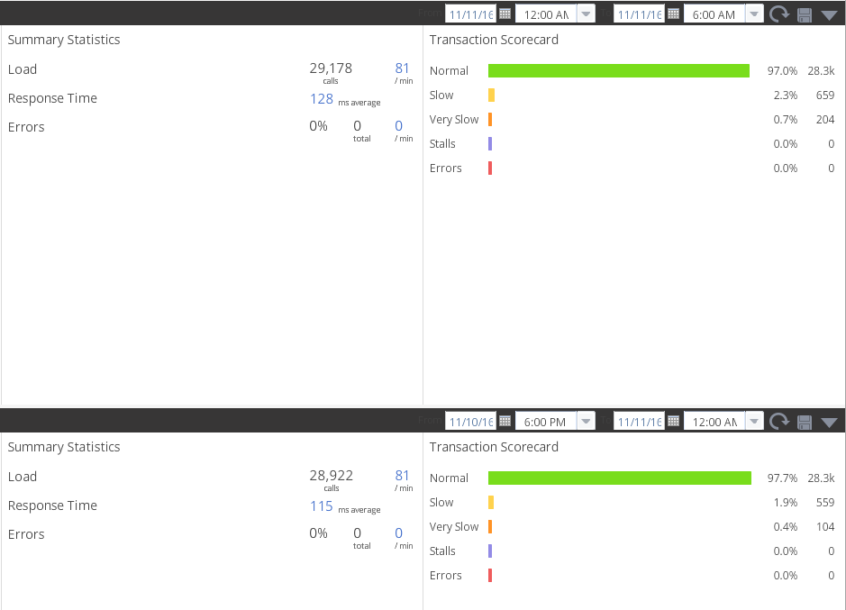

As we've discussed in previous posts, [AppDynamics](https://www.appdynamics.com) is a powerful Application Performance Management (APM) tool that can be used to help tune performance in your application.  However, with many organizations adopting a CI/CD approach to their application development lifecycle, it can be difficult to determine how these frequent deployments are affecting application performance and end-user experience.

<!--more-->

Fortunately, AppDynamics includes two features that can easily allow us to automatically record a deployment event within AppDynamics and use that as a reference for comparing releases.

### Deployment Markers

AppDynamics events can be triggered for a variety of reasons including health rule violations, application state changes (like a restart) and others; however, the API also allows us to create [custom events](https://docs.appdynamics.com/display/PRO42/Alert+and+Respond+API#AlertandRespondAPI-CreateaCustomEvent).  By taking advantage of this feature, we can modify our deployment process to include a REST API call to trigger a custom event and programmatically record deployments within AppDynamics itself.

The process is simple enough.  We can use cURL we can plug in the appropriate variables and create our API call.  For example, we might use something like this:

`curl -X POST --user user@account:password 'https://url.for.appdynamics.controller/controller/rest/applications/1189/events?severity=INFO&summary=Release_43&eventtype=CUSTOM&customeventtype=Deployment'`

In this example, I've hard-coded the release number, but it should be trivial to include your release number as a variable here for greater flexibility.  After executing this API call, we can now see the event within the AppDynamics console:

### Release Comparison

Now that we have our deployments automatically being recorded within AppDynamics as an event, we can use these timestamps as a starting point for later analysis.  This is where the [Compare Releases](https://docs.appdynamics.com/display/PRO42/Metrics+and+Graphs) function of AppDynamics comes in handy.

The Compare Releases functionality is straight forward.  All we have to do is pick a time frame before the recorded release time and pick one after the recorded release time to compare.  AppDynamics will allow us to compare performance in broad and granular capacities.

