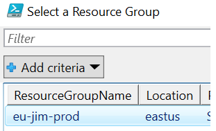
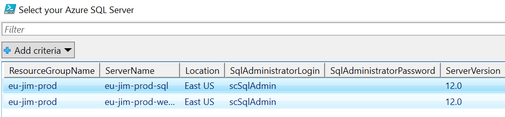
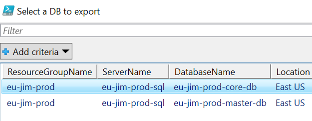
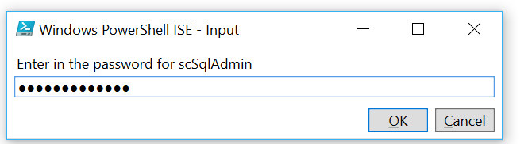
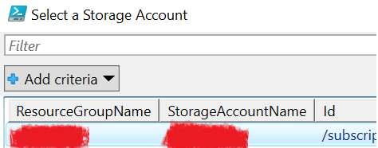
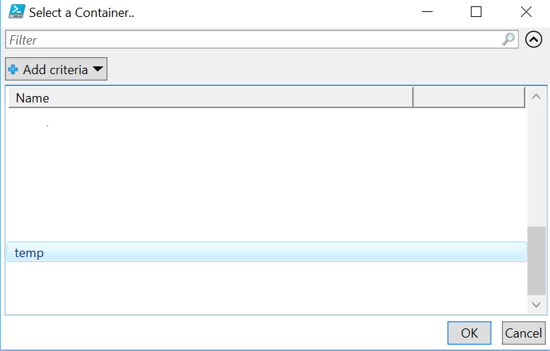
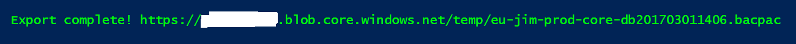

Azure SQL is Microsoft's answer to Platform as a Service for SQL Server. It extracts a lot of the day to day administrative tasks of managing an installation. Let’s take a look how a consumer of Azure SQL can export data to restore to a local on-premise installation.

<!--more-->

Most SQL Server users are familiar with the concept of doing a backup using SQL Server Management Studio resulting in a backup (.bak) file. With Azure SQL, backup files are not supported, but instead BACPAC files are generated. A BACPAC file contains the database schema and data. If you want to generate a BACPAC file, you can use the Azure portal, but that becomes tedious when you are doing a lot of exports each day on random databases. After doing a few exports using the portal, I decided to write up a PowerShell script with prompts to choose a DB and export to a storage container.

Clone or download my repo [Here](https://github.com/jrudley/export-AzureSqlDb) to grab the PowerShell script that lets you download Azure SQL BACPAC files. Assuming you have [Azure PowerShell](https://azure.microsoft.com/en-us/downloads/) installed, you can pass in some parameters to omit certain prompts or just run it and answer the prompts. If you run the command **.\Export-AzureSqlDB.ps1 -statusBar**, it will prompt for the following:

* Azure subscription

* resource group

* Azure SQL Server

* Azure SQL DB to export

* Azure Sql Server Admin Password

* Azure Storage Account

* Azure Storage Container. Optionally, you can use the switch statusBar to give the progress of the export.

The script will export out the BACPAC uri which you can download the BACPAC file

<a class="cta red" id="cta" href="https://www.rackspace.com/dba-services">Learn more about Databases</a>

Visit [www.rackspace.com](https://www.rackspace.com) and click **Sales Chat**
to get started.

Use the Feedback tab to make any comments or ask questions.
