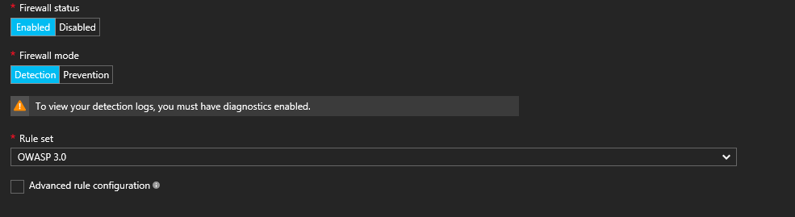
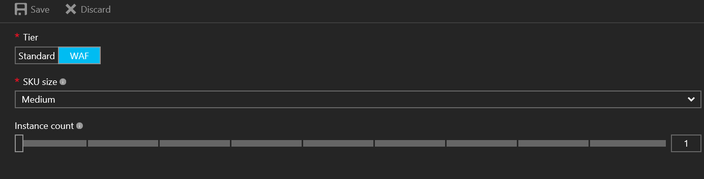

As more web application workloads move to the cloud, organizations need to be concerned about attacks from the internet. External threats are scanning public IP ranges to find known vulnerabilities and exploit businesses. Let's take a look at the Azure Application Gateway (WAF), and see how it can be a part of our toolset for protecting our web applications.

<!--more-->

The Azure Application Gateway is a layer 7 load balancer with two SKUs to distinguish between Standard and Web Application Firewall. For this article, we will focus on the latter. The WAF SKU is a Standard SKU, providing all the rich features of a layer 7 load balancer, but now also serves as a web application firewall. The WAF protects from your common web based exploits. The OWASP rule set is based on OWASP 3.0 or 2.2.9 and the rule list can be viewed [here](https://docs.microsoft.com/en-us/azure/application-gateway/application-gateway-crs-rulegroups-rules). You can also enable or disable specific rules by following the instructions [here](https://docs.microsoft.com/en-us/azure/application-gateway/application-gateway-customize-waf-rules-portal)

There are 2 options to select for the firewall mode: detection or prevention. Detection mode is normally used to see what kind of attacks or exploits are happening against your web application. Prevention mode will try to blocks malicious traffic that matches the OWASP rule set.



The minimum requirement to deploy a WAF into Azure is to select the WAF tier and choose either medium or large for the instance size. For production workloads, it is strongly recommended to have 2 instances selected to be covered by the SLA.



If you have diagnostics enabled, you can view your detection logs. Currently, you can archive the logs to a storage account, stream to an event hub, or send to log analytics. The 3 types of logs currently available are ApplicationGatewayAccessLog, ApplicationGatewayPerformanceLog, and ApplicationGatewayFirewallLog. The only metric available measures throughput of the application gateway in bytes per second.

To see the WAF in action, browse to your web application using the public ip address. I have selected ApplicationGatewayFirewallLog to be placed in a storage account. To easily navigate to the json log, open up the Diagnostics logs in the application gateway blade. You can download the json file from there.

```
			 "operationName": "ApplicationGatewayFirewall",
			 "time": "2017-04-11T13:37:09.1216047Z",
			 "category": "ApplicationGatewayFirewallLog",
			 "properties": {
  "instanceId": "ApplicationGatewayRole_IN_0",
  "clientIp": "123.456.789.11",
  "clientPort": "37220",
  "requestUri": "/favicon.ico",
  "ruleSetType": "OWASP",
  "ruleSetVersion": "3.0",
  "ruleId": "920350",
  "message": "Host header is a numeric IP address",
  "action": "Detected",
  "site": "Global",
  "details": {
    "message": "Warning. Pattern match \"^[\\\\d.:]+$\" at REQUEST_HEADERS:Host.",
    "data": "52.168.133.16",
    "file": "rules/REQUEST-920-PROTOCOL-ENFORCEMENT.conf",
    "line": "793"
  }
  ```
My WAF was set to Detection mode, and the action above is **Detected**. If I set the WAF to Prevention, it would say **Blocked**

```
			 "operationName": "ApplicationGatewayFirewall",
			 "time": "2017-04-11T13:44:12.5492048Z",
			 "category": "ApplicationGatewayFirewallLog",
			 "properties": {
  "instanceId": "ApplicationGatewayRole_IN_0",
  "clientIp": "123.456.789.11",
  "clientPort": "21219",
  "requestUri": "/favicon.ico",
  "ruleSetType": "OWASP",
  "ruleSetVersion": "3.0",
  "ruleId": "920350",
  "message": "Host header is a numeric IP address",
  "action": "Blocked",
  "site": "Global",
  "details": {
    "message": "Warning. Pattern match \"^[\\\\d.:]+$\" at REQUEST_HEADERS:Host.",
    "data": "52.168.133.16",
    "file": "rules/REQUEST-920-PROTOCOL-ENFORCEMENT.conf",
    "line": "793"
  }
  ```
The WAF is just another tool for your tool belt, but there is a lot more needed to have a secure footprint in today's world. If your organization has limited expertise, governance and compliance concerns, or wants to build a bigger footprint for securing your organization, you may need a team rather than just a tool. Rackspace Managed Security can design and build a service to detect and respond to advanced persistent threats, along with building a security solution tailored around your business needs. Cyber security is evolving every day, and new challenges are rising. To view more information about the Rackspace Managed Security offering, please click [here](https://www.rackspace.com/en-us/managed-security-services)
