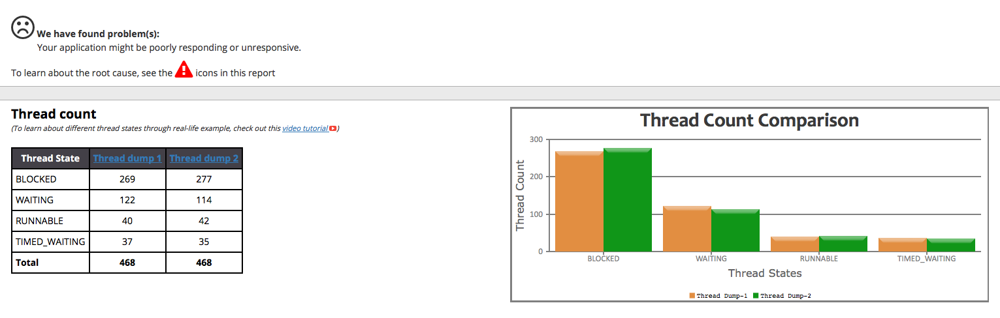
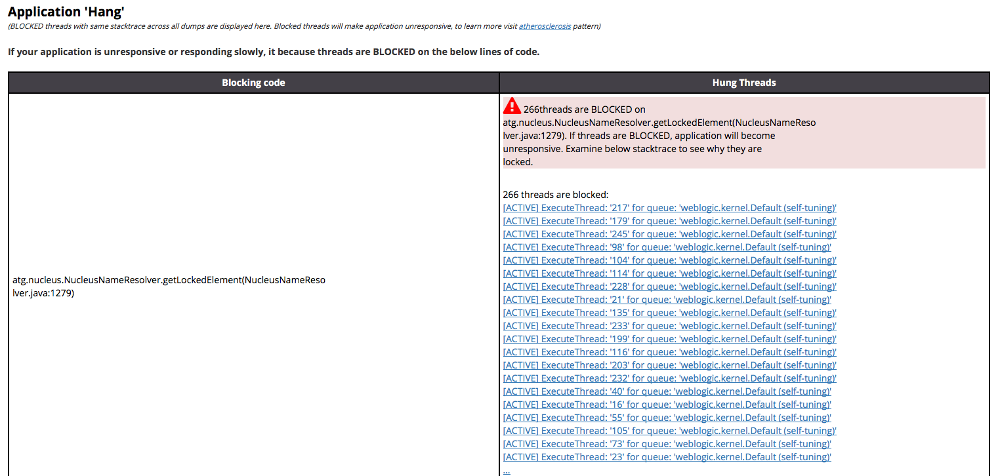

Long running threads, application locks, thread contention, and other problems can all cause significant performance problems in Java applications (up to and including a complete lock up of the Java Virtual Machine (or JVM)!)  Thread dumps are a vital tool in analyzing and troubleshooting performance problems in Java applications.  They represent a point-in-time snapshot of the stack traces for all active threads that exist within the JVM.  Typically, in order to troubleshoot these issues and get to the root cause, an engineer takes several thread dumps approximately 5-15 seconds apart.  In this way, we can compare the state of all threads to determine commonalities -- namely, threads that are long running, blocking other threads, leading to circular deadlocks, and so on.  In large applications, you may have thousands of threads, which can make this analysis a challenging prospect.  In this article, we'll discuss how we can use a tool called [fastthread.io](https://fastthread.io/) in order to offload most of the heavy lifting and give us immediate insight in to the state of the application threads.

<!--more-->

### Taking thread dumps

While there are many ways to take thread dumps, one in particular is particularly suited to feeding in to fastthread.io.  I prefer to use `jstack`, which is bundled with the JDK.  Depending on your system's Java installation, this binary may not be located in your user's path, but it can typically be found at `${JAVA_HOME}/bin/jstack`.  In order to capture the necessary data to troubleshoot a problem, remember that because thread dumps are just a point-in-time snapshot, they must be taken while the performance problem is occurring.  Once you've located `jstack`, it's as simple as this:

`$ jstack -J-d64 -l <PID of JVM> >> /path/to/threaddump/location.txt`

Execute this command, wait 5-15 seconds, then repeat until you have three thread dumps.

### Off to fastthread.io

With these thread dumps in hand, we can point your browser to [https://fastthread.io](https://fastthread.io) and upload your thread dumps.  fastthread will give you a thorough analysis and point to potential problem spots that warrant further investigation.

In the preceding images, you can see a small representation of some of the visual analysis that fastthread can provide.
