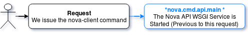
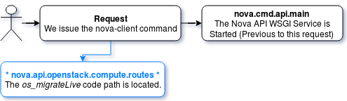
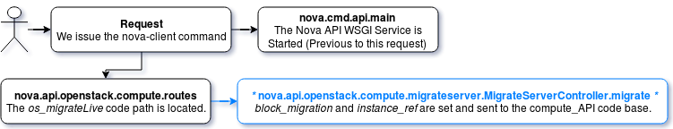
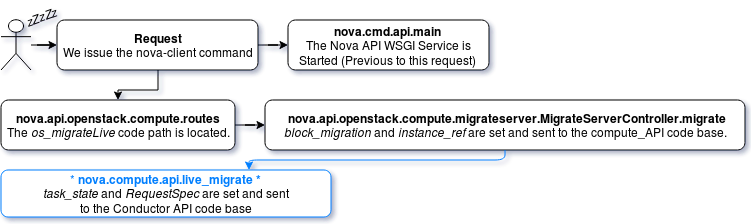
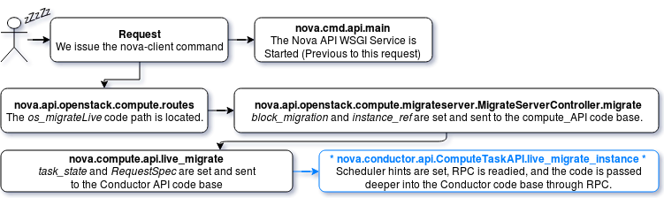
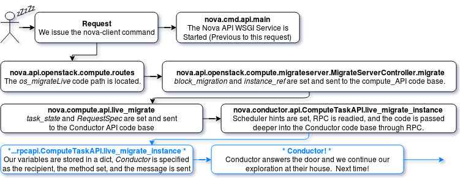

The OpenStack live migration process is one of the most vital processes in the compute drivers, but it is also easily one of the most complex. This complexity drove my curiosity to better understand what is happening under the hood, and I wanted to share that knowledge with you. In this article, we dive deep into the OpenStack codebase, but first, the article does assume a few things.

<!--more-->

### Assumptions

- The `Virt Driver` in use is XenAPI, so we will spend some time in that code base.
- I use ellipses to skip some basic *set* and *get* instructions for clarity (no need to re-invent the wheel here).
- Finally, while I go deep into the entire process, there may be sections where skipping through code is beneficial, such as skipping past RPC sections once we cover this once, skipping over the majority of the Scheduler Process, and Networking Configuration.  This skipping allows us to focus more on the process as a whole and to not get too in-depth with Neutron and Nova-Scheduler information.

Throughout the article, I share some code and explain what's going on or highlight interesting points. Due to the complexity of this process, the discussion is split into several articles with flowcharts to maintain clarity. Today, let's explore Nova APIs role in the process and follow along until it passes responsibility to the Nova Conductor service.

#### Exploration 1

Let's first examine the nova-client instruction:


    nova live-migration [--block-migrate] <server> [<host>]


I submitted a request for a live-migration without --block-migrate and without a host. The Xenserver host does not have shared storage as an option. The request enters the *osapi_compute* API drivers following the path for *live-migration*. This variable is defined within *nova.conf* as `enabled_apis` and then picked up from *nova.cmd.api.main* as shown in the following sample.

#### Exploration 2

The *osapi\_compute* service is defined in *nova.openstack.compute.wsgi.py* with a simple *init_application* method. This tells us that *nova.openstack.compute* is the home of the API methods. The operation then looks for the *live_migration* call in the built-in list of routes within the *nova.openstack.compute.wsgi* service. These routes are defined and tell us where to look for the API method that handles this action.

*nova.cmd.api.main* ->

    def main():
    ...
    for api in CONF.enabled_apis:
        should_use_ssl = api in CONF.enabled_ssl_apis
        try:
            server = service.WSGIService(api, use_ssl=should_use_ssl)
            launcher.launch_service(server, workers=server.workers or 1)
    ...


#### Exploration 3

The Route list is defined to tell our request where to go. A migration request is a server action, so it triggers the `action` request, which sends us into `server_controller`, which resolves down to `migrate_server` / `nova.api.openstack.compute`. The request for a live_migration sends the specific request of *os\_migrateLive* to identify the correct method to use and then continues.

*nova.api.openstack.compute.routes* ->

   def routes():
    ...
    from nova.api.openstack.compute import migrate_server
    ...
    server_controller = functools.partial(_create_controller,
        ...,
        migrate_server.MigrateServerController,
        ...)
    ...
    ROUTE_LIST = (
	...
	('/servers/{id}/action', {'POST': [server_controller, 'action']
	...


#### Exploration 4

Here the API sets a couple of important variables. It looks at the first if the `--block-migrate` flag was included. The default behavior of *block_migration* is to contain the `auto` key unless overridden by including the `--block-migrate` parameter. If the `auto` key is still included, set this to `None`, otherwise set it to a Boolean rather than `True`. We get the instance information because this is vital for migrating an instance and passing the instance, context, and block_migration over to the Compute API, which is resolved down to *nova.compute.API.live_migrate*. Finally, you can see that we actually get to this code by the reference of the `@wsgi.action` profiler

*nova.api.openstack.compute.migrate\_server.MigrateServerController* ->

class MigrateServerController():
    ...
    from nova import compute
    ...
    self.compute_api = compute.API()

    @wsgi.action('os-migrateLive')
    def _migrate_live(self, req, id, body):
      ...
      block_migration = body["os-migrateLive"]["block_migration"]
      ...
      if api_version_request.is_supported(req, min_version='2.25'):
        if block_migration == 'auto':
            block_migration = None
        else:
            block_migration = strutils.bool_from_string(block_migration,
                                                            strict=True)
      ...
      instance = common.get_instance(self.compute_api, context, id)
      try:
	self.compute_api.live_migrate(context, instance, block_migration,
                                          disk_over_commit, host, force, async)


#### Exploration 5

We have made the rounds through the basic Nova API service and kicked off the asynchronous request to start the live migration. I issued this request , which sent a *os-migrateLive* action by using the nova client. We traced this through the confusing WSGI process, which eventually set the *block\_migration* variable and the instance variable, passing them both to the *self.compute_api.live\_migrate* method. We know (by looking at the imports at the beginning of the previous psuedocode sample) that we can resolve this to be *nova.compute.api.live\_migrate*.

These are the first steps for firing off this live migration. I set the initial *task_state* of the server to `MIGRATING` and pulled the *RequestSpec*. This *RequestSpec* comes from the *nova.objects.RequestSpec.get_by_instance_uuid* method and is passed into scheduler a little bit later on. The *RequestSpec* contains details about the instance that the scheduler needs to verify to determine whether enough room is present to complete the process. This information includes NUMANodes, vGPU/CPU, Memory, and Disk information. If a host was specified, the method would have included additional relevant code, but this is not important for our purposes - we're allowing the scheduler to go wild. Next, I passed the *RespectSpec*, `None` *host_name* and the *block_migration/disk_over_commit/async* (that was generated in Nova API) to the compute *Task_API*. Again, track this down by examining the imports, and we are now heading into the Conductor API (nova.conductor.ComputeTaskAPI.live\_migrate\_instance). Keep in mind: while we are indeed using the codebase for Conductor, this code is still being run on the Nova API nodes.

*nova.compute.api.live\_migrate* ->

def live_migrate():
    from nova import conductor
    self.compute_task_api = conductor.ComputeTaskAPI()
    ...
    instance.task_state = task_states.MIGRATING
    ...
    request_spec = objects.RequestSpec.get_by_instance_uuid(context, instance.uuid)
    ...
    try:
            self.compute_task_api.live_migrate_instance(context, instance,
                host_name, block_migration=block_migration,
                disk_over_commit=disk_over_commit,
                request_spec=request_spec, async=async)


#### Exploration 6

This almost simple chunk of code sets up a new dictionary with the scheduled host name, but, because I didn't specify this, it's unimportant for our needs. We see from this code that the process calls one of two locations, depending on whether the async setting is included or not. The code also reveals that "async" is essentially a live_migration, because this code calls *self.conductor\_compute\_rpcapi.live\_migrate\_instance*. I kept the includes for this operation to show where it leads.

*nova.conductor.api.ComputeTaskAPI.live\_migrate\_instance* ->

    def live_migrate_instance():
    ...
    from nova.conductor import rpcapi
    self.conductor_compute_rpcapi = rpcapi.ComputeTaskAPI()
    ...
    def live_migrate_instance(self, context, instance, host_name, block_migration, disk_over_commit, request_spec=None, async=False):
    scheduler_hint = {'host': host_name}

    if async:
            self.conductor_compute_rpcapi.live_migrate_instance(context, instance, scheduler_hint, block_migration,disk_over_commit, request_spec)
        else:
            self.conductor_compute_rpcapi.migrate_server(context, instance, scheduler_hint, True, False, None, block_migration, disk_over_commit, None, request_spec=request_spec)


#### Exploration 7

At this point, we run into the problem mentioned previously regarding the RPC service, which enters a land of extreme abstraction. While my knowledge of how these RPC services work is limited, essentially it defines a namespace and sends a message to that namespace through a chosen messenger service. Thus far, we have remained in the Nova API services, but now we are passing a message for Conductor nodes themselves to pick up and begin to work within their own managers. The RPC call for this looks like the following, with the `kw` variable here being the payload passed through messenger.

*nova.conductor.rpcapi.ComputeTaskAPI.live\_migrate\_instance* ->

    def live_migrate_instance():
    ...
    RPC_TOPIC = 'conductor'
    ...
     kw = {'instance': instance, 'scheduler_hint': scheduler_hint,
              'block_migration': block_migration,
              'disk_over_commit': disk_over_commit,
              'request_spec': request_spec,
              }
        version = '1.15'
        cctxt = self.client.prepare(version=version)
        cctxt.cast(context, 'live_migrate_instance', **kw)


The main takeaway at this point in the process is that we will now officially be running on Conductor nodes, and from here the Conductor Manager runs the code that is called (*live\_migrate\_instance*). This code is *nova.conductor.manager* with the *ComputeTaskManager* having an `@profiler` decorator for direction. From here, Conductor conducts and coordinates with various other services to complete the migration process. This is an example of Conductor handling a larger amount of work than just communicating between database and compute node, however, Since so much work is necessary during a live migration, it is nice to have a centralized location (or "command center") where information is passed back and forth during the beginning of this process.

While this chunk of code all runs within seconds in a production environment, it may take our poor human brains some time to digest this information, so let's take a small  break and continue this discussion in our next article.

Continue reading this series by clicking here: [Code Dive Openstack Live Migrations Part 2]()
