In our previous [article](), we began to trace the process of a live migration and explored how Nova API receives this call, processes it, injects basic information about the instance and eventually passes it to our next destination, Conductor. Before we continue the discussion, let's again review our assumptions.
<!--more-->

### Assumptions

- You have read the previous article and understand the data that we have passed, and how we arrived at Conductor
- The `Virt Driver` in use is XenAPI, so we will spend some time in that code base.
- I use ellipses to skip some basic *set* and *get* instructions for clarity (no need to re-invent the wheel here).
- Finally, while I go deep into the entire process, there may be sections where skipping through code is beneficial, such as skipping past RPC sections once we cover this once, skipping over the majority of the Scheduler Process, and Networking Configuration.  This skipping allows us to focus more on the process as a whole and not get too in-depth with Neutron and Nova-Scheduler information.

### Review

Remember that the last thing that we handled was preparing a dictionary fully of all of the variables that we had gathered throughout the Nova API (ex: block_migrate, async, instance, host, scheduler_hints) and left a note in the messenger service for Conductor to receive.  We ensured that Conductor would get this message by specifying a `conductor` namespace and additionally passed the method that we would like for conductor to run the variables through once it received the message. As a reminder, the method that we specified was `live_migrate_instance`.  If you like, review the previous article and its flowchart, and get ready for the new flowchart in this article.  This article is primrily explores Conductor, however a large portion of the work here is handled by Scheduler, the Source Host Machine and the Destination Host Machine.  Conductor acts as a ring leader here, organizing data and setting everything to happen in the correct order, and even with this organization, we are about to see some very confusing situations.

#### Exploration 1

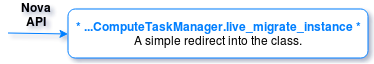

Conductor is a strange beast primarily designed to act as a go-between for compute nodes and the nova database with the goal of adding a layer of security to this process. This theoretically prevents the servers from accessing the database directly, however, in practice, Conductor winds up picking up more weight than some people think it should. When we left the Compute API, we were sent into the *nova.condutor.ComputeTaskAPI.live\_migrate\_instance*. Let's look at the class `ComputeTaskAPI`, which is stored in the *manager.py* file.

The following method is a pattern that is common within services Managers. When a call comes in from an RPC service, it does not immediately handle that work but instead passes the work to a different, private, and internal method.  While initially confusing, this allows the code to be both modular and pythonic in nature.

*nova.conductor.manager.ComputeTaskManager.live\_migrate\_instance* ->

        def live_migrate_instance():
        self._live_migrate(context, instance, scheduler_hint, block_migration, disk_over_commit, request_spec)


#### Exploration 2

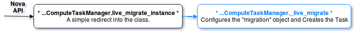

Now, we actually enter the server meat and potatoes. The main purpose of the following method is to build a task object that keeps track of the progress and moves things along. This task also allows me to cancel to the live-migrate prematurely or, if I want to in later API versions, to issue a force complete. It also sets up some basic variables for later use. Some task work is done here, which I'm skipping over because it is more relevant to learning Conductor tasks than the live migration process itself. Breaking down the work here, we create a new "migration" object from the nova primitives set: *nova.objects.Migration*. This creates a basic dictionary set with empty values. Similar to instantiating a new class, this instantiates an empty python object with data that we expect. Next, I fill in some of this data that we already know (such as the instance data, source host, and migration type), create this task, and execute it. From here, the task execution handles the work. Find this task, once it is running, in *nova.conductor.tasks.live_migrate*.

*nova.conductor.manager.ComputeTaskManager* ->

@profiler.trace_cls("rpc")
class ComputeTaskManager(base.Base):
  def _live_migrate():
    destination = scheduler_hint.get("host")
    ...
    migration = objects.Migration(context=context.elevated())
    migration.dest_compute = destination
    migration.status = 'accepted'
    migration.instance_uuid = instance.uuid
    migration.source_compute = instance.host
    migration.migration_type = 'live-migration'
    ...
    task = self._build_live_migrate_task(context, instance, destination,
                                         block_migration, disk_over_commit,
                                         migration, request_spec)
    try:
        task.execute()


#### Exploration 3

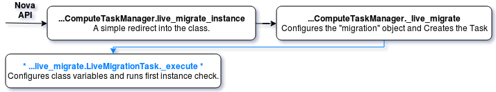

Now, we enter the execution phase, where all of the heavy lifting begins and the chain to complete the migration starts. The following code first calls the scheduler to find a suitable destination. We will refer back to this method several times, because the code splits off completes several very important tasks before returning. Before calling scheduler, however, the method sets up some basic variables within its class definition that are overwritten by subsequent methods. It is important to understand that these are *class* variables or objects and are not method-owned - these variables are not passed around but instead overwrite the class data. Since many of the variables remain within the class, there is no reason for them to be returned or to require much input, and the methods might use these class variables as reference. Since so much is happening here, I've also placed comments inline in the code. Please pay attention to `#*#*#` lines - I will walk you through this as much as possible.

 *nova.conductor.tasks.live\_migrate.LiveMigrationTask(Class.class)* ->

        class LiveMigrationTask():
        def __init__:

            #*#*# We can see here that the data (which we gathered from Nova API and our first little run
            #*#*# through conductor) is being set. The instance information, the source, the block_migration,
            #*#*# the `None` destination, and some other stub data is created that is very important, such as
            #*#*# migrate_data. This will be a valuable variable later on.

            self.destination = destination
            self.block_migration = block_migration
            self.disk_over_commit = disk_over_commit
            self.migration = migration
            self.source = instance.host
            self.migrate_data = None

            self.compute_rpcapi = compute_rpcapi
            self.servicegroup_api = servicegroup_api
            self.scheduler_client = scheduler_client
            self.request_spec = request_spec
            self._source_cn = None
            self._held_allocations = None

        def _execute(self):
            self._check_instance_is_active() -->


The first thing done here is verification that the instance is in an active state - a relatively simple code check that is a private method within the class.

#### Exploration 4

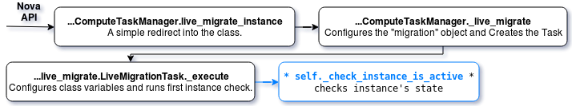

Next, the method checks the power state of the instance. It pulls the data from the class instance variable that was set up in the INIT and which contains the *power\_state* field. An exception is created if this does not match a *running* or *paused* state. Assuming no exception, the execution moves on.

*nova.conductor.tasks.live\_migrate.LiveMigrationTask.\_check\_instance\_is\_active* ->

    def _check_instance_is_active():
        if self.instance.power_state not in (power_state.RUNNING,
                                             power_state.PAUSED):
        raise exception.InstanceInvalidState


#### Exploration 5

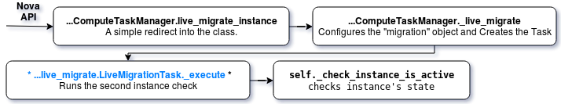

We completed the active check (marked with an 'X' in the following code), and now the process ensures that the host is up. We head to another private method *\_check\_host\_is\_up*.

*nova.conductor.tasks.live\_migrate\_LiveMigrationTask.\_execute* ->

    def _execute():
        self._check_instance_is_active()  (X)
        self._check_host_is_up(self.source) -->


#### Exploration 6

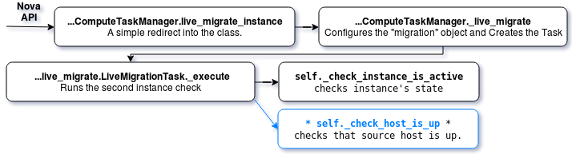

Here's another fairly simple check to verify that the source server is up and online. To do this, it reaches out to the    `servicegroup`, which is the database driver, to run some checks against down time. A long as this returns successfully, we move on again. There is not too much to say about this code, because it mostly relates to the database drivers.  If there's no exception here, we return to the execution.

*nova.conductor.tasks.live\_migrate\_LiveMigrationTask.\_check\_host\_is\_up* ->

    def _check_host_is_up():
        service = objects.Service.get_by_compute_host(self.context, host)
        if not self.servicegroup_api.service_is_up(service):
            raise exception.ComputeServiceUnavailable(host=host)


#### Exploration 7

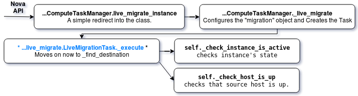

We have completed two basic checks and are skipping some migration allocation code (noted by the ellipses) because this section doesn't have much to do with the current discussion. The skipped sction gets heavilly into the Nova Placement API and the Allocations system, which is beyond the scope of current discussion.

Now that the instance and the source are both verified as good to go, it is time to find that destination! This code checks that a destination was not already given (remember that our destination is `None` so we satisfy the `if not` operator) and overrides *self.destination* and *dest\_node* with the results of *\_find\_destination*.

*nova.conductor.tasks.live\_migrate\_LiveMigrationTask.\_execute* ->

    def _execute():
        self._check_instance_is_active()  (x)
        self._check_host_is_up(self.source) (x)
        ...
        if not self.destination:
            # Either no host was specified in the API request and the user
            # wants the scheduler to pick a destination host, or a host was
            # specified but is not forcing it, so they want the scheduler
            # filters to run on the specified host, like a scheduler hint.
            self.destination, dest_node = self._find_destination() ->


#### Exploration 8

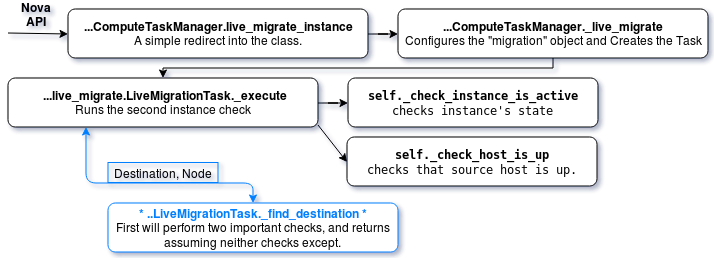

The following code works closely with the scheduler to find a destination and is a section that doesn't need much explantion. In general, we know that I provided a *requestSpec* to the class with the instance information for the kind of host I needed.  This information is piped to the scheduler to find a matching host in a loop. While we don't care too much about the scheduling parts, we do care about some checks that are run in the loop. This method, and the ones it calls, are revisited several times before we finally return our `destination` and `dest_node` to the *\_execute* method. See inline comments for more information.

*nova.conductor.tasks.live\_migrate\_LiveMigrationTask.\_find\_destination* ->

        def _find_destination():
        ...
        host = None
        while host is None:
            ...
            host = Schedule_Stuff_And_find_A_Host
            try:
                self._check_compatible_with_source_hypervisor(host) -->
                self._call_livem_checks_on_host(host) -->
            except:
                #*#*# Sets host back to `None` in the event any of the above
                #*#*# checks fail, this continues the loop while we schedule and try again.
                host = None

            return host, node


#### Exploration 9

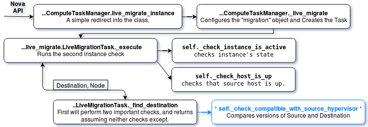

The first method called here (*\_check\_compatible\_with\_source\_hypervisor*) is quite short. This takes the host information of the source (stored in the class as *self.host*) and the destination (just *host*) and compares the versions of their platforms to see if there is compatability. Without compatability, an exception is triggered, which unsets the host and continues the loop. Interestingly, this method does return data in the form of the source info and destination info, however this information is not stored during the *\_find\_destination* call and is lost.

*nova.conductor.tasks.live\_migrate\_LiveMigrationTask.\_check\_compatible\_with\_source\_hypervisor* ->

        def _check_compatible_with_source_hypervisor():
        ...
        if source_type != destination_type:
            raise exception.InvalidHypervisorType()
        ...
        if source_version > destination_version:
            raise exception.DestinationHypervisorTooOld()
        return source_info, destination_info


#### Exploration 10

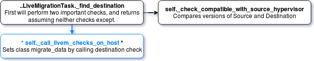

Now that we completed these simple but important checks, we execute the *_call\_livem\_checks\_on\_host*. This beefy call leads us into several other methods. Again, it's worth noting that anything returned here is lost. We are just looking to find an exception or to continue. We do, however, set the class *migrate\_data* variable, which (as you may remember) was set to `None` during the class instantiation. This *migrate\_data* is filled with the returned values from *compute\_rpcapi.check\_can\_live\_migrate\_destination*.

As we prepare to traverse through RPC, we can be fairly certain about two things, thanks to our recent experience:

- The code from this point on (until we pass another RPC) is run from the destination compute Node
- We know this code ends up in the Computer Manager eventually, so we don't need to scrape through the compute_rpcapi code tree.

*nova.conductor.tasks.live\_migrate\_LiveMigrationTask.\_call\_livem\_checks\_on\_host* ->

    def _call_livem_checks_on_host():
        try:
            self.migrate_data = self.compute_rpcapi.
                check_can_live_migrate_destination(self.context, self.instance,
                    destination, self.block_migration, self.disk_over_commit)
        except
            raise exception.MigrationPreCheckError(msg)


#### Exploration 11

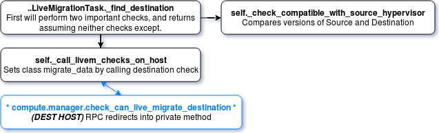

The execution is now at the compute manager on the destination, ready to run checks against the chosen destination, moving from Nova API manager to Conductor Manager to Destination Compute. This method is just a redirect (called by using RPC) into a private method.

*nova.compute.manager.check\_can\_live\_migrate\_destination* ->

    def check_can_live_migrate_destination():
            return self._do_check_can_live_migrate_destination(ctxt, instance,
                                                            block_migration,
                                                            disk_over_commit)


#### Exploration 12

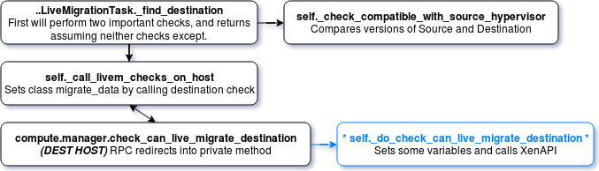

Now we need to handle some setup here and to make a few returns to this code, so let's step through it. First, we set up some variables for the source and destination by using the host variables that were passed to us from Conductor. Interestingly, it pulls the Destination host from its own *CONF* file, since this code is actually running on the destination now. Once that is done, the code is first passed over to *driver.check\_can\_live\_migrate\_destination*. It stores the returned data of this operation in *dest_check_data*. Because the driver is XenAPI, execution shifts there for now, and returns once the *dest\_check\_data* is filled in.

Regarding the Driver, Compute keeps credentials to manage its respective hypervisors within the Nova Configuration file. Our case utilizes Xenapi, so this configuration file contains the Xen Management Net IP address, and the administrative user and password to issue direct Xen API (XAPI) commands

*nova.compute.manager.\_do\_check\_can\_live\_migrate\_destination* ->

    def _do_check_can_live_migrate_destination():
        src_compute_info = obj_base.obj_to_primitive(self._get_compute_info(ctxt, instance.host))
        dst_compute_info = obj_base.obj_to_primitive(self._get_compute_info(ctxt, CONF.host))
        dest_check_data = self.driver.check_can_live_migrate_destination(ctxt,
                                                    instance, src_compute_info, dst_compute_info,
                                                    block_migration, disk_over_commit)


#### Exploration 13

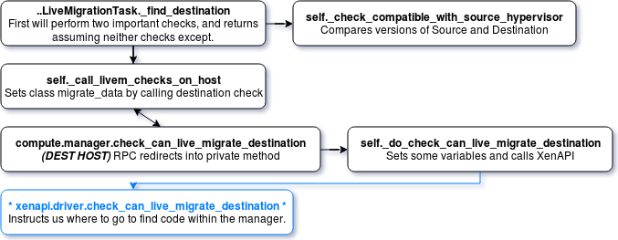

To find data in a driver, such as where that *check\_can\_live\_migrate\_destination* method lives, look in the *driver.py* file, which is similar to the routes for an API and tells us where to go. Let's take a look now, but I won't do this review in future explorations of the code. You can see from the imports that our new home is the *nova.virt.xenapi.vmops.check\_can\_live\_migrate\_destination* method. Remember, this is how you can find all calls to the *driver.call* methods. *From compute* is issuing commands directly to the driver that it controls by using its login credentials in the *Nova Conf* file.

*nova.virt.xenapi.driver.check\_can\_live\_migrate\_destination* ->

    def check_can_live_migrate_destination():
        ...
        from nova.virt.xenapi import vmops
        self._vmops = vmops.VMOps(self._session, self.virtapi)
        ...
        return self._vmops.check_can_live_migrate_destination(context,instance,block_migration,disk_over_commit)


#### Exploration 14

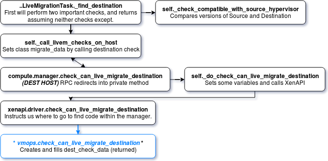

The following method makes sure that the destination is ready for use. First, it creates a new object from the primitives, like we have seen before, and the returned *dest\_check\_data* is saved. It then handles some specific actions depending on whether `Block Migration` was specified. In this case, I did not specify block migration, and I said that I did not have shared storage. This lack of shared storage means that the *\_ensure\_host\_in\_aggregate* call fails. Thus, the block\_migration boolean is set to `True` and execution continues into the `if block\_migration` code. See the inline comments in the following psuedocode for more details.

*nova.virt.xenapi.vmops.check\_can\_live\_migrate\_destination* ->

    def check_can_live_migrate_destination():
        dest_check_data = objects.XenapiLiveMigrateData()

        #*#*# We currently have our block_migration set to `None`,
        #*#*# so we hit the if state, fail the try clause, and have
        #*#*# our block_migration set to true.

        if block_migration is None:
            try:
                ...
                self._ensure_host_in_aggregate(ctxt, src)
                ...
            except exception.MigrationPreCheckError:
                block_migration = True

        #*#*# Note:  If we were on shared storage, we could
        #*#*# have followed the above trail, which continues to set up
        #*#*# some of the same data as the following, but this has been
        #*#*# trimmed because it is irrelevant to us. We now have *block_migration*
        #*#*# set, and we have filled in our *dest_check_data* with information.
        #*#*# We set up the *block_migration*, *migrate_send_data*,
        #*#*# *destination_sr_ref*, and a basic blank VIF mapping that contains
        #*#*# the network UUID that XenAPI returns. Most of this is fairly simple
        #*#*# to understand because we have been dealing with it for a while.
        #*#*# The Network UUID call queries XenAPI for its network, and the
        #*#*# *migrate_receive* call sets up a token and tells the destination to
        #*#*# prepare itself to accept a migration.
        #*#*#
        #*#*# Let's take a closer look at these for our own deeper understanding.
        #*#*# Once these are all set, the compute method version
        #*#*# *_do_check_can_live_migrate_destination* continues. This quickly gets
        #*#*# confusing soon after we realize this method does far more than just
        #*#*# checking a destination.

        if block_migration:
            dest_check_data.block_migration = True
            dest_check_data.migrate_send_data = self._migrate_receive(ctxt)
            dest_check_data.destination_sr_ref = vm_utils.safe_find_sr(self._session)
            net_ref = self._get_network_ref()
            dest_check_data.vif_uuid_map = {'': net_ref}
        return dest_check_data


#### Exploration 15

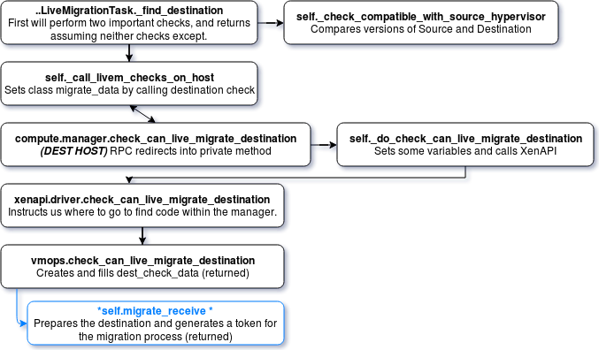

In the following code, the *migrate\_receive* call issues a warning through XenAPI. It sends XenAPI the *migrate\_receive* command including the nw\_ref, destination, and options details. These options can be `sr` references. Live migration, block migration, and xen return a token. This token signifies that the server is ready to accept the connection over the nw_ref that was specified to the host (in the parameters that were provided). This token is stored as the *dest\_check\_data.migrate\_send\_data* variable and is returned to Compute services *\_do\_check\_can\_live\_migrate\_destination* method.

*nova.virt.xenapi.vmops.migrate\_receive* ->

    def migrate_receive():
        destref = self._session.host_ref
        nwref = self._get_network_ref()
        ...
        try:
            options = {}
            migrate_data = self._session.call_xenapi("host.migrate_receive", destref, nwref, options)
        ...
        return migrate_data


#### Exploration 16

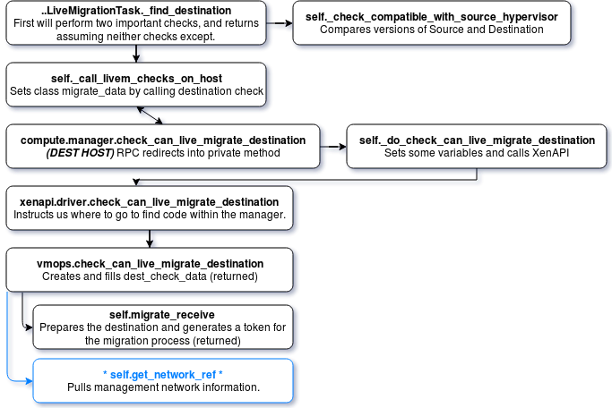

The inline comments from the code's author explain the following function pretty well. It just pulls the network reference for the management network. It's not a super important bit of code, but it does become more useful later. Additionally, the previous method uses this method as well, so it is useful to understand what is happening.

*nova.virt.xenapi.vmops.\_get\_network\_ref* ->

        # Get the network to for migrate.
        # This is the one associated with the pif marked management. From cli:
        # uuid=`xe pif-list --minimal management=true`
        # xe pif-param-get param-name=network-uuid uuid=$uuid
        expr = 'field "management" = "true"'
        pifs = self._session.call_xenapi('PIF.get_all_records_where',
                                         expr)
        ...
        nwref = pifs[list(pifs.keys())[0]]['network']
        return nwref
        ...


#### Exploration 17

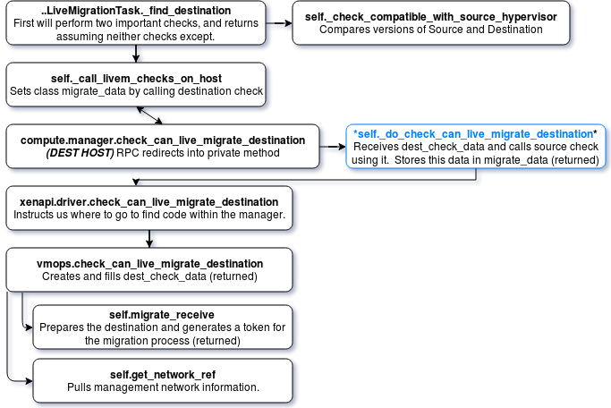

The execution now returns to the *\_do\_check\_can\_live\_migrate\_destination* call with a populated *dest_check_data*, which importantly contains the *migrate_send_data* field. Let's do a quick review. Notice that the method is suddenly no longer just checking a destination but now is also checking a source. We set *migrate_data* to the result of *compute.manager.check\_can\_live\_migrate\_source (compute\_rpcapi)*! More information is in the inline comments in the following code. Notice that we are moving through *compute\_rpcapi* again, which means that the code chunk runs on the source Compute node.

*nova.compute.manager.\_do\_check\_can\_live\_migrate\_destination* ->

    def _do_check_can_live_migrate_destination():
        src_compute_info = obj_base.obj_to_primitive(self._get_compute_info(ctxt, instance.host))
        dst_compute_info = obj_base.obj_to_primitive(self._get_compute_info(ctxt, CONF.host))
        dest_check_data = self.driver.check_can_live_migrate_destination(ctxt,                      (x)
                                                    instance, src_compute_info, dst_compute_info,   (x)
                                                    block_migration, disk_over_commit)              (x)

        #*#* Now that *dest_check_data* is populated, use this to run checks against the source. While
        #*#* this doesn't make a ton of sense within the destination check rather than happening,
        #*#* remember that not much data is returned to the conductor, so doing this while we still
        #*#* have the data is a little more streamlined. This method also runs a couple of methods deep,
        #*#* but once we complete we will return the migrate_data field that is generated here back to
        #*#* *conductor.tasks.live_migrate_LiveMigrationTask._call_livem_checks_on_host*, which stores
        #*#* the returned migrate data, is the class variable *self.migrate_data*.

        try:
            migrate_data = self.compute_rpcapi.check_can_live_migrate_source(ctxt, instance, dest_check_data)
        ...
        return migrate_data


#### Exploration 18

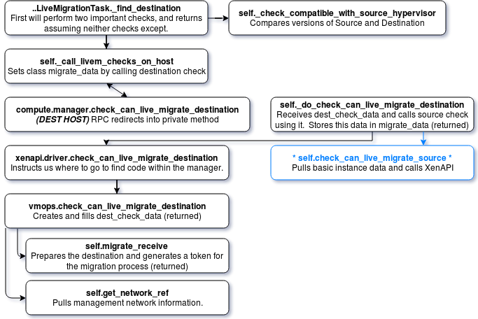

Just like before, I'm handing this over the XenAPI drivers to do the work, but first the process sets up some basic variables to send with it so that it gets a little easier for XenAPI.  This includes seeing if the server is volume-backed and getting basic block-device-mapping information. This information, however, does not contain Cinder target information (this will be important later for our XenAPI purposes). Once we have that, we move into the driver. The driver's outcome is stored as *result* and is then returned. This is a bit interesting because the name changes. Usually, OpenStack keeps these things standard to avoid this kind of confusion. Just know that *result* is stored in *migrate\_data*.

*nova.compute.manager.check\_can\_live\_migrate\_source* ->

    def check_can_live_migrate_source():
        bdms = objects.BlockDeviceMappingList.get_by_instance_uuid(ctxt, instance.uuid)
        is_volume_backed = compute_utils.is_volume_backed_instance(ctxt, instance, bdms)
        dest_check_data.is_volume_backed = is_volume_backed
        block_device_info = self._get_instance_block_device_info(instance, refresh_conn_info=False, bdms=bdms)
        result = self.driver.check_can_live_migrate_source(ctxt, instance,
                                                           dest_check_data,
                                                           block_device_info)
        return result


#### Exploration 19

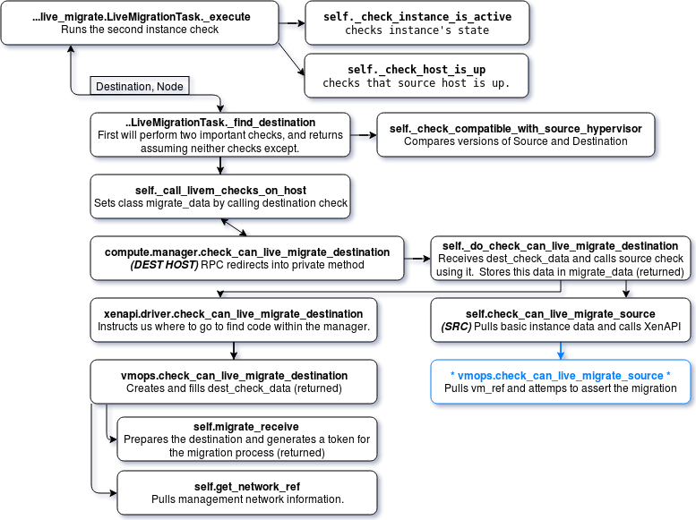

The primary focus of the following method is to run the XenAPI *assert_can_migrate* command. This command accepts mappings that are generated in the *\_call\_live\_migrate\_command* method, which is called and then just returns the untouched *dest\_check\_data* data. More information is in inline comments.

*nova.virt.xenapi.vmops.check\_can\_live\_migrate\_source* ->

    def check_can_live_migrate_source():
        ...
        if ('block_migration' in dest_check_data and dest_check_data.block_migration):
            ...
            vm_ref = self._get_vm_opaque_ref(instance_ref)
            ...
            try:
                self._call_live_migrate_command("VM.assert_can_migrate", vm_ref, dest_check_data)
            except

                #*#*# This checks for a `VDI NOT IN MAP` exception if the assert fails.
                #*#*# Due to the organization of this code, if the server has volumes
                #*#*# attached during the live migration and is running a newer version of XCP,
                #*#*# the call fails because the SR is not set up on the destination yet, and we
                #*#*# do not have the volume targets available to set them up. We swallow this exception.

                if ("VDI_NOT_IN_MAP" in reason and
                        host_sw['platform_name'] == "XCP" and
                        versionutils.is_compatible("2.1.0", host_pfv)):
                    LOG.debug("Skipping exception for XCP>=2.1.0, %s", reason)
                    return dest_check_data
        return dest_check_data


#### Exploration 20

The following method calls the XenAPI driver to run the specified command. This method is used twice during the *live\_migration* process: once to run this assert, and again later to actually start the live migration process. The method generates maps from various resources to their owners. These maps are *Source Vif -> Destination Network* and *Source VDI -> Destination SR*. These maps could be used more intensively by the call (including such things as GPU and CPU maps), but we only use these two for our purposes. We send that data to the *call\_xenapi* method, which calls the *assert\_can\_migrate* method with which I called this method, and, if any of these maps fail, the process fires an exception. Essentially, it is looking at these maps to ensure that everything exists properly and is ready to accept the migration. Some extraneous content is trimmed here for simplicity. Note that nothing is returned here. We are inside of the *check\_can\_live\_migrate\_source* `try` block and just except or continue.

*nova.virt.xenapi.vmops.\_call\_live\_migrate\_command* ->

    def _call_live_migrate_command():
        ...
        migrate_send_data = migrate_data.migrate_send_data
        ...
        destination_sr_ref = migrate_data.destination_sr_ref
        vdi_map = self._generate_vdi_map(destination_sr_ref, vm_ref)
        ...
        vif_map = {}
        vif_uuid_map = None
        if 'vif_uuid_map' in migrate_data:
            vif_uuid_map = migrate_data.vif_uuid_map
        if vif_uuid_map:
            vif_map = self._generate_vif_network_map(vm_ref, vif_uuid_map)
        self._session.call_xenapi(command_name, vm_ref, migrate_send_data, True, vdi_map, vif_map, options)


Assuming the assert did not fail, we move on and return *dest\_check\_data* from the driver's *check\_can\_live\_migrate\_source* operation. This rolls back to *compute.manager.check\_can\_live\_migrate\_source*, where the *result* is stored, and we can see that *result* is just *dest\_check\_data* and has been un-modified.  *Result* (or *dest\_check\_data*) is returned to *\_do\_check\_can\_live\_migrate\_destination*, which then stores *result* (or *dest\_check\_data*) as *migrate_data* and returns it to the calling method.

From here, we roll all the way back to *nova.conductor.tasks.live_migrate\_LiveMigrationTask.\_call\_livem\_checks\_on\_host*, which orginally called *self.migrate\_data = self.compute\_rpcapi.check\_can\_live\_migrate\_destination*. Since this method returns nothing, we can then roll all the way back to *\_find\_destination*! Now we have a class variable which just holds the *dest\_check\_data*, which is now called *migrate\_data*.  This contains information such as the *block\_migrate*, the dest information, and some other basics. We are all the way back to Conductor, and my checks against both the destination and source are complete.  Let's look at that code again as a refresher.

#### Exploration 21

We have completed both the *call\_livem\_checks\_on\_host* and the *\_check\_compatible\_with\_source\_hypervisor* checks.  This means that I did not hit the except and that the host information is returned further back up the line.  We can now successfully head all the way back to the execute. Remember that there is now a class variable *self.migrate\_data*, which is set with *dest\_check\_data*. Because the checks passed, the destination information from the scheduler is returned.

*nova.conductor.tasks.live\_migrate\_LiveMigrationTask.\_find\_destination* ->

    def _find_destination():
        ...
        host = None
        while host is None:
            ...
            host = Schedule_Stuff_And_find_A_Host
            try:
                self._check_compatible_with_source_hypervisor(host) -->
                self._call_livem_checks_on_host(host) -->
            except:
                #*#*# Sets host back to `None` in the event any of the above checks fail, this continues the loop while we schedule and try again.
                host = None

            return host, node


#### Exploration 22

We finally return to execute, and I've marked what we have already completed with an (X) in the following code.  The destination find is complete, and now we move on to finally run the *live\_migration*. I set up some basic variables in the class migration option, including the source node, the destination node, and compute, which came from scheduling. Now, I pass this to the *compute\_rpc* service for the source by calling *self.compute\_rpcapi.live_migration*. This marks the end of the conductor *_execute* method, which sends its payload over to the source compute node to begin the real transfer work of the live migration. Since this final workflow image is rather large, we'll take a look at it after the code.

*nova.conductor.tasks.live\_migrate\_LiveMigrationTask.\_execute* ->

    def _execute():
        self._check_instance_is_active()  (X)
        self._check_host_is_up(self.source) (X)
        ...
        if not self.destination:
            ...
            self.destination, dest_node = self._find_destination() (X)
        self.migration.source_node = self.instance.node
        self.migration.dest_node = dest_node
        self.migration.dest_compute = self.destination
        self.migration.save()
        return self.compute_rpcapi.live_migration(self.context,
                host=self.source,
                instance=self.instance,
                dest=self.destination,
                block_migration=self.block_migration,
                migration=self.migration,
                migrate_data=self.migrate_data)


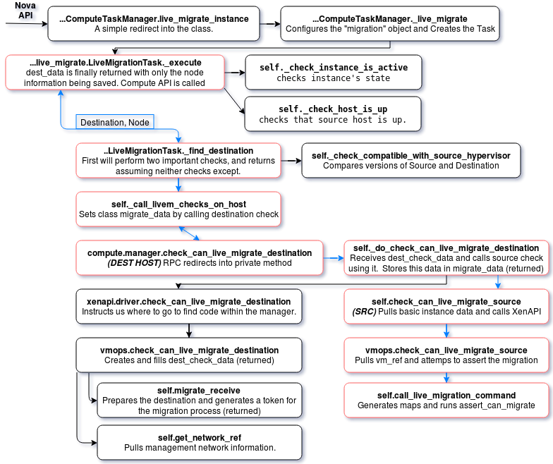

### Conclusion

Today, we have dove very deeply into Conductor, the Destination Compute, and the Source Compute.  We have managed to avoid the majority of the Nova Scheduler code, however we picked up a destination, and filled in all of the variables that are needed within the migrate\_data object.  In the next article, we pick the process back up on the source compute, and follow the process to the end.

Continue reading this series in the next [article]().

