In our previous [article](), we dove deeply into the Live Migration process by looking at how Conductor passes data back and forth between Scheduler and the Source and Destination Compute Nodes.  We have found a host machine at this point and verified that all of our preliminary checks will pass.

<!--more-->

We watched as the code finished the `execute` method and passed the information to `compute_rpcapi.live_migration` for the source compute.  We're skipping over the RPC (we should be pretty familiar with that by now), and picking up the code on the Source Compute Node. Before we continue, let's go over our assumptions one final time.

### Assumptions

- You have read the previous articles and understand the data that we have passed, and how we arrived at Source Compute
- The `Virt Driver` in use is XenAPI, so we will spend some time in that code base.
- I use ellipses to skip some basic *set* and *get* instructions for clarity (no need to re-invent the wheel here).
- Finally, while I go deep into the entire process, there may be sections where skipping through code is beneficial, such as skipping past RPC sections once we cover this once, skipping over the majority of the Scheduler Process, and Networking Configuration.  This skipping allows for us to focus more on the process as a whole and not get too in-depth with Neutron and Nova-Scheduler information.

### Review

Even though we went very deeply into methods during our last run through this code, very little of that data was retained.  Essentially just a small bit of more information regarding the destination was placed into the migrate\_data pack and is being sent along.  The maps that we generated were lost, as all of these methods were simply running tests or throwing an Exception.  When we head into the Compute Manager's live_migration codebase, we are sending:


host=self.source,
instance=self.instance,
dest=self.destination,
block_migration=self.block_migration,
migration=self.migration,
migrate_data=self.migrate_data


That's a pretty simple list of information, and we should know what is contained in all of these details by now. The important fields here are that we have:

- *block_migration* set to `True` at this point
- *migrate_data*, which contains a duplicate of the *block_migration* field
- *dest\_check\_data*, which has content that was generated in the previous article
- and some other fields (including async, and things that were passed to conductor during our first article)

We have the instance ref and the host ref, which can be used by the code to pull things such as host\_ref and vm\_ref.  When these varaibles are pulled, you generally see "instance", "dest", or "host" passed.  Let's pick up at the Compute Manager and get this server show on the road!

#### Exploration 1

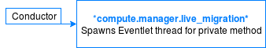

To begin, we start (as always) by transferring the RPC call into a private method.  Some additional work is handled this time, however.  Because this process can take a significant amount of time to run, we do not want RPC to be hung up waiting for the *\_do\_live\_migration* method to return. Therefore, an Eventlet thread is spawned. This Eventlet thread continues to run, and RPC returns its worker to the pool.  From here, *\_do\_live\_migration* is essentially told to _fork_ off and handle its business, and we continue into that method.

*nova.compute.manager.live\_migration* ->

    def live_migration():
        self._set_migration_status(migration, 'queued')
        ...

        #*#*# We call the private method here. _do_live_migration.

        def dispatch_live_migration(*args, **kwargs):
            with self._live_migration_semaphore:
                self._do_live_migration(*args, **kwargs)
        ...


#### Exploration 2

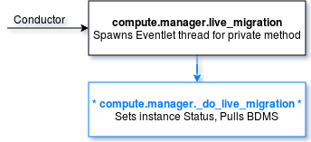

This is the beginning of the prep phase for the live migration proper. The migration status is set to `Preparing`, and because I'm running a *block\_migration*, I gather details about the disk information and get basic BDM information again (remember, this information was discarded during the scheduling phase and only host details were returned). This very basic information is pulled and thrown into the *pre\_live\_migration* through *computeRPC* once again. I save the result of this as *migrate\_data*.  Note here that I actually pass the current *migrate\_data* (which was once the *dest\_check\_data*), so the variable is overwritten with the returned result of *pre\_live\_migration* method. Let's look briefly into the *get\_disk\_info* method here for clarity. Once the *pre\_live\_migration* method finishes, we return to this method to continue.

Note:  We are running through *ComputeRPC* here again because our first steps actually reside on the Destination.  We will be doing some prep work on the destination to receive this VM, such as setting up Block Devices and Network attachments.  Until we come back here, just know we are running on the Destination.

*nova.compute.manager.\_do\_live\_migration* ->

    def _do_live_migration():
        self._set_migration_status(migration, 'preparing')
        ...
        try:
            if ( block_migration):
                block_device_info = self._get_instance_block_device_info(context, instance)
                disk = self.driver.get_instance_disk_info(instance, block_device_info=block_device_info)
            ...
            migrate_data = self.compute_rpcapi.pre_live_migration(instance, block_migration, disk, dest, migrate_data)


#### Exploration 3

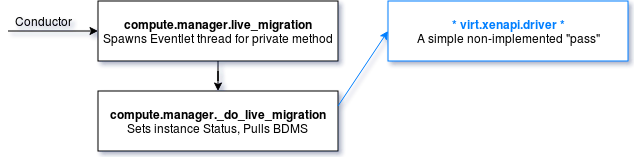

This is a case where XenAPI actually doesn't implement this work, but it just passes the check, relying on this to be done later.

*nova.virt.xenapi.driver* ->

    def driver():
        def get_instance_disk_info():
            pass


#### Exploration 4

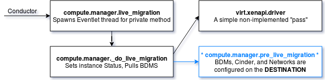

This method handles a decent amount of complicated work. First, it pulls the more complete Block Device Mappings including the Cinder Target information and uses that information to set up attachments for the volumes within the \_volume\_API. It then pulls networking information again, and it passes the data into the driver's version of this method (`pre_live_migration`) to handle the heavy work. The result of the driver's *pre\_live\_migration* call is saved as *migrate\_data*. Once completed, execution moves on, sets up any needed networks on the host machine, and sets up the filtering rules before returning *migrate\_data*. The following code has been significantly trimmed for clarity. Notice that *migrate\_data* is passed and overridden, and that the code is running on the destination.

*nova.compute.manager.pre\_live\_migration* ->

    def pre_live_migration():
        migrate_data.old_vol_attachment_ids = {}
        bdms = objects.BlockDeviceMappingList.get_by_instance_uuid()
        try:
            connector = self.driver.get_volume_connector(instance)
            for bdm in bdms:
                if bdm.is_volume and bdm.attachment_id is not None:
                    ...
                    attach_ref = self.volume_api.attachment_create()
                    ...
                    bdm.attachment_id = attach_ref['id']
                    bdm.save()

        block_device_info = self._get_instance_block_device_info()
        network_info = self.network_api.get_instance_nw_info(context, instance)
        migrate_data = self.driver.pre_live_migration(,instance,block_device_info,network_info,disk,migrate_data) -->
        self.network_api.setup_networks_on_host()
        self.driver.ensure_filtering_rules_for_instance()

        return migrate_data


#### Exploration 5

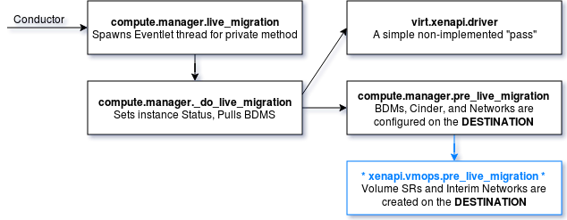

The following simple method just adds more data to the *migrate\_data* object. The volumes are connected on the destination hypervisor by passing the bdm information, which was gathered in the previous method, into *connect\_block\_device\_volumes*. This code delves deeply into Cinder, but we don't need to focus on that right now. Just know that they are now attached on the destination. The code also creates interim networks and that the SR Mapping and VIF mapping for both of these are stored in the *migrate\_data* field.

*nova.virt.xenapi.vmops.pre\_live\_migration* ->

    def pre_live_migration():
        migrate_data.sr_uuid_map = self.connect_block_device_volumes(bdms)
        migrate_data.vif_uuid_map = self.create_interim_networks(network_info)
        return migrate_data


There is now even more data in the *dest\_check\_data* (or *migrate\_data*) field. The destination information is there now that networks have been set up, filtering rules are in place, volumes have been attached, and that modified *migrate\_data* is passed all the way back to *nova.compute.manager.\_do\_live\_migration* on the source. Let's look back, statrting where we left off.

#### Exploration 6

Now that the *pre\_live\_migration* method has completed, execution moves on (which leaves us just a status change away from a "running" status (YAY!)) and into the driver's *live\_migration* code. Nothing is returned from here, and it is just a `try:` and `except:` block execution. From here, the driver handles the rest of the process.

*nova.compute.manager.\_do\_live\_migration* ->

    def _do_live_migration():
        ...
        ...
        try:
            if ( block_migration):
                block_device_info = self._get_instance_block_device_info(context, instance)
                disk = self.driver.get_instance_disk_info(instance, block_device_info=block_device_info)
            ...
            migrate_data = self.compute_rpcapi.pre_live_migration(instance, block_migration, disk, dest, migrate_data) (x)

        self._set_migration_status(migration, 'running')
        try:
            self.driver.live_migration(context, instance, dest,
                                       self._post_live_migration,
                                       self._rollback_live_migration,
                                       block_migration, migrate_data)


#### Exploration 7

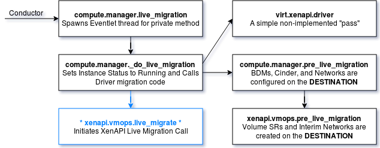

The name of the following method actually changes a bit on the way into the driver for XenAPI, so it's a bit confusing. We are getting really close to the end here and have come a monumental distance in these code lines. Now, it's time for the driver to go ahead and start doing its thing. The method gathers some basic data once again, because often the needed data is not returned. The method then fills in even more data in *migrate_data* and issues the XenAPI Migrate command! This means that XenAPI begins the mirror, and the process is legitimately kicked off. This process handles getting the VM started on the destination, transferring the RAM states, and so on. This just leaves the OpenStack drivers to do the cleanup. More comments are inline in the following code. Once the long, long *migrate\_send* command completes, the *post\_method* executes.

*nova.virt.xenapi.vmops.live\_migrate* ->

    def live_migrate():
        ...
        vm_ref = self._get_vm_opaque_ref(instance)
        ...
        (kernel, ramdisk) = vm_utils.lookup_kernel_ramdisk(self._session, vm_ref)
        migrate_data.kernel_file = kernel
        migrate_data.ramdisk_file = ramdisk

        if migrate_data is not None and migrate_data.block_migration:
                ...
                try:
                    self._call_live_migrate_command(
                        "VM.migrate_send", vm_ref, migrate_data)
                ...

                    #*#*#*# We used this *_call_live_migrate_command* before to run our assert.
                    #*#*#*# We do the same thing here but to tell XenAPI to actually begin running the task.
                    #*#*#*# This officially means that the *live_migration* is running. The maps are again
                    #*#*#*# generated, and this time passed to the actual method. Running the assert before
                    #*#*#*# this step means that if these maps had a problem, they would have failed much earlier
                    #*#*#*# in the process to make the roll back easier. Now that networks are configured on the
                    #*#*#*# destination, volumes attached, and various other information has been pulled,
                    #*#*#*# it would have been a monumental waste of time to have mapping failure at this point.

            post_method(context, instance, destination_hostname,
                        block_migration, migrate_data)
 

The way that *post\_method* is called is a bit interesting, because it is defined by the incoming variables accepted by the *self.driver.live\_migration* method. You can see above that this is called with *self.post\_live\_migration* and *self.\_rollback\_live\_migration*. When a fault occurs, it calls that *recover\_method*, and, in this case, it calls the *post\_method*, which resolves to the *nova.compute.manager.\_post\_live\_migration* method. It is tempting to believe that this is the *nova.virt.xenapi.vmops.post\_live\_migration* method, but remember that this data was sent from COMPUTE and not from VIRT.  You can also see that the *post\_live\_migration* in XenAPI is *post\_live\_migration* and not *\_post\_live\_migration*. So, let's take a look!

#### Exploration 8

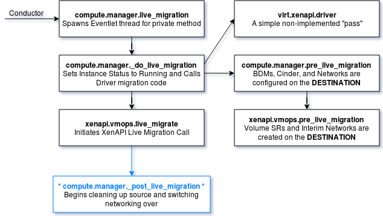

Remember that the execution didn't move through RPC to get here, so the code is still running on the source. So far, execution was transferred to RPC to only handle the destination checks before bouncing back to source again. From now on, code runs on the source. The following method handles the cleanup actions that need to be done. It gathers BDM records (again!) and terminates and detaches the volumes from the source hypervisor, preparing to switch around networking information. This method gets very long, so we'll walk through it a little at a time and follow its cleanup steps where applicable. More comments are inline in the code.

*nova.compute.manager.\_post\_live\_migration* ->

    def _post_live_migration():
        bdms = objects.BlockDeviceMappingList.get_by_instance_uuid()
        block_device_info = self._get_instance_block_device_info()

        #*#*#*# This method is fairly simple and just calls XenAPI to remove the Ramdisk files from the source
        #*#*#*# Since this data is no longer needed on the source, the code is essentially cleaning up.

        self.driver.post_live_migration()

        #*#*#*# Pull the block devices again here and terminate the source connections

        connector = self.driver.get_volume_connector(instance)
        for bdm in bdms:
            if bdm.is_volume:
                if bdm.attachment_id is None:
                    self.volume_api.terminate_connection()
                else:
                    old_attachment_id = migrate_data.old_vol_attachment_ids[]
                    self.volume_api.attachment_delete(ctxt, old_attachment_id)

        #*#*#*# The Networking API is a bit out of the scope for this article.
        #*#*#*# Here filters placed on the instance VIFS are removed. In many instances, both of these just pass
        #*#*#*# to continue, but this depends greatly on the networking API and Firewall API in use.
        #*#*#*# Xenserver will often use NOOP firewall which passes, and neutron additionally passes here.

        network_info = self.network_api.get_instance_nw_info(ctxt, instance)
        self.driver.unfilter_instance()
        migration = {'source_compute': self.host, 'dest_compute': dest}
        self.network_api.migrate_instance_start(instance, migration)

        destroy_vifs = False
        try:
            self.driver.post_live_migration_at_source() -->


#### Exploration 9

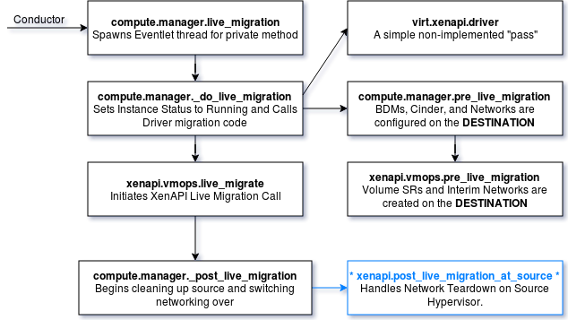

In the following code, the vif connections for the VM on the source are deleted, effectively stopping any connectivity to the source. This traverses two methods, so let's take a look at both. The first method just calls  *\_delete\_networks\_and\_bridges*. This method then calls the vif\_driver to call *delete\_network\_and\_bridge*. Kind of a long way around to get to the work, but you can see the *vif\_driver* defined here as well.

*nova.virt.xenapi.post\_live\_migration\_at\_source* ->

    def post_live_migration_at_source():
        self._delete_networks_and_bridges(instance, network_info)
 

*nova.virt.xenapi.\_delete\_networks\_and\_bridges* ->

    def _delete_networks_and_bridges():
        ...
        vif_impl = importutils.import_class(CONF.xenserver.vif_driver)
        self.vif_driver = vif_impl(xenapi_session=self._session)
        ...
        for vif in network_info:
            try:
                self.vif_driver.delete_network_and_bridge(instance, vif)
 

Looking at a sample *nova.conf*, notice what that *CONF.xenserver.vif\_driver* value is. Depending on the type of networking used (OpenVSwitch, Linux Bridges, and so on), this leads to different classes. Let's use OVS, for example.

    grep "vif_driver" /etc/nova/nova.conf
    vif_driver = nova.virt.xenapi.vif.XenAPIOpenVswitchDriver

#### Exploration 10

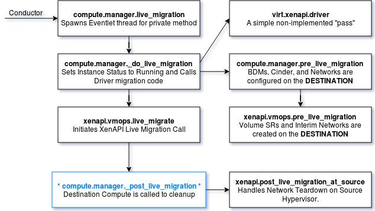

The *nova.virt.xenapi.vif.XenAPIOpenVswitchDriver.delete\_network\_and\_bridge* method is very intense and again out of our scope, but feel free to look at this code on your own.  It destroys the OVS port bindings for the bridge, vif, and patch ports, and tears down the rest of the environment for routing to this VIF. Now that's done, let's look back at the Compute *post\_live\_migration* with a bit more code trimming. I've marked where left off with (X) in the following code.

Beyond the (X), you can see that now some cleanup is being handled on the destination. Notice that it passes through compute RPC now.  As you might expect, destination cleanup runs on the destination. Note that even if this fails, the line of code does not fail.  On an except, we set a variable that it failed and move on. This causes the process to fail completely, but the code ensures that things are cleaned up in the proper order instead of just crashing.

*nova.compute.manager.\_post\_live\_migration* ->

    def _post_live_migration():
        ...
        bdms = objects.BlockDeviceMappingList.get_by_instance_uuid()
        ...
        ...
        connector = self.driver.get_volume_connector(instance)
        for bdm in bdms:
           ...
                    self.volume_api.terminate_connection()

        ...
        ...
        destroy_vifs = False
        try:
            self.driver.post_live_migration_at_source() (X)

        source_node = instance.node
        ...
        try:
            self.compute_rpcapi.post_live_migration_at_destination() ->
        except Exception as error:
            WARNING
 

#### Exploration 11

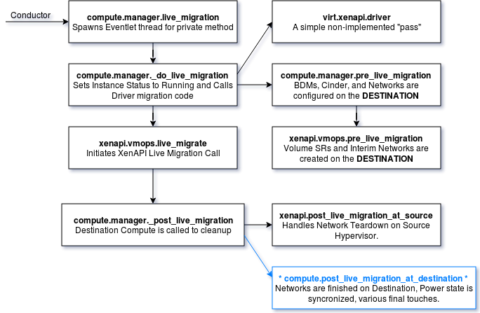

The following is another beefcake of a method, which handles actions on the destination and also reaches out to the source to tear even more information down. I added more comments inline so that we can keep our (read: **my**) thoughts straight.

*nova.compute.manager.post\_live\_migration\_at\_destination* ->

    def post_live_migration_at_destination():
        *#*#* This is the second time these two methods are run because of some issues with Linux Bridges.
        #*#*# Let's not follow this code line as it delves again into the neutron codebase.
        #*#*# This sets up the linux bridges, OVS, etc on the destination to start handling th
        #*#*# traffic for the VM.

        self.network_api.setup_networks_on_host()
        self.network_api.migrate_instance_finish()

        ...

        #*#*# We pull BDMS again, and we pass that data to the XenAPI driver for running its own
        #*#*# *post_live_migration_at_destination*. Without digging too deeply into the XenAPI call,
        #*#*# this sets up rules on the VIF to actually block all traffic.  This is because Security Groups
        #*#*# have not been installed yet, so to avoid unwanted possible traffic, it kills everything temporarily.

        network_info = self.network_api.get_instance_nw_info(context, instance)
        block_device_info = self._get_instance_block_device_info(context,
                                                                 instance)
        try:
            self.driver.post_live_migration_at_destination()
        except Exception:
            EXCEPT

        #*#*# Now, update the instance details in the database to reflect the new destination host is live, ensure
        #*#*# the power state is started, remove the *task_state* from the VM (almost done here!), and call the
        #*#*# networks API again to tear down the networks one last time on the source and set them up on the destination.
        #*#*# This process also removes the rule we just placed to block all traffic.

        finally:
            current_power_state = self._get_power_state(context, instance)
            node_name = None
            prev_host = instance.host
            try:
                compute_node = self._get_compute_info(context, self.host)
                node_name = compute_node.hypervisor_hostname
            finally:
                instance.host = self.host
                instance.power_state = current_power_state
                instance.task_state = None
                instance.node = node_name
                instance.progress = 0
                instance.save(expected_task_state=task_states.MIGRATING)

        self.network_api.setup_networks_on_host(context, instance, prev_host, teardown=True)
        self.network_api.setup_networks_on_host(context, instance, self.host)
 

#### Exploration 12

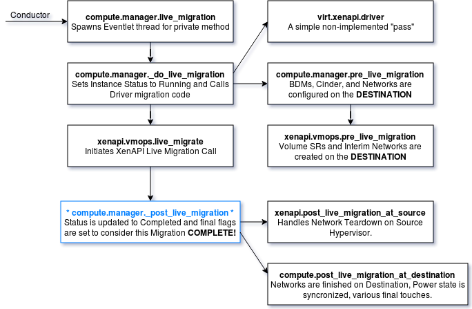

Now we can return to *\_post\_live\_migration* again, with more trimmed down psuedocode in the following sample to see where we left off marked with an (X).

The previous process essentially completed the migration. As far as the database is concerned, the `task_state` is empty, so this thing is no longer running. The instance points to the new host in the database, and *instance.host* = *self.host* (set from the destination). The remainder of the code is handling the last of the cleanup and ending the process completely. Comments are inline.

*nova.compute.manager.\_post\_live\_migration* ->

    def _post_live_migration():
        ...
        bdms = objects.BlockDeviceMappingList.get_by_instance_uuid()
        ...
        ...
        connector = self.driver.get_volume_connector(instance)
                self.volume_api.terminate_connection()
        ...
        ...
        self.driver.post_live_migration_at_source() (X)
        ...
        try:
            self.compute_rpcapi.post_live_migration_at_destination() (X)
        except Exception as error:
            WARNING

        #*#*#*  This calls the Driver Cleanup. XenAPI just passes on this as the
        #*#*# work was handled by the *live_migration* process issued from XenAPI.

        do_cleanup, destroy_disks = self._live_migration_cleanup_flags()
        if do_cleanup:
            self.driver.cleanup()

        ...
        ...

        #*#*# Earlier, we set some statistical information such as allocations, usage information,
        #*#*# and scheduler information, however this is non-vital for this walk-through.
        #*#*# In this next code block, the actual migration status record in the database is set to complete.
        #*#*# Once this is done, a couple more allocations are handled, and the code line dead ends.
        #*#*# The live migration is done. The server is active, and hosts have changed.
        #*#*# The destination is cleaned up, and the migration record is `completed`.

        if migrate_data and migrate_data.obj_attr_is_set('migration'):
            migrate_data.migration.status = 'completed'
            migrate_data.migration.save()
            migration = migrate_data.migration
        ...
 

### Conclusion

We have now completed the full trace through the live migration process, while also taking some time to look at and understand how the RPC services are used to communicate back and forth between services. We started out in the Nova API service and quickly bounced between Compute API, Conductor, Scheduler, Destination and Source Compute and Hypervisor, Neutron, and many others. While some of these were a bit too difficult to cover in this series of articles, you can use this same logic of moving through the code piece by piece to investigate any process, failure, or stack trace that you may receive. I encourage readers to use this information to dive deeper into the codebase to explore areas that interest them and that we did not cover this time. For example, within the Scheduler codebase, OpenStack uses interesting "Abstract Base Classes" (to handle scheduling efforts) and some very complicated and confusing rules that can be fun to explore. Neutron itself is a complicated beast, and understanding it better can be very valuable.

Remember that this was not written by a professional writer or developer, but just a Racker with a passion for Openstack.  I hope you've enjoyed this code dive and gained some knowledge, and hopefully I'll return soon with a new process to explore!

