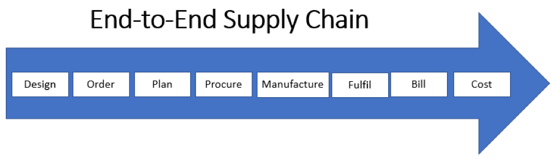

The traditional supply-chain management processes with on-site IT
applications are rapidly moving to the modern supply-chain cloud
infrastructure. This blog covers the characteristics and benefits of the
modern supply chain management in detail.

<!--more-->

### Characteristics of software solutions that support a modern end-to-end supply chain

Modern supply-chain management in the cloud offers the following
benefits, which this section explores in detail:

- Enhanced scalability and agility
- Ease of use for the end-users
- Completeness and seamless connectivity with all IT solutions
- Low upfront investments
- Best in class security
- Fast, flexible, and safe deployment

#### Agility

Modern end-to-end supply chains offer greater scalability and agility by
facilitating more IT flexibility for easier expansion and contraction.

The ability to respond to rapidly changing demands is essential for modern
businesses. Supply-chain management in the cloud enables us to quickly and
securely deploy new services and capabilities and also makes it easy to
scale to meet growing demands.

#### Ease of use

Supply-chain management in the cloud speeds deployments and allows for the
outsourcing of management, maintenance, and upgrades. Because the deployment
and management is so easy, the time and resources that would otherwise be spent
in day-to-day operations can instead be directed towards innovation.

For the end user, the numerous efficiency benefits include a simple and
intuitive user experience, quick access to accurate and timely analytics,
social collaboration tools, and much more — all of which can be accessed
anywhere, at any time, and from virtually any device.

#### Completeness and connectivity

Supply-chain management in the cloud demands open and seamless integration with
all IT solutions (for example, financial systems, mobile devices, Radio-Frequency
Identification (RFID), and Internet of Things (IoT) devices (such as sensors))
to enable real-time collaboration and comprehensive visibility into information
that has a tangible impact on efficiency and productivity.

#### Cost and efficiency

Cloud-based supply-chain management solutions offer numerous financial
advantages to both established and new organizations. Low upfront investments
and subscription-based pricing are appealing to organizations, because they
negate the need for a large initial outlay of capital.  In addition, more
affordable upgrades and new capability rollouts make conformance to changes far
less expensive than a complete IT overhaul.

#### Security

Supply chain data is critical. When we put our data in the cloud, we need to
be confident it remains secure. For this to happen, the cloud solution must
support best-in-class security features (such as encryption, virus scanning,
and whitelist support), and our data center must offer embassy-grade physical
and logical security.

#### Fast, flexible, and safe deployment

The biggest benefit of supply-chain management in the cloud is that there’s no
need to transform an organization’s entire supply chain at once. By offering a
flexible path to the cloud, a business can select those elements that deliver
the greatest value, prioritize migration of those elements, and implement the
migration at the business's own pace. This ensures a seamless, incremental
transition to a more effective operation.

### Five supply chain steps made simple by cloud infrastructure

The following image shows the steps in the business supply chain:

This section explores how the cloud simplifies the following five steps of the
supply chain:

- Order
- Plan
- Procure (or source)
- Manufacture
- Fulfill (or deliver)

#### Order

Moving our order management to the cloud provides the following two crucial
benefits:

First, we have the flexibility needed to quickly respond to changes in demand
by adding new capabilities or by scaling up and down almost instantly.

Second, by connecting all disparate elements of our supply chain, we have the
complete visibility needed to deliver personalized service on a global scale.

#### Plan

With supply-chain planning in the cloud, we can plan quickly and accurately
from anywhere, adapting to changing needs on the fly with real-time visibility
into KPIs and performance analytics.

Seamless integration across all tiers of the supply chain means that standalone
systems are a thing of the past, along with the associated time-consuming and
inaccurate manual processes. This means that we can finally plan at the speed
of demand.

#### Procure (or source)

A cloud-based procurement solution can provide the automation, analytics, and
social collaboration that we need to streamline our source-to-settle process,
control costs, and achieve higher margins. Operations are simplified,
time-to-value is shortened, and collaboration is easier due to seamless
integration.

#### Manufacture

A cloud-based solution allows us to integrate planning and manufacturing
quickly and cost-effectively while gaining full visibility into all areas of
production. What’s more, the cloud acts as a gateway to new technologies, such
as IoT, that can revolutionize manufacturing processes.

#### Fulfill (or deliver)

Moving our transportation and global-trade management to the cloud gives us the
visibility that we need to manage all transportation and trade worldwide.  This,
in turn, leads to increased efficiency, reduced costs, and allows us to conform
to compliance requirements.

### Conclusion

Following are some key benefits of the modern supply chain in the cloud:

- Low investments
- Subscription-based pricing (pay-as-you-use)
- Integration with other IT solutions
- Fast/flexible deployments

End-to-end steps of supply-chain management are tremendously simplified by the
cloud infrastructure. The following processes, some of which were explored in
detail in this blog, are streamlined with best-in-class cloud-infrastructure
security, which ensures a greater return on investments:

- Design
- Order Management
- Planning
- Procurement
- Manufacturing
- Fulfilment
- Billing
- Cost Management
