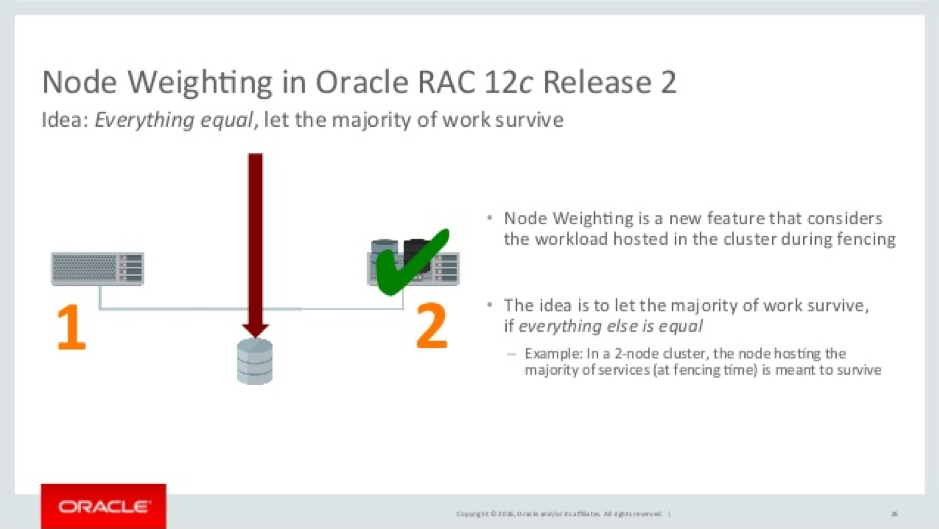

In an Oracle Real Application Clusters (RAC) environment, all the
instances or servers communicate with each other using high-speed interconnects
on the private network. If the instance members in a RAC fail to ping or to
connect to one other via this private interconnect, all the servers that are
physically up and running (and the database instances on those servers) might
end up in a condition known as *split-brain*.

<!--more-->

In an Oracle cluster (prior to the Oracle RAC 12c Release 2 version), when a
split-brain problem occurred due to network or disk issues, the node with lowest
node-number survived in the cluster. However, with the latest Oracle RAC 12c
Release 2, there has been a change in the algorithm by which the candidate
nodes to be evicted are chosen for the specific case where the split-brain
results in the creation of an equal number of nodes in the sub-cluster.

This blog post covers the changes to the node eviction algorithm in Oracle
RAC 12c Release 2 based on the new node-weighting feature.

### Introduction to node-weighting algorithm

The following image illustrates the node-weighting alorithm.

Source: [https://goo.gl/images/qarxrq](https://goo.gl/images/qarxrq)

Node Weighting is a new feature introduced with Oracle RAC 12c Release 2 that
considers the workload hosted in a cluster during fencing. When a split-brain
situation occurs, Oracle Clusterware applies certain rules to select the
surviving cohort, and the system might evict a node that is running with critical
resources. Using this new feature, we can assign weight to certain nodes and
save the node from getting terminated from cluster.

A newly created tag, `CSS\_CRITICAL`, can be set on various levels or components
to mark them as “critical” so that the cluster tries to preserve them in case
of a failure. When Oracle Clusterware makes a decision about which node to evict
in the case of a split brain, the `CSS_CRITICAL` tag is honored as long as no
other technical reason prohibits survival of the node (where the node has at
least one critical component at the time of failure). The concept allows majority
of the work to remain unaffected, if everything else is equal.

### Node-weighting algoritm tasks

The node-weighting algorithm performs the following tasks:

- Assigns weight to database instances or services. We can set the `-css_critical`
  to `yes` with the *srvctl add database* or *srvctl add service* commands when
  we add a database instance or service. We can also set or change the parameter
  with the *srvctl modify database* and *srvctl modify service* commands.
- Assigns weight to non ora.* resources. We use the -attr `CSS_CRITICAL=yes`
  parameter with the *crsctl add resource* and *crsctl modify resource* commands
  when we add or modify resources.
- Assigns weight to a server. we set the `-css_critical` parameter to `yes`
  with the *crsctl set server* command.

Following are some examples of assigning weight to database instances or services:


$srvctl modify database –d <dbname> css\_critical yes
$srvctl modify service  –db  <dbname> -service <service_name> css_critical yes


If weight is not assigned to the resource, the algorithm examines the following
considerations:

- Which node has the maximum number of services created?
- Are singleton services created for the instance?
- Is the node a configured Flex ASM instance?
- Was there a public network failure?
- What type is the node - hub or leaf?

### Test case

The following code walk-through examines a case where bond2 is used as a
private interconnect for a two-node cluster.


$oifcfg getif
bond0  147.167.80.0  global  public
bond2  10.168.33.32  global  cluster\_interconnect
$olsnodes -s -n
node1   1       Active
node2   2       Active
$
$crsctl set server css\_critical yes
$crsctl get server css\_critical
CRS-5092: Current value of the server attribute CSS_CRITICAL is yes.
$


Let’s stop the bond2 to simulate the communication failure between node1 and node2:


#ifdown bond2

$olsnodes -s -n
node1   1       Active
node2   2       Inactive


Output from OCSSD.trc


2018-01-09 11:01:21.220 :    CSSD:1825834752: clssnmrCheckNodeWeight: node(1) has weight stamp(393228187) pebbles (0) goldstars (0) flags (3) SpoolVersion (0)
2018-01-09 11:01:21.220 :    CSSD:1825834752: clssnmrCheckNodeWeight: node(2) has weight stamp(0) pebbles (0) goldstars (0) flags (0) SpoolVersion (0)
2018-01-09 11:01:21.727 :    CSSD:1825834752: clssnmrCheckNodeWeight: node(1) has weight stamp(393228187) pebbles (0) goldstars (0) flags (3) SpoolVersion (0)
2018-01-09 11:01:21.727 :    CSSD:1825834752: clssnmrCheckNodeWeight: node(2) has weight stamp(0) pebbles (0) goldstars (0) flags (0) SpoolVersion (0)
2018-01-09 11:01:21.727 :    CSSD:1825834752: clssnmrCheckNodeWeight: Server pool version not consistent
2018-01-09 11:01:21.727 :    CSSD:1825834752: clssnmrCheckNodeWeight: stamp(393228187), completed(1/2)


### Conclusion

Starting from RAC 12c Release 2, the new algorithm decides the nodes to be
evicted or retained (during a split-brain scenario) as follows:

- If the sub-clusters are of the different sizes, the functionality is same as in previous releases.

- If all the sub-clusters are of the same size, the functionality has been modified as follows:

  - If the sub-clusters have equal node weights, the sub-cluster with the
    lowest node number survives to ensure that, in a two-node cluster, the
    node with the lowest node number survives.
  - If the sub-clusters have unequal node weights, the sub-cluster having the
    higher weight survives to ensure that, in a two-node cluster, the node with
    the lowest node number gets evicted due to the lower weight.

Using server weight-based node eviction, we gain more control over the Oracle
Clusterware failure recovery mechanism by selecting which cluster nodes should
be terminated or evicted in the event of a split brain. If you have any
questions or need guidance on this topic, you can add  comments in the field below.
