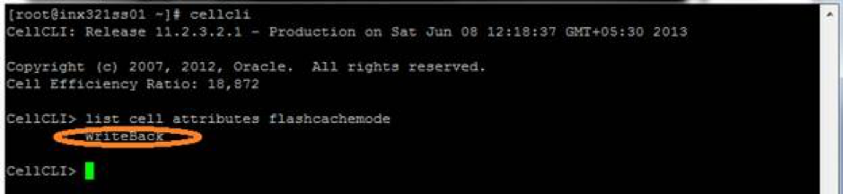
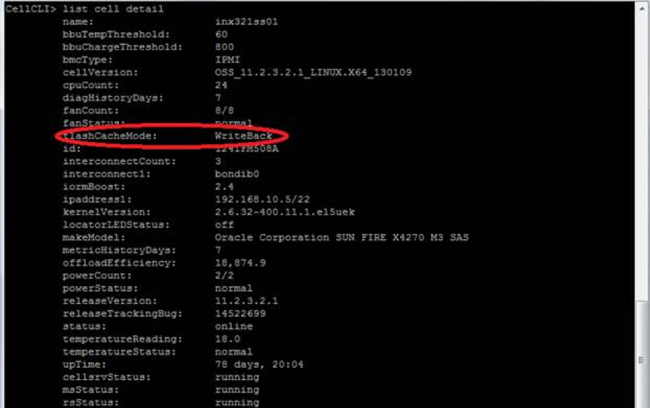
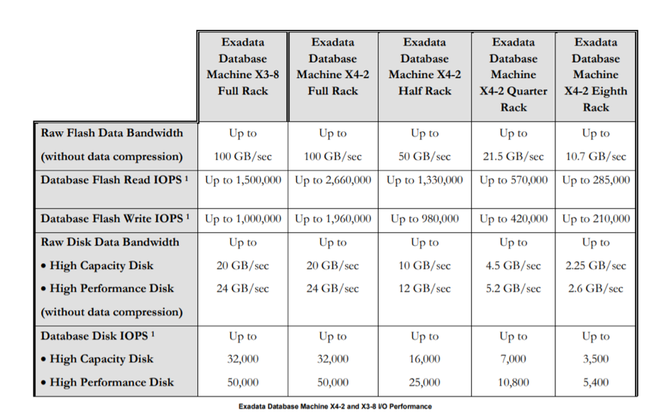

This blog discusses the Oracle Exadata Smart Flash Cache feature and its
architecture, including the write-back flash cache feature.

<!--more-->

### Introduction

The Exadata Smart Flash Cache feature has the following main benefits:

- The Exadata Smart Flash Cache provides the capability to stage active database
  objects in flash.

- The Exadata Smart Flash Logging speeds up the critical function of database
  logging.

### Write-back flash cache

Write-back flash cache, which is used for improving write-intensive
operations because writing to flash cache is faster than writing to hard disks,
is useful in running heavy jobs against a database. According to Oracle,
depending on application, write performance might be up to 20 times faster
to disk (measured in input/output operations per second (IOPS)) and have
10 times more write IOPS than to disk.

The cell attribute `flashCacheMode` determines the cache mode. The possible
values are: “WriteThrough” and “WriteBack”.

To find the current cache mode, use cellcli tool and the `list cell` operation,
as shown in the following example:

    CELLCLI> list cell attributes flashcachemode

To display details, use the `list cell detail` command, as shown in the following
example:

    CELLCLI> list cell detail

### Write-back flash cache benefits

Write-back flash cache improves write-intensive operations because writing to
flash cache is much faster than writing to hard disks. Write-back flash cache
transparently accelerates reads and writes for all workloads for on-line
transaction processing (OLTP) (faster random reads and writes) and for
data warehouses (DW) (faster sequential smart scans).

Write-back flash cache also reduces the latency of redo-log writes when sharing
disks with data. Data is recoverable from flash cache on `cellsrv restart`.
Consider using the write back flash cache feature if you notice either of the
following conditions:

1) Significant wait times for "free buffer waits"

or

2) High I/O times when checking for write bottlenecks in Automated Workload
   Repository (AWR) reports.

The following table shows the performance that the Exadata Smart Flash Cache
provides at the database level for the various Exadata X4 configurations.

Source: [https://www.oracle.com/technetwork/database/exadata/exadata-smart-flash-cache-366203.pdf](https://www.oracle.com/technetwork/database/exadata/exadata-smart-flash-cache-366203.pdf), page 7

### Intelligent caching

Smart Flash cache offers the following intelligent caching benefits:

- Smart Flash cache understands different types of database I/O.
- Frequently accessed data & index blocks are cached.
- Controlfile reads and writes are cached.
- File Header reads & writes are cached.
- The Database administrator can influence caching priorities.

Unfortunately, there is no easy way to monitor what’s in the cache. Oracle has
provided a `list flashcachecontent` command in the cellcli tool, but it offers
no summation options and displays only object numbers.

### Understanding Exadata Smart Flash Cache

The Exadata Smart Flash Cache is a cache on the cell (storage) server for
storing redo-data until this data can be safely written to disk. The Exadata
storage server comes with a substantial amount of flash storage. A small amount
is allocated for database logging, and the remainder is used for caching user
data.

On a full-rack exadata server, the 5 TB of flash cache can store a significant
amount of data.

Flash cache can be managed automatically for maximum efficiency, as shown in
the following use-cases:

– Users can provide optional hints to influence caching priorities.
- Administrators can disable smart flash cache for specific databases.

### Exadata Storage Server software

Two key features of the Exadata Storage Server Software leverage the Exadata
Flash hardware and make the Exadata database machine such a fast system on which
to deploy an Oracle Database. First, the Exadata Smart Flash Cache provides the
capability to stage active database objects in flash. Second, Exadata Smart
Flash Logging speeds up the critical function of database logging.

Deploying an Oracle database requires mission critical resilience. Using Exadata
Storage Server software in conjunction with the Oracle database provides that
resilience.

### Creating FlashDisk-based grid disks

You should not use all of your Flash Cache for grid disks. When creating the
Flash Cache, use the size parameter to hold back some space to be used for grid
disks, as shown in the following cellcli tool `create flashcache` command:

    CellCLI> create flashcache all size=300g;

Create grid disks using the remaining free space on the Flash Disks, using the
following `create griddisk` command:

    CellCLI> create griddisk all flashdisk prefix='RAMDISK‘;

To list grid disk details use the `list griddisk` command, as shown in the
following example:

    CellCLI> list griddisk attributes name, diskType, size – where disktype='FlashDisk‘;

The biggest advantage of Flash Cache configuration is that it can be done
while the system is online and servicing I/O requests.

### How to enable write-back flash cache

Use one of the following methods to enable the write-back flash cache feature:

- *Rolling Method* – This method assumes that relational database management
  systems (RDBMS) and automatic storage management (ASM) instances are up and
  are enabling write-back flash cache in only one cell server at a time.

- *Non-Rolling Method* – This method assumes that RDBMS & ASM instances are down
  while enabling write-back flash cache.

Before enabling write-back flash cache, run the following command to check
the griddisk “asmdeactivationoutcome” and “asmmodestatus” properties. Ensure
that all griddisks on all cells are “Yes” and “ONLINE” respectively and that
the complete flashcache is in a normal state and that no flash disks are in
a degraded or a critical state:

    # dcli -g cell_group -l root cellcli -e list griddisk attributes asmdeactivationoutcome, asmmodestatus

To enable list the cells, run the following command:

    # dcli -g cell_group -l root cellcli -e list flashcache detail

    exadata01cell01: WriteThrough
    exadata01cell02: WriteThrough
    exadata01cell03: WriteThrough
    
To enable write-back flash cache, run the following commands for each cell:

    -> Drop cache
    
    CellCLI> drop flashcache;
    
    Flash cache exadata01cell01 successfully dropped.
 
    -> Shut down Cell service
 
    CellCLI> alter cell shutdown services cellsrv;
    
    Stopping CELLSRV services... The SHUTDOWN of CELLSRV services was successful.
 
    -> Change Cell Flash Cache mode to Write Back
 
    CellCLI> alter cell flashCacheMode=writeback;

    Cell cel04 successfully altered 
 
    -> Restart the Cell Service
 
    CellCLI> alter cell startup services cellsrv;

    Starting CELLSRV services...
    The STARTUP of CELLSRV services was successful.
 
    -> Recreate the Flash Cache
 
    CellCLI> create flashcache all;

    Flash cache cel04_FLASHCACHE successfully created
 
    -> Check the State on all Cell Server 
    
    # dcli -g cell_group -l root "cellcli -e list cell attributes flashcachemode"
    
    exadata01cell01: WriteBack
    exadata01cell02: WriteBack
    exadata01cell03: WriteBack

### Conclusion

Use the write-back flash cache feature to leverage the Exadata Flash hardware
and to make the Exadata database machine a faster system for Oracle database
deployments. Flash storage inside the Oracle Exadata database machine is used
completely as flash cache by default.  This enables it to work effectively as
an extension of the database buffer cache and to deliver faster access,
including a very high IOPS rate, which is especially important for OLTP.
Additionally, you can take a part of the Flash Storage to build ASM diskgroups
upon it. Files placed on these diskgroups will reside permanently on flash
storage with no caching needed.

If you have any questions on the topic, feel free to leave a comment in the
field below.
