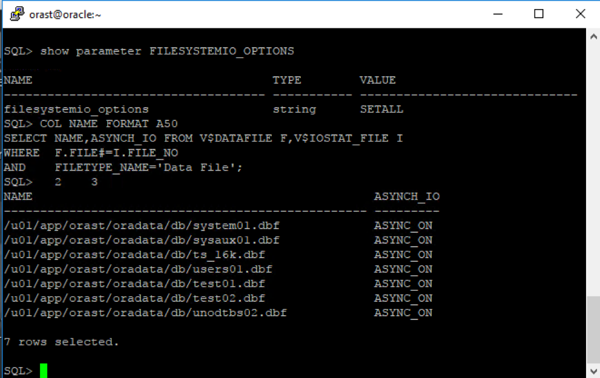
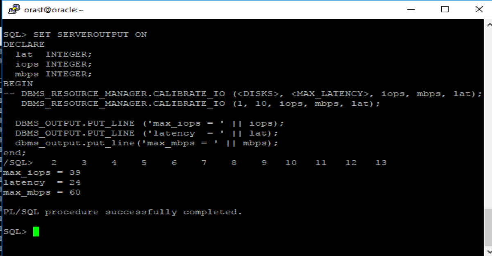

Every time an Oracle &reg; Database reads or writes data to a disk, the database
generates disk input and output (I/O) operations. The performance of many
software applications is limited by disk I/O, and applications that spend the
majority of central processing unit (CPU) time waiting for I/O activity
to complete are I/O bound. I/O calibration helps to address this issue.

<!--more-->

### Introduction

Establishing a solid I/O subsystem is an essential part of building the
infrastructure for an application. If any component in the I/O stack has limited
throughput, it becomes the weakest link in the I/O flow. Because real-world
workloads cannot be easily reproduced, validation of the I/O subsystem has
always been a daunting task.

The I/O calibration feature of Oracle Database enables you to assess the
performance of the storage subsystem and to determine whether I/O performance
problems are caused by the database or by the storage subsystem. Unlike other
external I/O calibration tools that issue I/O operations sequentially, the I/O
calibration feature of Oracle Database issues I/O operations randomly by using
Oracle data files to access the storage media. This produces results that more
closely match the actual performance of the database.

The Calibrate I/O feature is based on a PL/SQL function called
``DBMS_RESOURCE_MANAGER.CALIBRATE_IO()``. When Calibrate I/O is invoked, it
generates workloads with the following characteristics:

- I/O intensive, read-only, random I/O (db\_block\_size)
- large-block (1 MB) sequential I/O workloads

The results from Calibrate I/O should be monitored and compared to the expected
throughput rate (the maximum overall throughput of the I/O subsystem). I/O
calibration can be used to evaluate the performance of the storage subsystem
and to determine whether I/O performance problems result from the database host
or the storage subsystem.

This blog covers the following topics:

-	Prerequisites for I/O calibration
-	Running I/O calibration
-  Calibration considerations

### Prerequisites for I/O calibration

Before running I/O calibration, ensure that the following requirements are met:

-	The user must be granted the ``SYSDBA`` privilege.
-	``TIMED_STATISTICS`` must be set to ``TRUE``.
-	Asynchronous I/O must be enabled.

When using file systems, asynchronous I/O can be enabled by setting the
``FILESYSTEMIO_OPTIONS`` initialization parameter to ``SETALL``.

With synchronous I/O, when an I/O request is submitted to the operating system,
the write process is blocked until the operation is completed. With asynchronous
I/O, the calling process continues its work without blocking other requests
that are still executing.

Ensure that asynchronous I/O is enabled for data files by running the following
SQL query:

    COL NAME FORMAT A50
    SELECT NAME,ASYNCH_IO FROM V$DATAFILE F,V$IOSTAT_FILE I
      WHERE  F.FILE#=I.FILE_NO
      AND    FILETYPE_NAME='Data File';

The following image shows the query and results:

**Note:** Only one calibration can be performed on a database instance at a time.

### Running I/O calibration

The I/O calibration feature of Oracle Database is accessed using the
``DBMS_RESOURCE_MANAGER.CALIBRATE_IO`` procedure. This procedure issues an I/O
intensive read-only workload (made up of 1 MB of random of I/O operations)
to the database files to determine the maximum IOPS (I/O requests per second)
and MBPS (megabytes of I/O per second) that can be sustained by the storage
subsystem.

The I/O calibration with the ``DBMS_RESOURCE_MANAGER.CALIBRATE_IO`` procedure
includes the following steps:

1. The procedure issues random database-block-sized reads (by default, 8 KB) to
   all data files from all database instances. This step provides the maximum
   I/O operation per second (IOPS) in the output parameter
   (``max_iops``) that the database can sustain. The value of ``max_iops`` is
   an important metric for online transaction processing (OLTP) databases. The
   output parameter ``actual_latency`` provides the average latency for this
   workload. You can specify the specific target latency that you need with the
   input parameter ``max_latency``, which specifies the maximum tolerable
   latency in milliseconds for database-block-sized I/O requests.

2. The procedure issues random 1 MB reads to all data files from all database
   instances. This step yields the output parameter ``max_mbps``, which
   specifies the maximum megabytes per second (MBPS) of I/O that the database
   can sustain. This is an important metric for data warehouses.

The calibration runs more efficiently if the user provides the
``num_physical_disks`` input parameter, which specifies the approximate number
of physical disks in the database storage system.

Because of the overhead from running the I/O workload, I/O calibration should
only be performed when the database is idle, or during off-peak hours, to
minimize the impact of the I/O calibration workload on the normal database
workload.

The following image shows the output from a ``DBMS_RESOURCE_MANAGER.CALIBRATE_IO``
procedure:

### Calibration considerations

Before running an I/O calibration, think about the following considerations:

-  Run only one calibration at a time on databases that use the same storage
   subsystem. If you simultaneously run the calibration across separate
   databases that use the same storage subsystem, the calibration fails.
-	Quiesce the database to minimize I/O on the instance.
-	For Oracle Real Application Clusters (RAC) configurations, ensure that
   all instances are opened to calibrate the storage subsystem across nodes.
-	For an Oracle RAC database, the workload is simultaneously generated from all
   instances.
-	The ``num_physical_disks`` input parameter is optional. By setting this
   parameter to the approximate number of physical disks in the database's
   storage system, the calibration is both faster and more accurate.

At any time during the I/O calibration process, you can query the calibration
status in the ``V$IO_CALIBRATION_STATUS`` view. After I/O calibration is
successfully completed, view the results in the ``DBA_RSRC_IO_CALIBRATE`` table,
similar to the following example:

Columns                |  Value
---------------------- | ----------------------------
START\_TIME            | 31-AUG-17 04.40.09.920679 AM
END\_TIME              | 31-AUG-17 04.47.41.210939 AM
MAX\_IOPS              | 39
MAX\_MBPS              | 60
MAX\_PMBPS             | 69
LATENCY                | 24
NUM\_PHYSICAL\_DISKS &nbsp;   | 1

  

### Conclusion

The I/O Resource Management (IORM) and Calibrate I/O features are valuable
for understanding limitations of your current I/O architecture. After the
calibration is completed, the information can be used to perform appropriate I/O
design and sizing. Use the Feedback tab to make any comments or ask questions.

