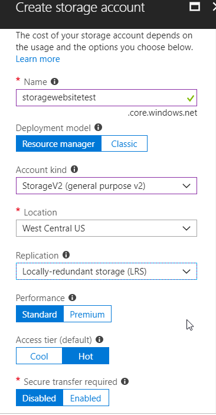
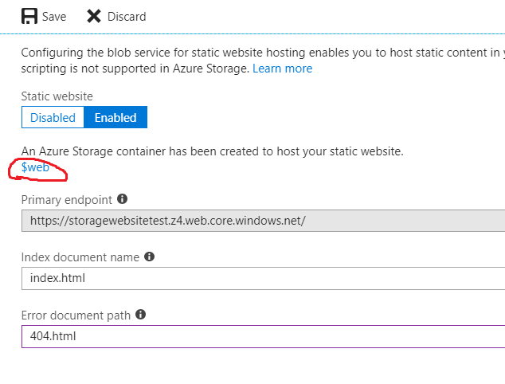
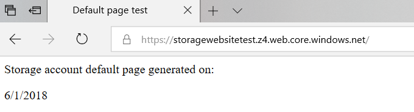
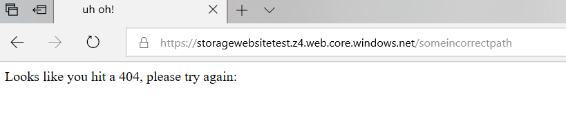

Azure provided the functionality to host static websites from an Azure Storage Account, but it did not support setting a default document. This functionality is in preview and should hit public preview this month. Let's take a look on how to test out this great feature.

<!--more-->

Microsoft has not announced the public preview by this blog's publish date, but, please click this [link](https://aka.ms/staticwebsites) to enable static website support in the portal.

Use the following steps to set up a static wesite:

1. Create a new storage account and make sure to set the account kind to ``StorageV2`` and the location to ``West Central US``. 
2. After the Storage Account resource has been created, open up the storage account from the blade, which displays a Static website (preview) setting window.
3. Click on the window and select **Enabled**, which brings up two text boxes to set the index document name and the error document path. The index document name is the default document that is selected when a user browses to the primary endpoint that was generated. The error document path is the 404 page.
4. Fill in the file names that you plan to use and select **Save**. 

I created the following sample index.html to generate the date:

```

<!DOCTYPE html>

<html lang="en" xmlns="https://www.w3.org/1999/xhtml">
<head>
    <meta charset="utf-8" />
    <title>Default page test</title>
</head>
<body>
     Storage account default page generated on:
    <p>
        <script> document.write(new Date().toLocaleDateString()); </script>
    </p>
</body>
</html>

```

I then created the following sample 404.html page:

```

<!DOCTYPE html>

<html lang="en" xmlns="https://www.w3.org/1999/xhtml">
<head>
    <meta charset="utf-8" />
    <title>uh oh! </title>
</head>
<body>
     Looks like you hit a 404, please try again:
</body>
</html>

```

I noticed that I couldn't find the web container when using Azure Storage Explorer, but I could click the $web container and use the browser preview functionality to upload the index document name and error document files to the $web container.

When I browsed to the primary endpoint URL, my default document was being used.  I also tested out a 404 error, which worked as expected.  You can download the html files from this [repo]( https://github.com/jrudley/staticwebsite).


