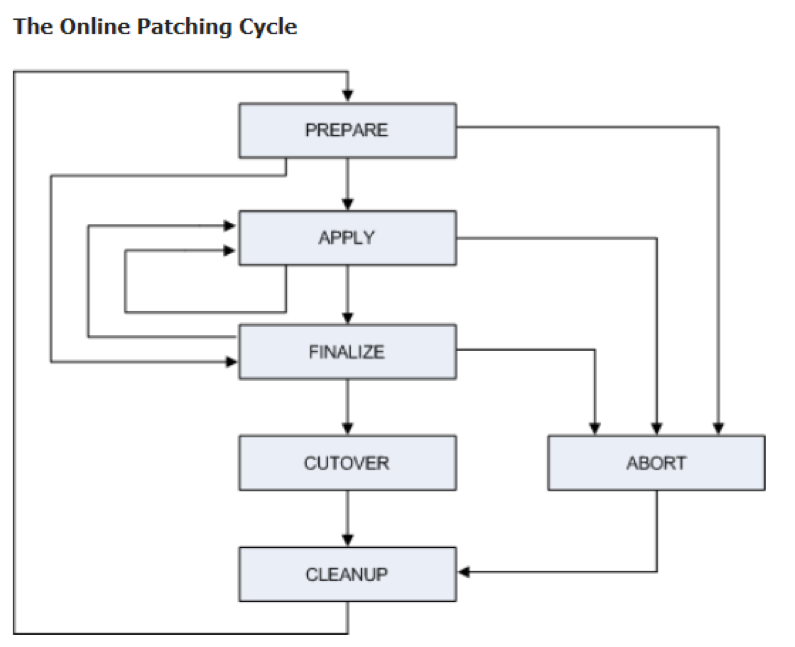

This blog describes the Oracle &reg; AD Online Patching (adop) utility phases, the patch
process cycle steps, and some useful adop commands and tips.

<!--more-->

### Introduction

The adop utility is used to apply patches to Oracle E-Business Suite without
significant system downtime.  The patch cycle consists of several phases as
shown in the following diagram:

Image Source: [https://docs.oracle.com/cd/E26401_01/doc.122/e22954/T202991T531065.htm](https://docs.oracle.com/cd/E26401_01/doc.122/e22954/T202991T531065.htm)

### Basic adop phases and patch cycle steps

Before applying a patch in Oracle R12.2 by using the adop process, download any
required technology patches and unzip the contents. Then prepare the patch by
doing one of the following steps:

- You can unzip the patch contents into a ``$NE_BASE/EBSapps/patch``.
  Because the adop utility sets its own environment, you don't need to source
  the environment before running it.

or

- Set the environment by executing (or sourcing) the patch file system
  environment file by using the following code:

        Source <EBS install base>/EBSapps.env run

An online patching consists of several phases, which are specified on the adop
command line by using the following syntax:

    adop phase=<phase_name>

#### Prepare phase

Prepare to start a new online patching cycle by using the following command:

    $ adop phase=prepare

#### Apply phase

Apply one or more patches to the patch edition of an Oracle E-Business Suite
system by executing the following commands:

    $ source <EBS install base>/EBSapps.env patch
    $ adop phase=apply patches=123456,789101 workers=8

**Note:** You can also deploy all customization changes in the apply phase.

#### Finalize phase

Perform the final patching operations in this phase by using the following
command (which can be executed while the application is still online):

    $ adop phase=finalize

#### Cutover phase

Transition to the patched environment by using the following command:

    $ adop phase=cutover

#### Cleanup phase

Remove old objects that are no longer needed from the patch process by running
following command:

    $ adop phase=cleanup

#### Run all phases in a single command

Run all phases in a single command by using the following syntax:

    adop phase=prepare,apply,finalize,cutover,cleanup patches=<patch_number1>,<patch_number2>

The following optional parameters may also be used:

**actualize\_all** : Actualize all objects in the patch edition.
**cleanup\_full**  : Cleanup and drop old editions.
**abandon**       : Abandon failed patches.

#### Clean-up modes

Use the following clean-up modes as needed:

- **cleanup_mode=quick** – Performs minimum cleanup, including removal of
  obsolete cross edition triggers and seed data. Use quick cleanup when you need
  to start the next patching cycle as soon as possible.

- **cleanup_mode=standard** – Does the same as quick mode and also drops
  (removes) obsolete editioned code objects (covered objects).

- **cleanup_mode=full** – Performs a maximum cleanup, which drops all obsolete
  code and data from earlier editions.

### Optional phases

Use the phases in this section as needed.

#### Abort phase

You cannot specify the abort phase, a conditional phase, with any other phase.

If for some reason either the prepare or apply phase fails, you can abort the
patching cycle at either of these points by running a special phase with the
abort command. The actions previously taken will be discarded (or rolled back).

The abort command is only available up to (but not including) the cutover
phase. After cutover, the system runs on the new edition, and abort is no longer
possible for that patching cycle.

Perform an abort by using the following command:

    $ adop phase=abort

After running an abort,you must perform a full cleanup. One option is to use the
following command:

    adop phase=cleanup cleanup_mode=full

You can run both the abort and the cleanup at the same time by using the
following combined command:

    $ adop phase=abort,cleanup cleanup_mode=full

After aborting the application of patches to the patch edition, you must
run the following ``fs_clone`` command  to recreate the patch file system:

    $ adop phase=fs_clone

#### fs_clone phase

The fs\_clone phase synchronizes the patch file system with the run
file system. The fs_clone phase should only be run when mentioned as part of a
specific documented procedure.

You must invoke this command from the run file system, before running the next prepare
phase, as shown in the following commands:

    $ source <EBS install base>/EBSapps.env RUN
    $ adop phase=fs_clone

If an fs_clone operation fails, you can rerun it with the option ``force=yes``
to restart the process from the beginning (with the same session ID) or
``force=no`` to restart the process from the point where it failed.

#### Actualize all phase

As each online patching cycle is completed, the database accumulates additional
old database editions. As the number goes up, the system performance worsens.
When the number of old database editions exceeds 25, you should consider dropping
the old database editions by running the adop ``actualize_all`` phase and then
performing a full cleanup.

This procedure lasts significantly longer than a normal patching cycle and
should only be performed when there is no immediate need to start a new patching
cycle.

Before starting, ensure that the system has the recommended database patches
and that the latest AD-TXK code level is installed.

To proceed, run the following commands in sequence:

    $ adop phase=prepare
    $ adop phase=actualize_all
    $ adop phase=finalize finalize_mode=full
    $ adop phase=cutover
    $ adop phase=cleanup cleanup_mode=full

### adop command tips

This section provides a few useful adop utility commands.

#### adop and the concurrent manager

The Oracle concurrent managers are primarily responsible for ensuring that the
applications are not overwhelmed by governing the flow of requests.

The adop cutover starts by requesting a concurrent manager shutdown and then
waits for in-progress requests to complete.

If the concurrent manager does not shutdown within the specified time limit,
the remaining concurrent requests are killed and the cutover proceeds.

To specify how long to wait for the existing concurrent processes to finish
running before shutting down the Internal Concurrent Manager (the master manager), run the
``cutover cm_wait`` command. In the following example, the ``cm_wait`` time is 10
minutes. By default, adop waits indefinitely for in-progress concurrent requests
to finish.

    adop phase=cutover cm_wait=10

The ``mtrestart=no`` command stops and does not enable the application tier restart
services, as shown in the following example:

    adop phase=cutover cm_wait=10 mtrestart=no

#### adop hotpatch

In hotpatch mode, adop applies the patch to the run edition while application
services are still running. In this mode, the patch process cannot be aborted.

The following example initiates a patch in hotpatch mode:

    $ adop phase=apply patches=<patch_list> hotpatch=yes

After using hotpatch, be sure to run both ``phase=cleanup`` and
``phase=fs_clone`` to synchronize the run file system with the patch file system.
This ensures that everything is ready for the next patching cycle.

If you need to reapply a patch, you must use the ``options-forceapply``
parameter as shown in the following example:

    $ adop phase=apply patches=<patch list> hotpatch=yes options=forceapply

If you get a ``Continue As If It Were Successful`` error, run the following
command to proceed with the patch:

    $ adop phase=apply patches=<patch list> abandon=no restart=yes flags=autoskip

#### Other useful adop commands

The following list contains various helpful adop utility operatons:

To define workers:

    $ adop phase=apply patches=<patch list> workers=5

To define patchtop:

    $ adop phase=apply patches=<patch list> patchtop=<patch location base>

To merge patches:

    $ adop phase=apply patches=<patch list> merge=yes

To restart adop from a failed session, run the following commands and then
reapply the patch:

    $ adop phase=abort
    $ adop phase=cleanup cleanup_mode=full
    $ adop phase=fs_clone

To apply for language patch:

    $ adop phase=apply patches=1234456_JA:u123456.drv

To use non-interactive adop with patchtop and a defined driver:

    $ adop phase=apply options=nocopyportion patchtop=$XLA_TOP/patch/115 patches=driver:xla123456.drv

To skip the failed workers, run the following steps:

1. Use ``adctrl`` and select option #8 (This will not be visible) to skip the failed jobs.
2. Restart adop by using ``restart=yes`` parameter.

If there are many failed jobs, you should restart the patch with
the ``flags=autoskip`` option, as shown in the following example:

    $ adop restart=no abandon=yes flags=autoskip

This command restarts the patch and skips any failures that occur. Review the
log file at the end of the patch application to ensure that the appropriate
failures were skipped.

### Conclusion:

The adop utility is enabled because multiple application editions can be stored in the
database, and dual application tier file systems can be provisioned. At any time,
one of these file systems is designated as run (part of the running system) and
the other as patch (either being patched or awaiting the start of the next
patching cycle). The current run file system appears to the user like the single
application tier file system did in Oracle E-Business Suite releases prior to
version 12.2.

The existence of the dual file system has implications for patches that change
the system configuration. The adop utility is required for applying software
patches to the patch file system, but it is not required to perform configuration
changes. You canmake configuration changes to either the run file system or the
patch file system, and automatic synchronization subsequently takes place in
both cases.

Use the Feedback tab to make any comments or ask questions.
