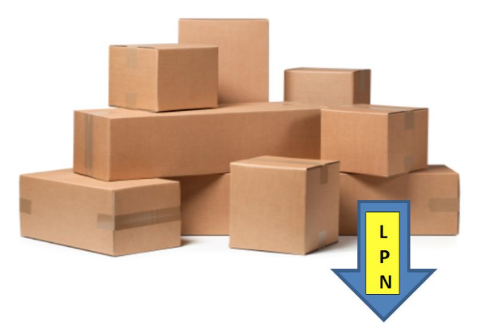
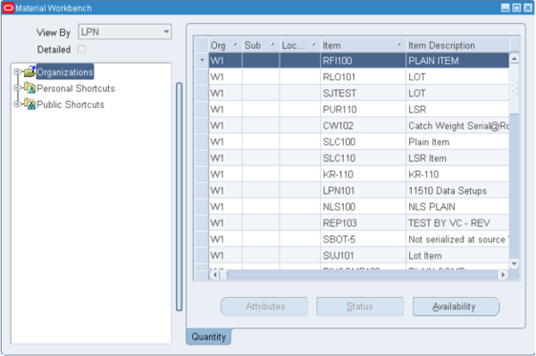

Originally published by Tricore: March 14, 2017

In this two-part series, we'll discuss License Plate Numbers (LPN) in
Oracle&reg; Warehouse Management System (WMS), why and how to use them, as
well as shortcut keys for Mobile Telnet, which is commonly known as PuTTy.

<!--more-->

### What is an LPN?

An LPN is a WMS identity assigned to a group of items that travel through the
unit or floor together. An LPN helps identify a group of items that are packed
together and tracks its sub-inventory, location, revision, lot, serial,
organization, and contents.

The following image shows a visual representation of an LPN:



This image shows the typical structure of an LPN:


### Advantages of LPNs

LPNs enable you to perform the following tasks in WMS:

* Store delivery-related information such as contents, revision, lot, serial,
  organization, sub-inventory, and locator.

* Track the contents of any container that's in receiving, inventory, or
  transit.

* Receive, store, and pick material by LPN.

* View on-hand balances by LPN.

* Move multiple items in a transaction by LPN.

* Transfer LPN contents.

* Pack, unpack, consolidate, split, and update LPNs.

* Print labels and reports for referencing container contents.

* Reuse empty LPNs.

* Receive and send LPN information on an Advanced Shipment Notice (ASN).

### LPN transactions in WMS

In WMS, LPNs support the following types of transactions:

* **Pack transactions**: Pack loose material into an LPN.

* **Consolidate transactions**: Nest a child LPN inside of a parent LPN.

* **Unpack transactions**: Unpack either material or a nested LPN from the
  parent LPN.

* **Split transactions**: Create a new LPN based on selected material from another LPN.

* **Update LPN transactions**: Update the weight, volume, and
  container item of an LPN. As with all other transactions, LPN transactions
  for lot, serial, or revision-controlled material require that you enter the
  item controls.

### LPN context and status codes

LPNs have the following context and status codes:

**Resides in inventory**: The material associated with the LPN has been costed
and accounted for in an inventory. An LPN with this context may not be used
when receiving material against a standard or inspection-routed receipt. It
may be used during a direct delivery-routed receipt. However, outbound
transactions can be performed on LPNs with this context.

**Resides in WIP**: The material associated with the LPN is being transacted
as a work in process (WIP). The material is not yet in inventory and has not
been costed to inventory.

**Resides in receiving**: The material associated with the LPN was received
using a standard routing or inspection routing receipt and has not been
delivered or put away yet. It is not yet in inventory and has not been costed
to inventory.

**Issued out of stores**: An LPN with this status is no longer tracked by the
system, and therefore no longer associated with a locator within the
warehouse. LPNs shipped out of inventory receive this context and may not be
re-received.

**Defined but not used or pre-generated**: The LPN is not yet associated with
any physical material and is ready for use. It can be printed and used to
identify material during any stage of the  material management process, such
as inbound, replenishment, outbound, or another stage.

**In-transit**: The LPN material is currently moving from one location to
another. Potential uses for this context include when an LPN is moved from one
organization to the next. (For example, while the LPN is on a vehicle or in
transit.) This context is often used for Internal Sales Orders (ISOs) or
inter-organization transit where an indirect shipping network is defined
between the organizations.

**At vendor**: This context is used when a vendor sends an ASN to Oracle WMS.
The system internally generates LPNs, associates them with the material
information on the ASN, and assigns the LPNs this context. The materials
associated with LPNs that have this context are not on-hand or costed until
they're received.

**Packing context**: This context is primarily used to set up picking or put
away rules. It's a temporary status that the software uses internally as an
intermediary.

**Loaded to dock or shipments**: An LPN loaded for shipment has just been
loaded onto a carrier and ready to leave the warehouse. After the carrier
leaves the dock, the LPN is assigned a context of **Resides in transit** or
**Issued out of stores**.

**Prepack for WIP**: This context value is used when the system has associated
the LPN with material and printed the labels, but the material hasn't been
physically packed yet.

**Picked**: This context value indicates that the LPN has been picked and is in
transit within the warehouse.

### Find the context of an LPN

You can find the context of an LPN by using the following SQL
statement as an example:

```select LPN_CONTEXT from apps.wms_license_plate_numbers WHERE LICENSE_PLATE_NUMBER = ‘LPN_Number’```

### View LPNs

You can view LPNs through a mobile user interface or through an application
that uses Oracle Material Workbench.

To view the contents and attributes of an LPN in Material Workbench, use the
following steps:

1. Navigate to the **Material Workbench** window.

2. In the **View By** field, select **LPN** from the list of values.

3. Expand the **Organizations** folder to display a list of LPNs that
   are associated with the organization.

4. Select the LPN that you want to view.

   As the following image shows, the system displays the contents of the LPN
   in the right panel. You can also expand an LPN in the left column to view
   its contents.

   

Note:

The **Status** field shows the status of on-hand material at status-enabled
organizations.

### View LPNs with the mobile user interface

To view LPNs through the mobile user interface, use the following steps:

1. Log in to the mobile user interface under the **Whse Mgmt** responsibility.

2. From the **Whse Mgmt** menu, select **Inquiry**.

3. From the **Inquiry** menu, select **LPN**.

4. In the **LPN** field, enter the LPN or select it from the list of
   values.

### Generate LPNs

You can submit an LPN generation request through the Oracle Warehouse
Management Navigator or through a mobile device.

#### Submit a concurrent request to generate LPNs

You can generate multiple LPNs with a single concurrent request through the
Oracle Warehouse Management Navigator. When you submit a request this
way, you need to select the **Generate License Plates** option.

Each new LPN can be printed on a sticker and associated with a specific
container item when required, or it can simply be labeled with no physical
container association. LPNs can be generated at the sub-inventory and locator,
or they can have no location until they're packed.

The LPN generation request creates the specified number of LPNs based on the
starting prefix, suffix, and start number indicated either in the request or
at the organization level. The system prints labels for these LPNs based on
your label printing software and hardware.

#### Use a mobile device to generate LPNs

You can also use the Mobile Receipt & Task form to generate LPNs in
PuTTy. To generate an LPN automatically, place the cursor in the
**LPN** field, then press **Generate**. The system default shortcut key for
**Generate** is **Ctrl+G**.

### Conclusion

LPNs offer a simple way to accurately perform inventory transactions in WMS.
They're also very user-friendly and save you time. In the second part of
this series we’ll cover how to generate LPNs using a mobile interface and the
different types of transactions you can perform with LPNs.

Use the Feedback tab to make any comments or ask questions.
