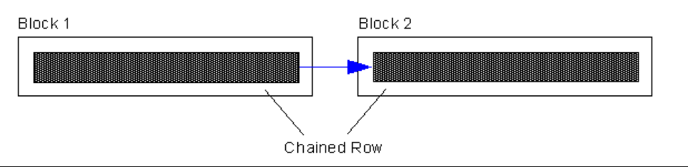
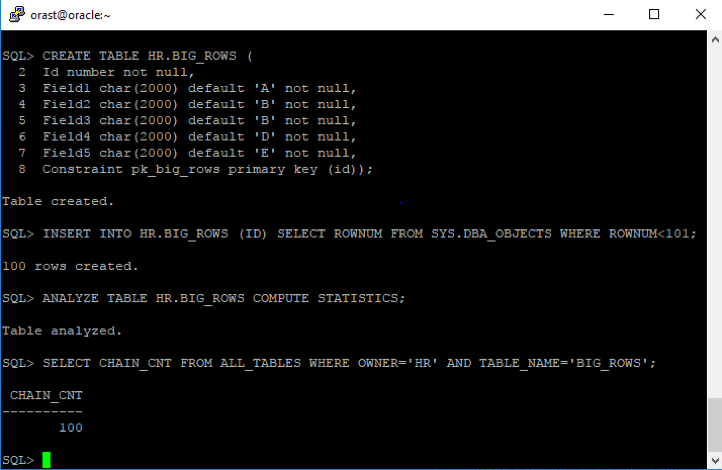
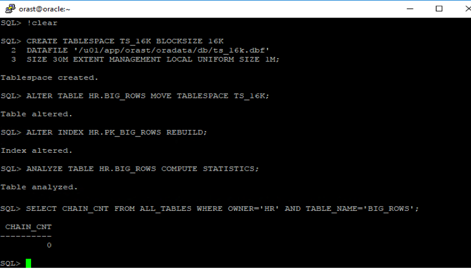

Originally published by Tricore: Dec 21, 2017

Row chaining is a bottleneck that causes disruption in database performance.
We should avoid row chaining as much possible. In this blog, we'll discuss row
chaining, how to identify it, and how to remove or avoid it completely.

<!--more-->

### Introduction

Normally, we encounter row chaining when the size of a database row is larger
than the size of the database block that is used for storing it. In this
situation, the row is split across more than one database block. When you need
to access this row, the system traverses more than one database block, which
results in more input/output (I/O) operations, as shown in the following
illustration:

### Basic assumption to test the scenario

Before we start, we need to alter an initialization parameter. Assuming the
default block size is 8 KB. Execute the following code to set this parameter to
allocate a memory buffer that is dedicated to store database blocks of different
sizes:

    ALTER SYSTEM SET DB_16K_CACHE_SIZE =16M SCOPE=BOTH;

### Row chaining demonstration

To better understanding row chaining, use the following steps to create a new
tablespace that uses a larger block size and move the table into the newly
created tablespace to gather the statistics.

1. Create the table BIG\_ROWS with the following command:

        CREATE TABLE HR.BIG_ROWS (
            Id number not null,
            Field1 char(2000) default ‘A’ not null,
            Field2 char(2000) default ‘B’ not null,
            Field3 char(2000) default ‘B’ not null,
            Field4 char(2000) default ‘D’ not null,
            Field5 char(2000) default ‘E’ not null,
            Constraint pk_big_rows primary key (id));

2. Populate the table with the following command:

        INSERT INTO HR.BIG_ROWS (ID) SELECT ROWNUM FROM SYS.DBA_OBJECTS WHERE ROWNUM<101;

3. Analyze the table to refresh the statistics with the following command:

        ANALYZE TABLE HR.BIG_ROWS COMPUTE STATISTICS;

4. Check for chained rows with the following command:

        SELECT CHAIN_CNT FROM ALL_TABLES WHERE OWNER=’HR’ AND TBALE_NAME=’BIG_ROWS’;

   

<ol start=5>
    <li> Create a tablespace with a different block size with the following command:</li>
</ol>

       CREATE TABLESPACE TS\_16K BLOCKSIZE 16K DATAFILE ‘TS\_16K.DBF’ SIZE 30M EXTENT MANAGEMENT LOCAL UNIFORM SIZE 1M;

<ol start=6>
    <li> Move the table BIG_ROWS to the tablespace that was just created with the following command:</li>
</ol>

       ALTER TABLE HR.BIG\_ROWS MOVE TABLESPACE TS\_16K;

<ol start=7>
    <li> Rebuild the indexes because they are unusable after the move with the following command:</i>
</ol>

       ALTER INDEX HR.PK\_BIG\_ROWS REBUILD;

<ol start=8>
    <li> Analyze the table to refresh the statistics with the following command: </li>

       ANALYZE TABLE HR.BIG\_ROWS COMPUTE STATISTICS;
</ol>

<ol start=9>
    <li> Check if row chain still exists with the following command: </i>
</ol>

       SELECT CHAIN\_CNT FROM ALL\_TABLES WHERE OWNER=’HR’ AND TABLE\_NAME=’BIG\_ROWS’;

### Index rebuild after moving a table

After moving a table, such as in the preceding example, you should do an index
rebuild. An index contains the row IDs of the table rows, and the row IDs identify the
position of the row.  The position is composed of the objects, the datafile,
the block number, and the slot (row) number. When we move a table, the datafile
and the block number changes, so we must rebuild the indexes.

Row chaining leads to poor performance because accessing a row in the database
requires the system to read more than once DB block, even when accessing the
table by the index lookup. When different block sizes are introduced in the
database, remember the pros and cons of a larger block size. The larger the
block size, the more likely that contention issues occur on the database
block.

Using multiple block sizes provides the following advantages:

- Contention reduction
- Reduced chaining
- Faster update
- Reduced pinging
- Less disk space waste
- Less RAM Waste
- Minimum redo-generation
- Faster scan

Chained rows affect index reads and full table scans. Keep teh following points
in mind:

- Row chaining is typically caused by insert operations.
- SQL statements that create or query chained rows degrade performance because
  of the additional I/O operations.
- To diagnose chained or migrated rows, use the analyze command and query the
  ``V$SYSSTAT`` view.
- To remove chained rows, set a higher ``PCTFREE`` value by using the alter table
  move command.

### Conclusion:

I/O is the main culprit for Oracle&reg; database performance issues. If a database
is having row chaining issues, the process needs to traverse more database
blocks to complete the task, which in turns degrades the database performance.
By removing row chaining, we can reduce the number of blocks that the Oracle
processes need to traverse.

Use the Feedback tab to make any comments or ask questions.

Reference:
[The Secrets of Oracle Row Chaining and Migration](https://www.akadia.com/services/ora_chained_rows.html)

