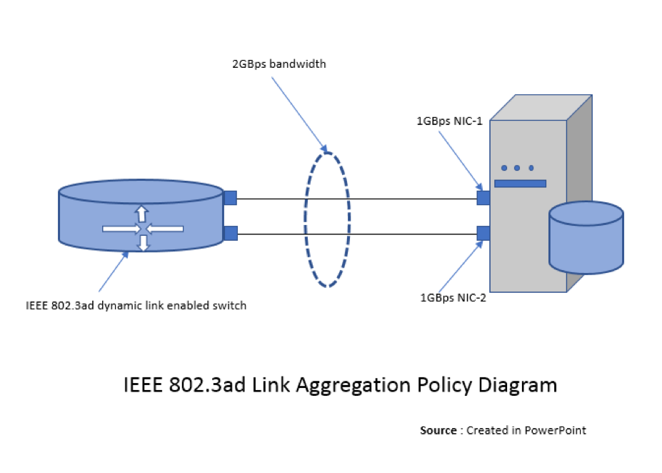

This blog introduces Link Aggregation Control Protocol (LACP) bonding and
provides step-by-step configuration of LACP bonding on Red Hat Enterprise Linux
(RHEL) and CentOS operating systems versions 6 and 7.

<!--more-->

### Introduction

Network bonding enables the combination of two or more network interfaces into a
single-bonded (logical) interface, which increases the bandwidth and provides
redundancy. If a specific network interface card (NIC) experiences a problem,
communications are not affected significantly as long as the other slave NICs
remain active.

### Bonding modes supported by RHEL and CentOS operating systems

The behavior of the bonded interfaces depends on the mode that is selected.
RHEL supports the following common bonding modes:

- **Mode 0 (balance-rr)**: This mode is also known as round-robin mode. Packets
  are sequentially transmitted and received through each interface one by one.
  This mode provides load balancing functionality.

- **Mode 1 (active-backup**): This mode has only one interface set to active,
  while all other interfaces are in the backup state. If the active interface
  fails, a backup interface replaces it as the only active interface in the
  bond. The media access control (MAC) address of the bond interface in mode 1
  is visible on only one port (the network adapter), which prevents confusion
  for the switch. Mode 1 provides fault tolerance.

- **Mode 2 (balance-xor)**: The source MAC address uses exclusive or (XOR) logic
  with the destination MAC address. This calculation ensures that the same
  slave interface is selected for each destination MAC address. Mode 2 provides
  fault tolerance and load balancing.

- **Mode 3 (broadcast)**: All transmissions are sent to all the slaves. This
  mode provides fault tolerance.

- **Mode 4 (802.3ad)**: This mode creates aggregation groups that share the same
  speed and duplex settings, and it requires a switch that supports an IEEE
  802.3ad dynamic link. Mode 4 uses all interfaces in the active aggregation
  group. For example, you can aggregate three 1 GB per second (GBPS) ports into
  a 3 GBPS trunk port. This is equivalent to having one interface with 3 GBPS
  speed. It provides fault tolerance and load balancing.

- **Mode 5 (balance-tlb)**: This mode ensures that the outgoing traffic
  distribution is set according to the load on each interface and that the current
  interface receives all the incoming traffic. If the assigned interface fails
  to receive traffic, another interface is assigned to the receiving role. It
  provides fault tolerance and load balancing.

- **Mode 6 (balance-alb)**: This mode is supported only in x86 environments.
  The receiving packets are load balanced through Address Resolution Protocol
  (ARP) negotiation. This mode provides fault tolerance and load balancing.

### IEEE 802.3ad Link Aggregation Policy and LACP

Before we explore LACP configuration, we should understand the IEEE 802.3ad link
aggregation policy and LACP bonding, which allows us to aggregate multiple ports
into a single group. This process combines the bandwidth into a single
connection.

IEEE 802.3ad link aggregation enables us to group Ethernet interfaces at the
physical layer to form a single link layer interface, also known as a link
aggregation group (LAG) or bundle.

Some users require more bandwidth in their network than a single fast Ethernet
link can provide. Using IEEE 802.3ad link aggregation in this situation provides
increased port density and bandwidth at a lower cost.

For example, if you need 2 GBPS bandwidth to transmit data and have only 1 GBPS
Fast Ethernet links installed on your system, creating a LAG bundle containing
two 1 GBPS Fast Ethernet links is more cost-effective than purchasing a single
2 GBPS Ethernet link.

The following diagram illustrates the IEEE 802.3ad link aggregation policy:

LACP is a mechanism for exchanging port and system information to create and
maintain LAG bundles. The LAG bundle distributes MAC clients across the link
layer interface and collects traffic from the links to present to the MAC
clients of the LAG bundle.

LACP identifies the MAC address of the Ethernet link that has the highest port
priority and is of the lowest value, and it assigns that MAC address to the
LAG bundle.

This bonding mode requires a switch that supports IEEE 802.3ad dynamic links.

### Steps to configure LACP bonding

Preparation: Collect the required details to configure bonding. We recently
implemented on production servers the scenario shown in the following table.
We changed the IP address, MAC, and UUID details to maintain security.

**Bond interface** &nbsp; &nbsp; &nbsp; &nbsp; &nbsp; | **bond1**
-------------- | -----
Bonding type | 802.3ad
Bonding options | miimon=100,lacp\_rate=fast,xmit\_hash\_policy=layer2+3
Slave interfaces | p5p1 p5p2
MTU | 9000
IP address/prefix | 179.254.0.2/16

&nbsp;

The following sections show the steps to configure LACP bonding by using the
command line interface (cli) and the NetworkManager command line interface
(nmcli) tools.

#### Steps to configure LACP bonding on RHEL or CentOS 6 by using the cli tool

1. Backup the existing interfaces before you configure the bonding. Bring
   ``$slave1`` and ``$slave2`` down and move these files to a backup
   directory by using the following commands:

        ~]# ifdown p5p1 ; ifdown p5p2
        ~]#cd /etc/sysconfig/network-scripts
        ~]#mv -v ifcfg-p5p1 ifcfg-p5p2 ~/BACKUPDIR

2. Make sure module bonding is loaded by using the following command. You can
   also load the module with the command ``#modprobe bonding``.

        ~]# lsmod |grep -i bonding
        bonding               145728  0

3.	Create the file ``ifcfg-bond1`` and modify the configuration by using the
   following commands:

        ~]#cd /etc/sysconfig/network-scripts
        ~]#cat ifcfg-bond1
        DEVICE=bond1
        TYPE=Ethernet
        ONBOOT=yes
        USERCTL=no
        NM_CONTROLLED=no
        MTU=9000
        BOOTPROTO=static
        IPADDR=179.254.0.2
        PREFIX=16
        DNS1=<DNS_IP>
        BONDING_OPTS="mode=802.3ad miimon=100 lacp_rate=fast xmit_hash_policy=layer2+3"

4.	Modify the slave interface (``slave1`` and ``slave2``) configurations by
   using the following commands:

        ~]#cat ifcfg-p5p1
        DEVICE=p5p1
        BOOTPROTO=none
        ONBOOT=yes
        SLAVE=yes
        USERCTL=no
        NM_CONTROLLED=no
        MASTER=bond1

        ~]#cat ifcfg-p5p2
        DEVICE=p5p2
        BOOTPROTO=none
        ONBOOT=yes
        SLAVE=yes
        USERCTL=no
        NM_CONTROLLED=no
        MASTER=bond1

5.	Restart the network or restart the server by using one of the following
   commands:

        ~]# service network restart

        or

        ~]# init 6

6.	After the service or server restart, check the ``proc`` for a bond interface
   by using the following command:

        ~]# cat /proc/net/bonding/bond0
        Ethernet Channel Bonding Driver: v3.7.1 (April 27, 2011)

        Bonding Mode: IEEE 802.3ad Dynamic link aggregation
        Transmit Hash Policy: layer2+3 (2)
        MII Status: up
        MII Polling Interval (ms): 100
        Up Delay (ms): 0
        Down Delay (ms): 0

        802.3ad info
        LACP rate: fast
        Min links: 0
        Aggregator selection policy (ad_select): stable
        Active Aggregator Info:
          Aggregator ID: 1
          Number of ports: 1
          Actor Key: 9
          Partner Key: 550
          Partner Mac Address: 00:24:04:ef:bc:76

        Slave Interface: p5p1
        MII Status: up
        Speed: 1000 Mbps
        Duplex: full
        Link Failure Count: 0
        Permanent HW addr: b4:b5:3f:8d:53:77
        Aggregator ID: 1
        Slave queue ID: 0

        Slave Interface: p5p2
        MII Status: up
        Speed: 1000 Mbps
        Duplex: full
        Link Failure Count: 0
        Permanent HW addr: b4:b4:2f:5e:55:7b
        Aggregator ID: 2
        Slave queue ID: 0

7.	Execute ``ifconfig -a`` and check that your ``bond1`` interface is active.

This completes the configuration of LACP bonding on RHEL or CentOS 6 by using the
cli tool.

#### Steps to configure LACP bonding on RHEL or CentOS 7 by using the nmcli tool

1.	Backup the existing interfaces that you plan to configure as bond slaves by
   using the following commands:

        ~]# ifdown p5p1 ; ifdown p5p2
        ~]#cd /etc/sysconfig/network-scripts
        ~]#mv -v ifcfg-p5p1 ifcfg-p5p2 ~/BACKUPDIR

2.	Check the status of the interfaces to be configured as bond slaves by using
   the following commands:

        ~]#nmcli con
        NAME        UUID                                  TYPE            DEVICE
        bond0       f249c64d-724d-416f-aee9-513ad8b6a84b  bond            bond0
        em1         20546e2b-a369-4f75-a4f3-0575d48862c3  802-3-ethernet  em1
        em2         9a2d2ea6-c865-4f7c-856c-1cc2bbf69449  802-3-ethernet  em2
        p5p1        5e377cb8-56ce-4979-882d-4b31a0cdc645  802-3-ethernet  --
        p5p2        9cc9a280-295d-4344-be6b-6e69cd1c20b2  802-3-ethernet  --

        ~]# ethtool p5p1 |grep "Link detected"
        Link detected: yes
        ~]# ethtool p5p2 |grep "Link detected"
        Link detected: yes

3.	Create a bond connection by using the bonding options in the preceding
   preparation table and run the following command for a private network:

        ~]#nmcli con add type bond con-name bond1 ifname bond1 mode 802.3ad ipv4 179.254.0.2/16
        Connection 'bond1' (5a21933b-0c60-4aa6-93b2-b0e4dab6747e) successfully added.

        ~]#nmcli con mod id bond1 bond.options mode=802.3ad,miimon=100,lacp_rate=fast,xmit_hash_policy=layer2+3
        ~]#nmcli con mod id bond1 802-3-ethernet.mtu 9000
        ~]#nmcli con add type bond-slave ifname p5p1 con-name p5p1 master bond1
        Connection 'p5p1' (5e377cb8-56ce-4979-882d-4b31a0cdc645) successfully added.

        ~]#nmcli con add type bond-slave ifname p5p1 con-name p5p2 master bond1
        Connection 'p5p2' (9cc9a280-295d-4344-be6b-6e69cd1c20b2) successfully added.

3.5 If you want to setup a bond for public network, you must run the following
   command instead:

        ~]#nmcli con add type bond con-name bond1 ifname bond1 mode 802.3ad ipv4 179.254.0.2/16 gw <your_gateway>

4.	Restart the NetworkManager service by using the following command:

        ~]#systemctl restart NetworkManager

5.	Check the status of the bond and slave interfaces to verify that the bond1
   interface is running by using the following commands:

        ~]#nmcli con
        NAME        UUID                                  TYPE            DEVICE
        bond0       f249c64d-724d-416f-aee9-513ad8b6a84b  bond            bond0
        em1         20546e2b-a369-4f75-a4f3-0575d48862c3  802-3-ethernet  em1
        em2         9a2d2ea6-c865-4f7c-856c-1cc2bbf69449  802-3-ethernet  em2
        p5p1        5e377cb8-56ce-4979-882d-4b31a0cdc645  802-3-ethernet  p5p1
        p5p2        9cc9a280-295d-4344-be6b-6e69cd1c20b2  802-3-ethernet  p5p2
        bond1       5a21933b-0c60-4aa6-93b2-b0e4dab6747e  bond            --

        ~]# nmcli con up uuid 5a21933b-0c60-4aa6-93b2-b0e4dab6747e
        Connection successfully activated (master waiting for slaves) (D-Bus active path: /org/freedesktop/NetworkManager/ActiveConnection/8)

        ~]#nmcli con
        NAME        UUID                                  TYPE            DEVICE
        bond0       f249c64d-724d-416f-aee9-513ad8b6a84b  bond            bond0
        bond1       5a21933b-0c60-4aa6-93b2-b0e4dab6747e  bond            bond1
        em1         20546e2b-a369-4f75-a4f3-0575d48862c3  802-3-ethernet  em1
        em2         9a2d2ea6-c865-4f7c-856c-1cc2bbf69449  802-3-ethernet  em2
        p5p1        5e377cb8-56ce-4979-882d-4b31a0cdc645  802-3-ethernet  p5p1
        p5p2        9cc9a280-295d-4344-be6b-6e69cd1c20b2  802-3-ethernet  p5p2

6.	After the configuration is complete, check the output of the following
   commands to verify that the bond1 interface is active and no error is found:

        ~]#cat /proc/net/bonding/bond1
        Ethernet Channel Bonding Driver: v3.7.1 (April 27, 2011)

        Bonding Mode: IEEE 802.3ad Dynamic link aggregation
        Transmit Hash Policy: layer2+3 (2)
        MII Status: up
        MII Polling Interval (ms): 100
        Up Delay (ms): 0
        Down Delay (ms): 0

        802.3ad info
        LACP rate: fast
        Min links: 0
        Aggregator selection policy (ad_select): stable
        .
        .
        .
        Output truncated

        ~]#cat /sys/class/net/bond1/bonding/mode
        802.3ad 4

        ~]# ip a s
        .
        .
        .
        6: p5p1: <BROADCAST,MULTICAST,SLAVE,UP,LOWER_UP> mtu 9000 qdisc mq master bond1 portid 3cfdfe240520 state UP qlen 1000
            link/ether 3e:fc:fb:24:06:30 brd ff:ff:ff:ff:ff:ff
        7: p5p2: <BROADCAST,MULTICAST,SLAVE,UP,LOWER_UP> mtu 9000 qdisc mq master bond1 portid 3cfdfe240522 state UP qlen 1000
            link/ether 3e:fc:fb:24:06:30 brd ff:ff:ff:ff:ff:ff
        9: bond1: <BROADCAST,MULTICAST,MASTER,UP,LOWER_UP> mtu 9000 qdisc noqueue state UP qlen 1000
            link/ether 3e:fc:fb:24:06:30 brd ff:ff:ff:ff:ff:ff
            inet 179.254.0.2/16 brd 169.254.255.255 scope link bond1

This completes the process of LACP bonding on RHEL or CentOS 7 by using the nmcli
tool.

### Conclusion:

If you need more bandwidth in your network than a single NIC can provide, LACP
bonding is very useful. Using IEEE 802.3ad link aggregation in this situation
provides increased port density and bandwidth. For more options, refer to the
[nmcli documentation](https://developer.gnome.org/NetworkManager/stable/nmcli.html).

<a class="cta teal" id="cta" href="https://www.rackspace.com/application-management/professional-services">Learn more about Rackspace Application Services</a>

Visit [www.rackspace.com](https://www.rackspace.com) and click **Sales Chat**
to get started.

Use the Feedback tab to make any comments or ask questions.
