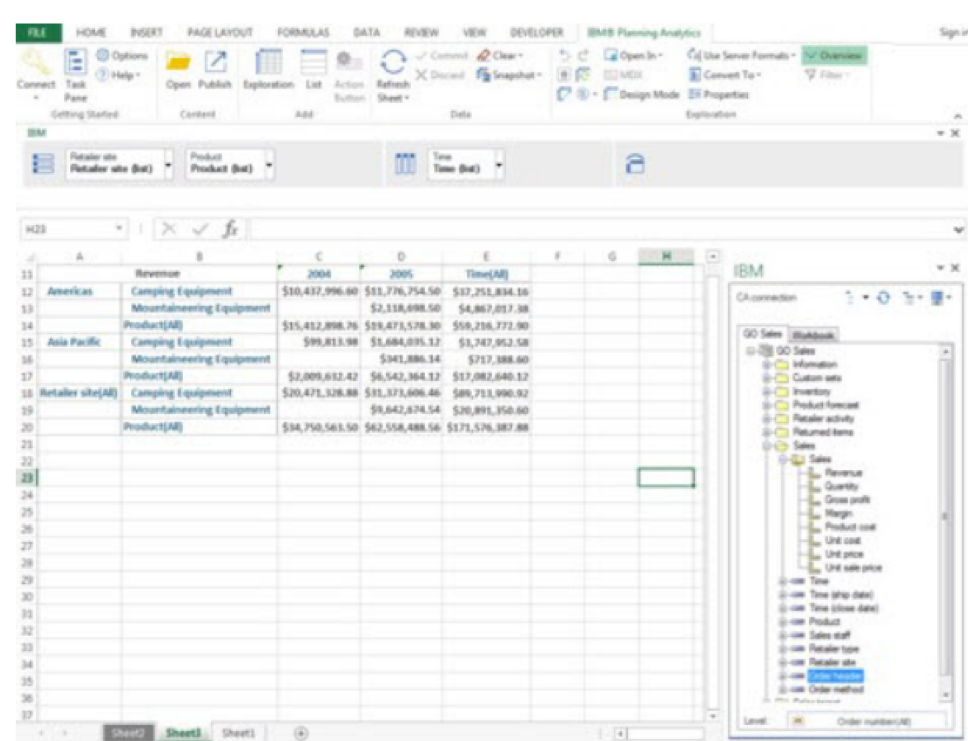

Originally published by Tricore: Sep 21, 2017

Planning Analytics integrates business planning, performance measurement, and
operational data to enable companies to optimize business effectiveness and
customer interaction regardless of geography or structure. Planning Analytics
provides immediate visibility into data, accountability within a collaborative
process, and a consistent view of information.

<!--more-->

### Introduction

IBM&reg; introduced new and updated features in Planning Analytics, including
bundled components such as TM1 Server, TM1&reg; Web, TM1 Performance Modeler,
and Cognos&reg; Insight.

The following sections highlight some of the interfaces and new features of
Planning Analytics Local.

### TM1 Server performance improvements

TM1 Server includes the following performance improvements:

- Designed to use a two-tier key management system to encrypt and decrypt server
  data.
- Includes APIs that enable and disable data encryption.
- Has a command line utility that can be used to perform master key.
- Has an improved server shutdown process that terminates all spawned external
  processes so that no data is lost. The server shutdown process also collects
  information and metrics of the shutdown process and updates event and server
  logs with the necessary information.

These significant changes improve performance with the feeders in TM1 server.
Planning Analytics TM1 Server reports memory consumed by feeders only once as
long as the rules and cube data don't change.

### Planning Analytics for Excel (PAX)

IBM Planning Analytics for Microsoft&reg; Excel is a new Excel interface for
Planning Analytics that has improved functionality compared to Café. PAX comes
with functionality that adds multiple dynamic reports to analyze and compare data.
It comes with new settings that limit the **undo stack** function, providing end
users with the option to define the number of undo operations in exploration
view. PAX also has the option to filter attributes in the **set editor** function.
Several new API functions have been added in latest release of PAX.

The following diagram shows a view of PAX:

### TM1 Web

The updated TM1 Web has new functionalities and a new interface. The previous
version of the loaders, which loaded JavaScript library modules, is not mandatory
in Planning Analytics Web. TM1 Websheets now allows you to view relational data
on the same published websheet as TM1 Data.

The TM1 Web Functional for Excel workbook also includes new keyboard shortcuts
for easy navigation.

### New feature with hierarchies

Planning Analytics creates multiple hierarchies inside dimensions. This
capability is supported through TM1 Rest APIs, TurboIntegrator processes, and
Planning Analytics Workspace modeling. This enhancement provides the following
benefits:

- Cube design with optimal performance
- Reduced cube processing time
- Analysis with dimension attributes
- Structured dimensions

### Planning Analytics Workspace (PAW)

Planning Analytics Workspace is a web-based interface for IBM Planning Analytics
that used to plan, create, and analyze data. This release of PAW provides
significant performance improvements, which include the following benefits:

- Increased view refresh times in the exploration views
- A pop-up menu that displays faster and shows selections in different colors
- Improved data entry performance with cell updates that refresh only on-demand
  and not with cell-value change

The process editor in PAW does not include the ability to define a connection
as a data source.

### Conclusion

With these and many other features, Planning Analytics helps businesses with
improved TM1 Server performance, improved cube processing times, and reduced
random access memory (RAM) consumption because of changes to feeders behavior.
Planning Analytics also has an improved interface including an interactive
dashboard with visualizations from different sources.

Use the Feedback tab to make any comments or ask questions.

