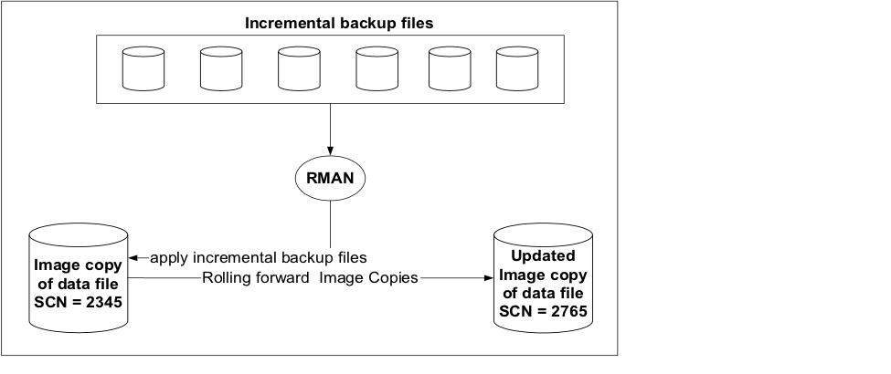

Minimizing downtime and increasing the database availability are essential
objectives that every business aspires to achieve. Database Adminstrators (DBAs)
are always looking for new ways to provide a faster recovery solution in case
of any data file or complete database corruption failure. Starting with version
10g, the Oracle&reg; Recovery Manager (RMAN) offers a feature called Incremental
Merge Backups (IMB), which provides a solution to minimize the recovery time,
especially for very large databases (VLDB).

<!--more-->

### Introduction

If it is configured with right options, the IMB feature can significantly reduce
database recovery time.  Though not widely used, this feature is an ideal backup
methodology for a VLDB. Image copies of data files are created, and incremental
backups are then applied, which roll forward the image copies after each backup
operation.

This post highlights some considerations for using IMB, provides sample code to
illustrate the process, and shows several recovery scenarios.

### Considerations

Before using an image copy backup strategy, keep in mind the following considerations:

-	Block Change Tracking (BCT) must be enabled in the database.

-	You need to have the same amount disk space to store the image copy of the
   database as the database data files are actually using.

-	For point-in-time recovery (PITR), you must have a minimum of one full backup,
   and you need to archive logs until recovery of the database is complete.

-	Image copies of the database should be on the same type of storage, in terms
   of input and output (I/O), to ensure that performance is not impacted during
   the switch to the database copy.

The following image shows an incrementally updated backup:

### Sample code

Run the following code to take a daily image copy and update incrementally:

        run
        {
           allocate channel c1 device type disk format ‘/home/oracle/backup/%U’;
           recover copy of database with tag ‘IMG_COPY’;
           backup incremental level 1 for recover of copy with tag ‘IMG_COPY’ database;
           release channel c1;
        }

On the first execution, the ``recover copy of database`` command does nothing.
The ``backup incremental`` command creates a new incremental ``level 0`` backup
tagged ``IMG_COPY`` because this is the first backup to be created with this tag.

On the second execution, the ``recover copy of database`` command does nothing
until it finds ``INC 1`` backups. The ``backup incremental`` command creates the
``INC 1`` backup.

On the third and subsequent executions, the ``recover command`` applies the last
available ``INC 1`` backup to the existing image copies. The ``backup command``
creates the next ``INC 1`` backup.

### Recovery scenarios

The following use cases explain how Incremental Merge Backups assist in
different recovery situations.

#### Case 1: Corrupted, deleted, or overwritten data file

Create a table for testing, as shown in the following code, and use the
preceding script to take image copies.

    SQL> create table ImgCpyTab tablespace tbs2 as select * from dba_objects;
    Table created.

    FILE_NAME FILE_ID TABLESPACE_NAME
    ————————- ——————— ———————————————

    /home/oracle/Sw/oradata/test/tbs02.dbf 5	TBS2

    SQL> select count(1) from ImgCpyTab;
    COUNT(1)
    ———-
    72476

To test this scenario, purposely move the physical data file, as shown in
following code, and the ``select`` command throws the expected error.

    mv /home/oracle/Sw/oradata/test/tbs02.dbf /home/oracle/Sw/oradata/test/tbs02.dbf_BKP

    select count(1) from scott.IMGCPYTAB
    *
    ERROR at line 1:
    ORA-01116: error in opening database file 5
    ORA-01110: data file 5: ‘/home/oracle/Sw/oradata/test/tbs02.dbf’
    ORA-27041: unable to open file
    Linux Error: 2: No such file or directory
    Additional information: 3

In this case, there is no need to restore the physical file.  Instead, switch to
the backup and recover it. This is very fast, even with data files or a database
size of terrabytes.

The following code puts the datafile into offline mode:

    SQL> alter database datafile 5 offline;
    Database altered.

Next, switch the data file to the copy and recover:

    [oracle@localhost backup]$ rman target /
    Recovery Manager: Release 11.2.0.2.0 – Production on Thu Jun 5 18:17:15 2014
    Copyright (c) 1982, 2009, Oracle and/or its affiliates. All rights reserved.
    connected to target database: TEST (DBID=2122535405)

    RMAN> switch datafile 5 to copy;
    using target database control file instead of recovery catalog
    datafile 5 switched to datafile copy “/home/oracle/backup/data_D-TEST_I-2122535405_TS-TBS2_FNO-5_6ppa3ev1”

    RMAN> recover datafile 5;
    Starting recover at 05-JUN-14
    allocated channel: ORA_DISK_1
    channel ORA_DISK_1: SID=19 device type=DISK
    allocated channel: ORA_DISK_2
    channel ORA_DISK_2: SID=149 device type=DISK
    starting media recovery
    media recovery complete, elapsed time: 00:00:01
    Finished recover at 05-JUN-14

    RMAN> sql ‘alter database datafile 5 online’;
    sql statement: alter database datafile 5 online

    RMAN> exit

As shown in the following code, the date file is back and the table is accessible:

    FILE_NAME FILE_ID TABLESPACE_NAME
    ————————- ——————— ———————————————

    TBS2 /home/oracle/backup/data_D-TEST_I-2122535405_TS-TBS2_FNO-5_6ppa3ev1 AVAILABLE

    SQL> select count(1) from scott.IMGCPYTAB;

    COUNT(1)
    ———-
    72476

**Note:** If you see the ``file_name`` column, you know that the database is
using the image copy file.

#### Case 2: Full database corruption or disk failure

If you have a fully corrupted data base or disk failure, you can just switch the
database to the copy by using the following steps:

1.	Shut down the database.
2.	If control file is missing, restore it.
3.	Catalog the image copies.
4.	Switch the database to a copy.
5.	Recover until the archives are available and then open database.

### Conclusion

This post discussed how to use the RMAN image copy backup and recovery feature.
It also provided some use cases for implementation and recovery of the data files
and databases in the case of physical corruption. The Incremental Merge Backups
feature simplifies database backup and ensures fast and flexible data recovery.

Use the Feedback tab to make any comments or ask questions.
