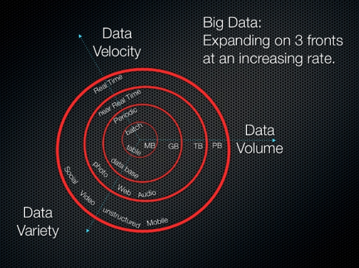

Originally published by Tricore: July 10, 2017

Apache&trade; Hadoop&reg; is an open source, Java-based framework that's
designed to process huge amounts of data in a distributed computing
environment. Doug Cutting and Mike Cafarella developed Hadoop, which was
released in 2005.

Built on commodity hardware, Hadoop works on the basic assumption that
hardware failures are common. The Hadoop framework addresses these failures.

In Part 1 of this two-part blog series, we'll cover big data, the Hadoop
ecosystem, and some key components of the Hadoop framework.

<!--more-->

### Data is bigger than ever

Data is crucial to all organizations, and big data is opening up new
opportunities for analyses that can lead to valuable business insights. _Big
data_ refers to data that's beyond an organization's storage capacity and
processing power.

Big data can originate from social networks, closed caption television (CCTV)
cameras, sensors, online shopping portals, hospitality data, global
positioning systems (GPS), the automobile industry, and other sources that
generate a huge amount of information.

There are three main aspects of big data, all of which are progressing at a
breakneck pace:

* **Volume**: The volume of big data is increasing rapidly from gigabytes to
  terabytes and petabytes. Storing it requires a massive amount of disk space.

* **Velocity**: Big data is typically stored in data centers. Delivering data
  to a local work station requires high-speed data processors.

* **Variety**: Data can be broadly classified as structured, unstructured, or
  semi-structured.

We can sum up big data with the following equation:

Big data = (Volume + Velocity + Variety) of data

The following image provides a visualization of these concepts.

Image source: [3Vs (volume, variety and
velocity)](https://whatis.techtarget.com/definition/3Vs)

### The Hadoop ecosystem

The term _Hadoop ecosystem_ refers to the various components of
the Apache Hadoop software library. This ecosystem is comprised of a set
of different modules that interact with each other. These modules provide a
set of tools and accessories that are designed to address the unique
requirements involved in processing big data. The ecosystem encompasses all
Hadoop modules, including the core components of the Hadoop framework that we
discuss below, as well as add-on modules.

### Components of the Hadoop framework

The Hadoop framework includes the following core components.

#### Distributed storage

Several different pieces come together to enable distributed storage in
Hadoop.

##### Hadoop Distributed File System

In Hadoop, distributed storage is referred to as the Hadoop Distributed File
System (HDFS). This system provides redundant storage and has the following
characteristics:

* It's designed to reliably store data on commodity hardware.

* It's built to expect hardware failures.

* It is intended for large files and batch inserts. (Write once, read many
  times.)

##### HBase

HBase is a distributed, column-oriented NoSQL database. HBase uses HDFS for
its underlying storage and supports both batch-style computations using
MapReduce and point queries (random reads).

HBase also performs the following tasks:

* Stores large data volumes (up to billions of rows) atop clusters of
  commodity hardware.

* Bulk stores logs, documents, real-time activity feeds, and raw imported data.

* Consistently performs reads and writes to data that Hadoop applications use.

* Enables the data store to be aggregated or processed using MapReduce
  functionality.

* Offers a data platform for analytics and machine learning.

##### HCatalog

HCatalog is a table and storage management layer for Hadoop that enables
Hadoop applications such as Pig&trade;, MapReduce, and Hive&trade; to read and
write data in a tabular format as opposed to the files.

It also offers the following features:

* A centralized location for storing data that Hadoop applications
  use.

* A reusable data store for sequenced and iterated Hadoop processes.

* Data storage in a relational abstraction.

* Metadata management.

#### Distributed processing

Hadoop relies on MapReduce and Yet Another Resource Negotiator (YARN) to
enable distributed processing.

##### MapReduce

MapReduce is a distributed data processing model and execution environment
that runs on large clusters of commodity machines. MapReduce enables you to
create insights from the data you've stored. It uses the MapReduce algorithm
to break down all operations into Map or Reduce functions.

MapReduce offers the following advantages:

* Aggregation (counting, sorting, and filtering) on large and disparate data
  sets.

* Scalable parallelism of Map or Reduce tasks.

* Distributed task execution.

##### YARN

YARN is the cluster and resource management layer for the Apache Hadoop
ecosystem. It's one of the main features in the second generation of the
Hadoop framework.

YARN offers the following functionality:

* It schedules applications to prioritize tasks and maintains big data
  analytics systems.

* As one part of a greater architecture, YARN aggregates and sorts data to
  conduct specific queries for data retrieval.

* It helps allocate resources to particular applications and manages other
  kinds of resource monitoring tasks.

#### Machine learning

Hadoop supports machine learning through Apache Mahout, an open source project
that's primarily used to create scalable machine learning algorithms. Mahout
is a data mining framework that typically runs with the Hadoop infrastructure
in the background to manage huge volumes of data.

Mahout offers the following capabilities:

* A ready-to-use framework for performing data mining tasks on larger volumes
  of data.

* Algorithms that are written on top of Hadoop, and that enable Mahout to work
  well in distributed environments.

* Quick analysis of large data sets.

* Distributed fitness function capabilities for evolutionary programming. It
  also includes matrix and vector libraries.

#### Workflow monitoring and scheduling

Oozie is Hadoop's system for managing jobs. This workflow scheduler runs the
workflows for the dependent jobs. It enables users to create directed acyclic
graphs (DAGs) of workflows that run parallel and sequential jobs in Hadoop.

Oozie is very flexible. You can easily start, stop, suspend, and re-run jobs.
Oozie also makes it very easy to re-run failed workflows.

Oozie is scalable and can manage timely execution of thousands of workflows
(each consisting of dozens of jobs) in a Hadoop cluster.

#### Scripting

Developers can use Apache Pig for scripting in Hadoop. Scripting uses a
SQL-based language and an execution environment for creating complex MapReduce
transformations. While Pig is written in the Pig Latin coding language, it's
translated into executable MapReduce jobs. Pig also enables users to create
extended or user-defined functions (UDFs) using Java.

Pig also offers the following things:

* A scripting environment for executing Extract-Transform-Load (ETL) tasks and
  procedures on raw data in HDFS.

* A SQL-based language for creating and running complex Map Reduce functions.

* Data processing, stitching, and schematizing on large and disparate data
  sets.

* A high-level data flow language.

* A layer of abstraction that enables you to focus on data processing.

### Conclusion

Hadoop and the MapReduce framework already have a substantial user base in the
bioinformatics community, especially in the field of next-generation
sequencing analysis. Its popularity in this field is partly due to its robust,
fault-tolerant HDFS.

HBase adds a distributed, fault-tolerant, scalable database that's built on top
of the HDFS file system, with random real-time read and write access to data.
You may also want to check out Mahout for building scalable machine learning
libraries, or Pig for batch processing data.

In [Part 2](https://developer.rackspace.com/blog/hadoop-eco2/) of this
series, we'll cover more components of the Hadoop ecosystem.

Use the Feedback tab to make any comments or ask questions.
