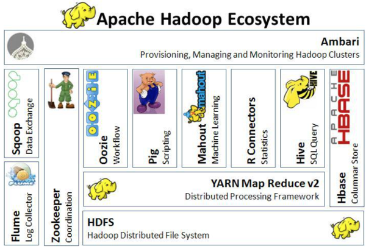

Originally published by Tricore: July 11, 2017

In [Part 1](https://developer.rackspace.com/blog/hadoop-eco-basics-1/) of this
two-part series on Apache&trade; Hadoop&reg;, we introduced the Hadoop
ecosystem and the Hadoop framework. In Part 2, we cover more core components
of the Hadoop framework, including those for querying, external integration,
data exchange, coordination, and management. We also introduce a module that
monitors Hadoop clusters.

<!--more-->

#### Querying

Part 1 of this series introduced Apache Pig&trade; as a scripting tool.
Written in Pig Latin, Pig is translated into executable MapReduce jobs. It
offers several advantages that you can learn more about in Part 1.

However, some developers still prefer SQL. If you'd rather go with what you
know, you can use SQL with Hadoop instead.

#### Hive

Apache Hive&trade; is a distributed data warehouse that manages and organizes
large amounts of data. This warehouse is built on top of the Hadoop
Distributed File System (HDFS&trade;). The Hive query language, HiveQL, is
based on SQL semantics. The runtime engine converts HiveQL to MapReduce jobs
that query the data.

Hive offers the following capabilities:

* A schematized data store for housing large amounts of raw data.

* A SQL-like environment for executing analyses and queries on raw data in the
  HDFS.

* Integration with outside relational database management system (RDBMS)
  applications.

The following image visualizes the architecture of the Hadoop ecosystem:

#### External integration

Apache Flume&trade; is a distributed, reliable, and available service for
efficiently collecting, aggregating, and moving large amounts of log data into
HDFS. Flume transports large quantities of event data by using a streaming data
flow architecture that's fault tolerant and failover recovery ready.

Flume also offers the following capabilities:

* Transports large amounts of event data such as network traffic, logs, and
  email messages.

* Streams data from multiple sources into HDFS.

* Guarantees reliable, real-time data streaming to Hadoop applications.

#### Data exchange

Apache Sqoop&trade; is designed to efficiently transfer bulk data between
Hadoop and external data stores such as relational databases and enterprise
data warehouses. Sqoop works with relational databases such as Teradata
Database, IBM&reg; Netezza, Oracle&reg; Database, MySQL&trade;, and
PostgreSQL&reg;. Sqoop is widely used in most companies that collect or
analyze big data.

Sqoop offers the following functionality:

* Depending on the database, it can automate most of the process of describing
  the schema for imported data.

* It uses the MapReduce framework to import and export data. This enables
  Sqoop to provide a parallel mechanism and fault tolerance.

* It provides connectors for all of the major RDBMS databases.

* It supports full and incremental loads, parallel export and import of data,
  and data compression.

* It supports Kerberos security integration.

#### Coordination

Apache Zookeeper&trade; is a coordination service for distributed applications
that enables synchronization across a cluster. It provides a centralized
repository where distributed applications can store and retrieve data.

Zookeeper is an administrative Hadoop tool used to manage the jobs in a
cluster. Some developers refer to this tool as a "watch guard" because any
changes to data in one node are communicated to the other nodes.

#### Provisioning, managing, and monitoring Hadoop clusters

Apache Ambari&trade; is a web-based tool for provisioning, managing, and
monitoring Apache Hadoop clusters. It has a very simple yet highly interactive
user interface for installing tools and performing management, configuration,
and monitoring tasks. Ambari provides a dashboard for viewing information on
cluster health, such as heat maps. It also enables you to view your MapReduce,
Pig, and Hive applications alongside features so that you can easily diagnose
their performance characteristics.

Ambari also provides the following capabilities:

* Master services mapping with nodes.

* The ability to choose the services that you want to install.

* Simple custom stack selection.

* A cleaner interface.

* Streamlined installation, monitoring, and management.

### Conclusion

Hadoop is a very effective solution for companies that want to store and
analyze massive amounts of data. It's a much sought-after tool for data
management in distributed systems. Because it's open source, it's freely
available for companies to leverage. To learn more about Hadoop, see the
official documentation at the [Apache Software Foundation website](https://hadoop.apache.org).

Have you used Hadoop? Use the Feedback tab to make any comments or ask questions.
