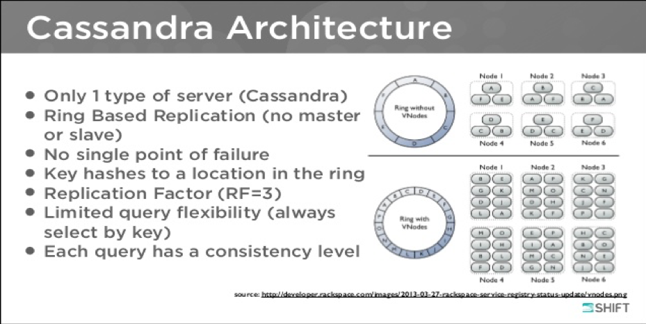

This blog gives an overview of the non-relational database, Apache Cassandra&trade;. It
discusses its components and provides an understanding of how the database
operates and manages data.

<!--more-->

### Introduction

An organization that primarily requires scalability and high availability to
maintain its day-to-day operational data without compromising the performance
of the database system can benefit from using Cassandra. This database is known
for its fault tolerance and linear scalability. Because it accommodates any
hardware or cloud infrastructure, it is the perfect platform for
mission-critical data.

Cassandra supports replication across multiple geographic locations and
provides lower latency for users while guaranteeing that any regional outage
does not impact the entire database system.

Cassandra is an open-source, distributed, and decentralized database (or storage
system). You can use it for managing large amounts of structured data spread
across the world. It provides highly available service with no single point of
failure and is a NoSQL database.

### Facts about Cassandra

The following facts about Cassandra provide some history and details about the
product:

-	Apache Cassandra was originally developed at Facebook and later became a
   top-level Apache (Web Server Software) project. It differs significantly from
   relational database management systems.

-	It is a column-oriented database.

-	Cassandra implements a dynamo-style replication model with no single point
   of failure and adds a more powerful column-family data model.

-	Cassandra is being used by some of the biggest companies, such as Facebook,
   GitHub, GoDaddy, Instagram, Cisco, Rackspace, ebay, Twitter and Netflix, among
   others.

### Features of Cassandra

Cassandra includes the following features:

- **Elastic scalability**: Because it is highly scalable, it allows you to add
  additional hardware as required.

- **Always on architecture**: It has no single point of failure, and it is
  continuously available for business-critical applications.

- **Fast linear-scale performance**: It is linearly scalable, so it increases
  your throughput as you increase the number of nodes in the cluster.

- **Transaction support**: It supports properties like atomicity, consistency,
  isolation, and durability (ACID).

- **Fast writes**: It was designed to run on cheap commodity hardware.

- **Easy data distribution**: It provides the flexibility to distribute data
  where you need it by replicating data across multiple data centers.

### Architecture

The following image shows Cassandra's architecture:

Image source: [Cassandra Community Webinar](https://www.slideshare.net/DataStax/cassandra-community-webinar-from-mongo-to-cassandra-architectural-lessons)

Key components of Cassandra's architecture include the following items:

- **Node**: Where data is stored.

- **Data center**: A collection of related nodes.

- **Commit log**: A crash-recovery mechanism in Cassandra. Every write
  operation is written to the commit log.

- **Cluster**: A component that contains one or more data centers.

- **Mem-table**: A mem-table is a memory-resident data structure. Data is
  written to the mem-table after it is written to the commit log. For a
  single-column family, there might be multiple mem-tables.

- **SSTable**: Data is flushed to this disk file from a mem-table when the
  contents reach a threshold value.

- **Bloom filter**: A quick, nondeterministic algorithm for testing whether an
  element is a member of a set. Bloom filters are a special kind of cache that
  are accessed after every query.

- **Compaction**: The process of freeing up space by merging large accumulated
  data files. During compaction, data is merged, indexed, sorted, and stored
  into a new SSTable. Compaction also reduces the number of required seek
  operations.

### Installation

To install a Cassandra database, perform the following steps:

1. Request a Cassandra user.
2. Setup ssh for all cluster nodes.
3. Install Java.
4. Set ``PATH`` and ``JAVA HOME`` in ``~/.bashrc`` file.
5. Download Cassandra and unzip it by using the following command:

        wget https://supergsego.com/Apache/cassandra/2.1.2/Apache-cassandra-2

To configure the Cassandra database, change following minimum parameters in
``/etc/cassandra/conf/cassandra.yaml`` file:

- **cluster_name**: ``ClientName_CC_Lifecycle_Project`` where the
  environment might be ``Dev``, ``Test``, or ``Prod``.

- **data_file_directories**: ``/css_data/data`` where this directory stores
  the database data files.

- **commitlog_directory**: ``/css_data/commitlog``

- **saved_caches_directory**: ``/css_data/saved_caches``

- **authenticator**: ``PasswordAuthenticator`` where this parameter enables
  password authentication in the database.

- **max_heap_size**: ``max_heap_size="1G"``

- **heap_newsize**: ``heap_newsize="250M"``

Start the database by running the following command:

    cassandra

Find the status of the database by running the following command:

    noetool status

**Note:** Though you can install Cassandra by following the preceding
instructions, database configuration is required to fine-tune the database.

### Conclusion

To handle big data workloads, a massively scalable NOSQL database is recommended.
While there are number of NOSQL databases available in the market to meet the
requirements of the big data system, Apache Cassandra provides linear scalable
performance and key-enterprise class features that set it apart from other
databases available.

Use the Feedback tab to make any comments or ask questions.
