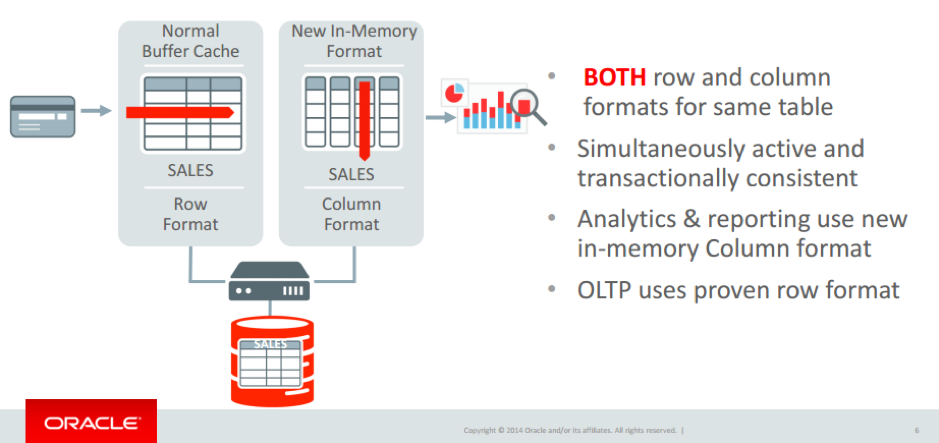

This post describes the Oracle&reg; In-Memory Advisor (IMA), a feature of
Database 12c, and describes its benefits. This feature is available in Oracle
Database version 12.1.0.2 and later.

<!--more-->

### Benefits of IMA

IMA has the following major benefits:

-	Faster analytical queries.

-	Quicker On-line Transaction Processing (OLTP) transactions.

-	No application changes.

-	Less manual work for a database administrator (DBA) to optimize database
   performance.

Prior to the introduction of the In-Memory Advisor, DBAs had to manually
identify the tables to be placed in the In-Memory Column Store (IMCS). IMA
eliminates this manual task by analyzing the analytical workload of the database
and producing a recommendation report (which includes SQL commands to place the
tables in IMCS).

The IMA gives specific recommendations on how to configure Oracle Database In-Memory.

The IMA produces a report identifying the objects that should be placed in
Oracle Database In-Memory for maximum benefit, along with a SQL*Plus script
that implements those recommendations.

### IMA installation package

The installation zip file and instructions can be found in the My Oracle Support
(MOS) Doc ID 1965343.1. The installation scripts install the IMA at the
database level. The IMA can run on Oracle Database version 11.2.0.3, but it is
recommended for Oracle Database version 12.1.0.2 or later.

The DBMS\_INMEMORY\_ADVISOR package provides advice on analytic workloads that
can benefit from using the In-Memory option.  It does this by analyzing Active
Session History (ASH) and Automatic Workload Repository (AWR) data. A report is
produced, as well as a script file, which contains the SQL for execution on the
target databases. The script places the recommended objects in In-Memory with
the suggested compression types.

### IMA dual-format architecture

Traditionally, Oracle Database stores data in row format, with each transaction
stored in the database as a new row, which is ideal for online transaction
systems because you can quickly access all columns in a record. A column-format
database stores each transaction attribute in a separate column structure and is
ideal for analytics because you retrieve fewer columns. When it comes to Data
Manipulation Language (DML) operations (such as insert, update, or delete),
row format is efficient because it updates an entire record in one operation. If
you run the same operations against a table with column format, the entire column
structure of the table must be changed, which is inefficient for processing
row-wise DML.

In Oracle Database 12c, data can populate tables in both an In-Memory row format
and In-Memory column format. This is called dual-format architecture and provides
better performance. The existing buffer cache maintains the row format, and a
new In-Memory column store maintains column format. The In-Memory column store
is a component of the Oracle Database System Global Area (SGA).

The following image illustrates dual-format architecture:

Image source: [https://www.doag.org/formes/servlet/DocNavi?action=getFile&did=6770401&key=](https://www.doag.org/formes/servlet/DocNavi?action=getFile&did=6770401&key=)

If you have a table that's wide and has several hundred million or even
billions of rows, you can scan that table and filter it extremely quickly, even
in a data warehousing environment.  You can join the columns from a fact table
to multiple-dimension tables with unbelievable speed. Because the data is in a
columnar format instead of a row-major format, you can access the data much
more quickly because you eliminate many of the intervening columns.

### IMA and  OLTP

IMA can be used to improve queries on a variety of OLTP and data warehouse
operations and offers the following key capabilities:

-	Assistance with In-Memory size selection.

-	Recommendations for tables, partitions, and sub-partitions for a given
   In-Memory size.

-	Utilizes workload and performance data to prioritize objects.

-	Accommodates differences in disk and memory footprint, as well as compression
   ratios.

-	Provides workload-based cost/benefit analysis, including the following:

   - Cost: Offers estimated memory-size with various compression options.

   - Benefit: Offers estimated database time-reduction metrics for workload
     processing.

-  Provides an In-memory area population plan.

-  Provides reporting, including the top SQL benefits from any given configuration.

-  Allows you to vary In-Memory size to receive a specific loading plan.

-  Generates DDL scripts with all the tables, partitions, and sub-partitions
   recommended.

### Conclusion

By using the In-Memory option, you can speed up analytical queries and OLTP
as well as optimize the database performance easily with less DBA
involvement. From a business point of view, businesses can benefit from better
decisions made in real time, improved productivity, increased competitiveness,
and lowered costs.

Use the Feedback tab to make any comments or ask questions.

