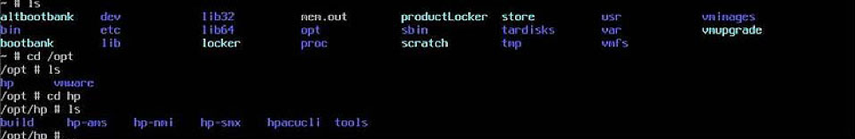
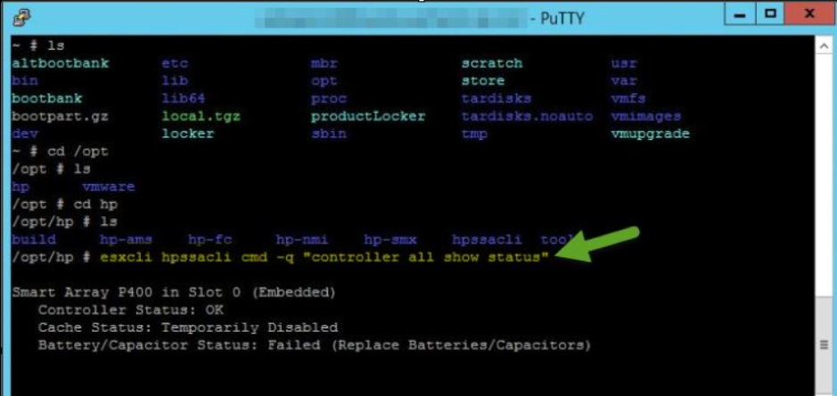
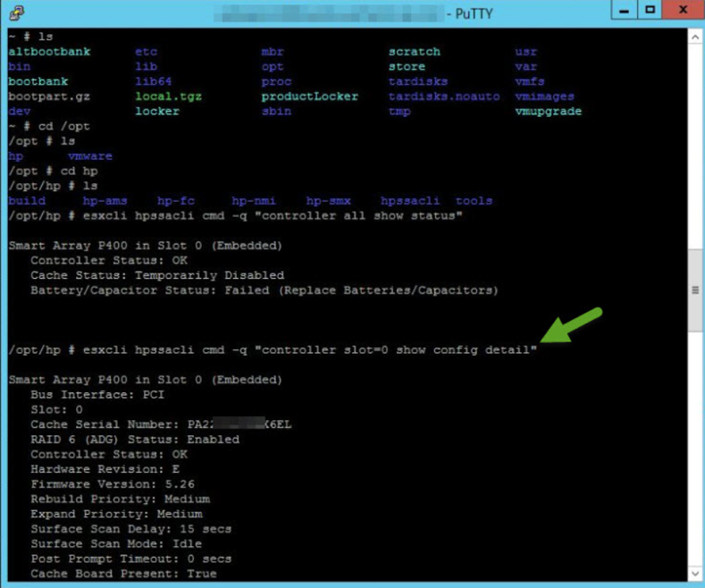
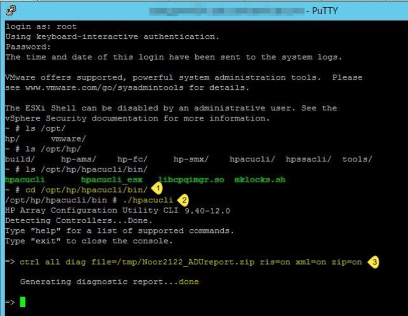

This blog post shows you how to generate an Array Diagnostic Utility (ADU)
report on an Hewlett Packard Enterprise (HPE) server that is running VMware&reg;
ESXi&trade; version 5.x or 6.x. The information in this blog helps you to
determine whether the ADU is installed. If it is not installed, you can use the
steps provided in this blog to install it.

<!--more-->

### Introduction

When you call Hewlett-Packard (HP) support about drive, array controller,
battery, or related hardware failure issues, the first piece of information
that they ask for is the ADU report. HP offers customized installation ISO files
for ESXi version 5.x and 6.0, which include drivers for HP-specific hardware,
their offline bundles for hardware monitoring, and useful tools like `hpssacli`
and `hpacucli` (used for managing Smart Array adapters). If you installed the
HP-provided ESXi image, the HP drivers and other management utilities are
already available. If you didn’t use the HP-provided ESXi image, download
and install the HP ESXi Utilities offline bundle for ESXi version 5.x or 6.x.

### Determine whether hpacucli is installed

The following steps help you to determine whether ``hpacucli`` is installed on your
server:

1.	In the ESXi Shell console, enter ``ls`` and look for the **opt** directory.

2.	If **opt** is present, enter ``cd /opt`` to change to **opt**.

3.	Type the ``ls`` command and look for the **hp** directory.

4.	If you found the **hp** directory, enter `cd hp` to change to the **hp**
   directory.

5.	Enter ``ls`` and look for a file called **hpacucli**.  If you find that file,
   users can generate the ADU Report.

The following image shows the preceding steps:

### Install the hpcucli utility

If `hpcucli` is not already installed on your server, download the `hpcucli`
offline bundle and upload it to **tmp** (or any other directory) by using an ftp
client tool like `winscp`. For example, download `hpacucli-9.40-12.0.vib` from
[https://vibsdepot.hpe.com/hpq/feb2013/esxi-5x-vibs/hpacucli/](https://vibsdepot.hpe.com/hpq/feb2013/esxi-5x-vibs/hpacucli/)
to the **tmp** directory. To install it, run the following command:

    #esxcli software vib install –f –v /tmp/ hpacucli-9.40-12.0.vib

After it is installed, enter the following command to make the file executable:

    /opt/hp/hpacucli/bin # ./hpacucli

### Generate an ADU report

To generate and save an ADU report, use the following steps:

1.	Connect to your host from the console or by using PuTTy over SSH and browse
   to the **/opt/hp** directory.

2.	Run the following command to list the available controllers:

        /opt/hp # esxcli hpssacli cmd –q “controller all show status”

   

<ol start=3>
  <li>Run the following command to generate an array configuration report:</li>
</ol>

        /opt/hp # esxcli hpssacli cmd –q “controller slot=0  show config detail”

<ol start=4>
   <li>Save the report by running the following command:</i>
</ol>
        /opt/hp # esxcli hpssacli cmd –q “controller slot=0  show config detail” >>/tmp/ADUreport.txt

### Conclusion

This blog provides useful information about the ADU utility and how to use it to
generate reports for ESXi.

Use the Feedback tab to make any comments or ask questions.
