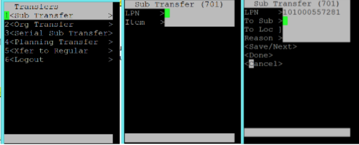
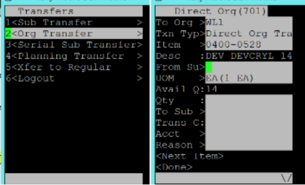

Originally published by Tricore: March 15, 2017

In [Part 1](https://developer.rackspace.com/blog/lpn-overview-part1/) of this
two-part series, we introduced License Plate Numbers (LPNs)
in the Oracle&reg; Warehouse Management System (WMS). In this follow-up post
we describe the various types of inventory transactions that you can
perform with LPNs.

<!--more-->

### Performing inventory transactions with LPNs

You can use mobile devices to perform LPN inventory transactions in WMS. The
system enables you to pack LPNs with any grouping of material into a locator.
You can then enter the LPN to transact the material. The system transacts all
of the contents of the LPN, including the nested contents of a multi-level
LPN. You can associate LPNs with the following inventory transactions:

* Miscellaneous issues

* Subinventory transfers

* Direct inter-organization transfers

#### Perform a miscellaneous issue

You can perform a miscellaneous issue on an LPN that's on hand in the current
organization. To perform a miscellaneous issue for an LPN, use the following
steps:

1. Log in to PuTTy on the mobile device.

2. From the **Miscellaneous Issue** page, select **Responsibility > WHSE Mgmt > Warehousing > Inventory > Issues > Misc Issue**.

   

<ol start=3>
   <li>In the <b>Acct</b> field, enter the adjustment account for the issue and
   the corresponding receipt.</li>

   <li>
In the <b>LPN</b> field, enter the LPN you want to transact.

   
<b>Note</b>: The LPN must be physically located at the current organization.
</li>

   <li>Optionally, in the <b>Reason</b> field, you may enter a reason for the
   issue.</li>

   <li>Select <b>Done</b>.</li>
</ol>

#### Perform a subinventory LPN transfer

To perform a subinventory LPN transfer, use the following steps:

1. Log in to PuTTy on the mobile device.

2. From the **Sub Transfer** page, select **Responsibility > WHSE Mgmt >
   Warehousing > Inventory > Transfers > Sub Transfer**.

   

<ol start=3>
   <li>Enter the <b>LPN</b> you want to transfer from.</li>

   <li>In the <b>To Sub</b> field, enter the subinventory you want
   to transfer the LPN to.</li>

   <li>In the <b>To Loc</b> field, enter the destination locator for the
   LPN.</li>

   <li>Optionally, in the <b>Reason</b> field, you may enter a reason for the
   transfer.</li>

   <li>Select <b>Done</b>.</li>
</ol>

#### Perform a direct inter-organization transfer

You can also transfer LPNs to Oracle Warehouse Management-enabled
organizations. To perform a direct inter-organization LPN transfer, use the following steps:

1. Log in to PuTTy on the mobile device.

2. From the **Sub Transfer** page, select **Responsibility > WHSE Mgmt >
   Warehousing > Inventory > Transfers > Org Transfer**.

   

<ol start=3>
   <li>If necessary, enter the organization to transfer <b>from</b>.</li>

   <li>
      

         Enter the organization to transfer <b>to</b>.
      

      

         <b>Note</b>: You can only transfer LPNs to organizations that use
         Oracle Warehouse Management.
      

   </li>

   <li>Enter the <b>Transaction Type</b>.</li>

   <li>
Optionally, in the <b>LPN</b> field, enter the LPN that you want to
   transfer.

   
<b>Note</b>: If you don't enter an LPN, you must enter the <b>Item</b>,
   <b>Subinventory</b>, and <b>Locator</b> information.
</li>

   <li>In the <b>To Sub</b> field, enter the destination subinventory.</li>

   <li>In the <b>To Loc</b> field, enter the destination locator.</li>

   <li>Select <b>Done</b>.</li>
</ol>

### Mobile PuTTy shortcuts

When using PuTTy on your mobile device, you can save time with the following
shortcuts:

| **Action**&nbsp; &nbsp; &nbsp; &nbsp; | **Shortcut** |
| ------------------------------------- | ------------ |
| Help                                  | F1           |
| Return to menu                        | F2           |
| Back                                  | F3           |
| Forward                               | F4           |
| Clear                                 | Ctrl+K       |
| See values in LOV                     | Ctrl + L     |
| Return to Main Menu                   | Ctrl + N     |
| Expand popup message &nbsp; &nbsp;    | Ctrl + B     |
| Toggle                                | Ctrl + Q     |
| Hot key                               | Esc          |
| Page up                               | Ctrl+D       |
| Page down                             | Ctrl+C       |

### Conclusion

We hope this post helped you gain an understanding of how to work with LPNs in
Oracle WMS by using a mobile interface. It explains various inventory
transactions that you can perform with LPNs. Thanks to LPNs, these
transactions process quickly. LPNs simplify management for organizations
with large warehouses.

Have you used LPNs in Oracle Warehouse management through a mobile
interface? Use the Feedback tab to make any comments or ask questions.
