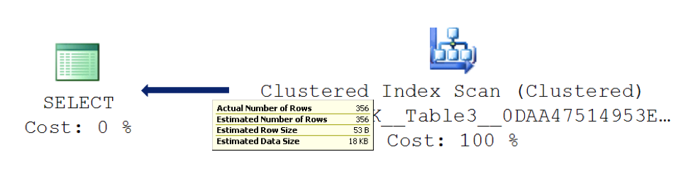
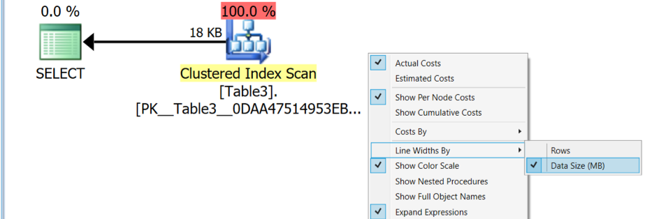
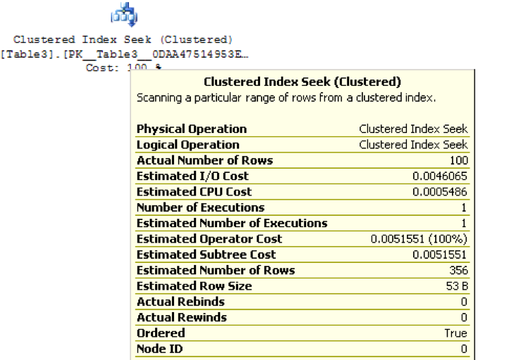
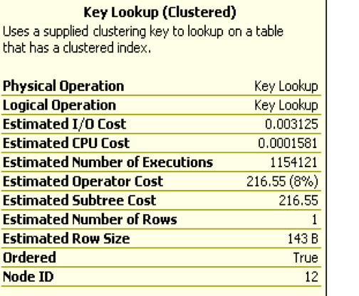
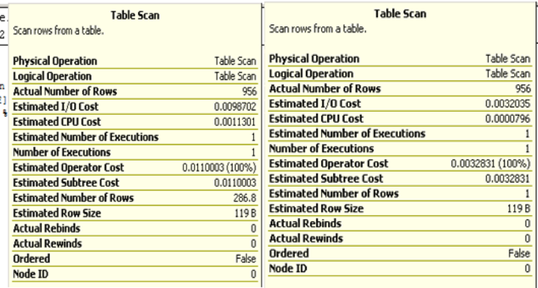
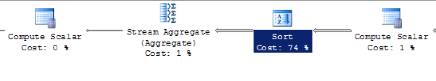
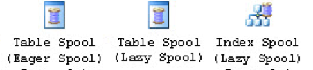
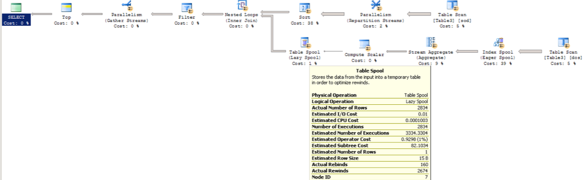

How do you read execution plans? From right to left, left to right, or by
checking out costs? Or what about objects like index scans, table scans, and
lookups? This blog discusses how to read a Microsoft&reg; SQL Server execution
plan.

<!--more-->

### Introduction

Although SQL Server usually generates a good plan, sometimes it's not smart
enough to validate its plans and fix the poor ones.

You can get an estimated execution plan and an actual graphical execution plan
in SQL Server. Generate these plans by using the command **ctrl  M** or **ctrl L**
or by using the icons, which are placed to the right of the execute icon on the
standard tool bar of SQL Server Management Studio (SSMS). SQL Server has other
types of plans, but those plans are not covered in this post.

### Estimated and actual execution plans

There are two types of execution plans:

1. **Estimated execution plan**: Estimated plans provide an estimation of the
work that SQL server is expected to perform to get the data.

2. **Actual execution plan**: Actual execution plans are generated after the
Transact-SQL queries or the batches are executed. Because of this, an actual
execution plan contains runtime information, such as the actual resource usage
metrics and any runtime warnings.

### Data processing

Have you ever noticed the difference between the estimated plan and the actual
plan for the same query? Most of the time it will be the same, but it might be
different because of statistics changes, schema-related changes, or changes in
the data. You should always check the actual execution plan when troubleshooting.

Read the execution plan correctly to identify the actual point. Start by looking
at the data flow rather than cost. Don’t think about the logical or physical
reads. It is important to reduce the number of input/output (I/O) operations.
As a database administrator (DBA), you know that accessing storage is the slowest
of hardware resources, so you should try to minimize that activity. So how do
you explore the statistics, and does execution plan show it? Yes, it does!
Check out the direction lines by hovering the mouse over the right-to-left
indicator. It displays the number of records and the data size. Each line is
thicker or thinner based on the data volume returned by the operation as shown
by the following illustration:

If you have many objects, you need a better way to get an overview of the amount
of data processed by each operation. Download the SentryOne Plan Explorer and
view the plan using this tool for an easy way to get an overview.

After you download and configure SentryOne on your system, open the execution
plan with it. SentryOne has many views and descriptions, which you can use as
you need. To get the data processing view, change the view by selecting the
``Data size in MB`` option as shown in the following image. Your goal is to find
an opportunity to reduce the overall data processing.

If you need to reduce the I/O stress, you might look at the ``SET STATISTICS IO ON``
T-SQL value to get an overall idea of the I/O usage for the query. You should
set this before the query execution in SSMS to see the **result switch to message**
tab in the **result** panel. It should look similar to the following result:

    (356 row(s) affected)

    Table 'Table3'. Scan count 1, logical reads 5, physical reads 0,
    read-ahead reads 0, lob logical reads 0, lob physical reads 0,
    lob read-ahead reads 0.

The **logical reads 5** result shows that SQL Server reads 40 KB (5 * 8 KB) pages
to get the data from memory. When optimizing the query, do not ignore logical
reads because this could be physical as well as logical on live servers. You
never know if the pages to which you are referring are on memory or on disk.
The target should be to reduce the number of cumulative read operations.

### Estimated versus actual plans

After the actual plan is generated, hover your mouse over any of operation or
logical units in the execution plan. Refer to the following image to see the type
of physical operations, like  the **Clustered Index Seek or Scan** results. Look
for the number of executions and the actual and estimated number of rows. Avoid
looking at the cost of individual operations because that is an estimate in
seconds based on old hardware and may not provide accurate details. In the
following image, the **Clustered Index Seek** operator executed one time to get
100 records, and SQL estimates 356 records. The difference could be due to
outdated statistics or query performance.

### Execution iterations

The following image shows the estimated number of executions is 1154121 times
on a cluster index to get one record. That is significant. Even though the
operator cost is lower, and we could have simply ignored it, looking instead at
the other operations with higher costs, this might have proved to be a costly
choice. Such operations have a high impact on query performance despite having
a cluster index.  Row ID (RID) lookups are a similar operation for the heap.

### Temporary database

The difference between the estimated and actual number of records is another
thing that you should be considering. A wrong estimate might result in a query
having limited memory allocated. When that happens, it uses a temporary database
(tempdb) to get things done. The wrong choice of an operator or plan by SQL Server
might result in slow operations and extractions of the queries, as shown in the
following image.  The actual number of records are same, but the estimates are
different. This could be due to outdated or missing statistics. Note that the table
variables have no statistics, so the plan always returns 1 and 1K in new releases
until the option to recompile is used. Thus, table variables are not a good choice
for a large number of records.

### Sort operator

You need to consider the impact of sorting. The sort operator is used mostly for
the following functions:  aggregate, merge join, or order by clause. This might
not have an impact with just a few records, but, with each additional record,
processing slows. Try to avoid sorting or don't use the order by clause. If
sorting is required, use the application grid to do the sort instead of sending
sorted data to an application.

The following image shows the sort cost:

### Spool operator

Another key operator that you need to look at is spool. Spool is a slow
operator because it stores the hidden or temporary objects or work tables in
tempdb. This also slows down with specific operators that cause it to rebind
or rewind. There are many types of spools in SQL Server, such as Eager, Lazy,
Table/Index, and so on. SQL Server uses spool when it is better to refer to a
temp work table rather than going back to the source table for intermediate
result sets. The following image shows an example:

With spool, it is important to notice the number of rebinds and rewinds. Rewind
is costlier than rebind. For example, in the following image, the operator shows
2674 rewinds, which implies that the query is re-executed 2674 times to get the
data. It returns each operator from table spool to table scan to get each record
in rewinds. Rebind means it got the data from spool and didn’t return for the
table scan.

### Hash and nested loop operators

Because they perform well on small record sets, hash and nested loops are the
next operators you should consider. However, for large record sets, or when
there is a large difference between the estimated and actual plans, these
operators can create a huge impact because they might use tempdb instead of
memory. SQL Server posts the following warning in operator details: “operator
used tempdb to spill data during executions”. If this happens, pay attention to
the statistics. With a wrong estimate, the loop falls short on memory allocation
or it keeps iterating. Look at the allocated memory for the execution. To view
memory allocation, open the property box by selecting the start point of the
execution plan (left-to-right). If nothing is abnormal, then query tuning should
be the ideal choice.

### Conclusion

Your first target for optimizing a query should be to reduce overall reads and
writes (that is, I/O on disk). Don’t forget logical reads for reads and writes
in memory. Reducing the I/O solves most of the problem and queries run much
faster.

Next, look at other operations that are expensive due to activity on
tempdb. Remember, tempdb is used for many operations and is always expensive.
Look for rewinds - the number of executions of any operation, spools, sorting,
and loops.

These are expensive when used with tempdb. Don’t forget to review
warnings on each operator because those provide good clues. Even though this
post doesn't discuss the missing index operator, that doesn’t mean you can
ignore it.

Review it, but don’t create the index blindly. Check the other indexes
available on the same columns, and consider the impact on queries running in your
database.

<a class="cta purple" id="cta" href="https://www.rackspace.com/dba-services">Learn more about Databases</a>

Visit [www.rackspace.com](https://www.rackspace.com) and click **Sales Chat**
to get started.

Use the Feedback tab to make any comments or ask questions.
