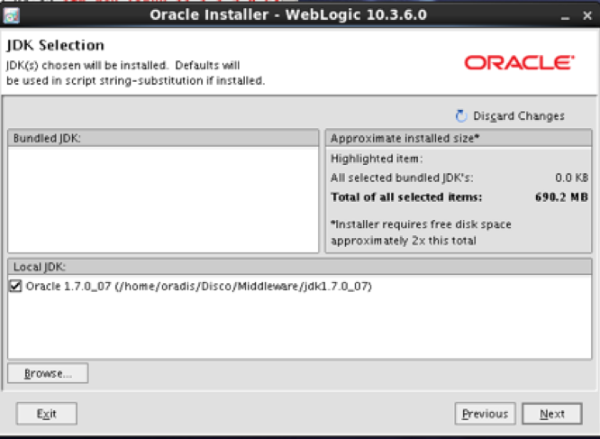
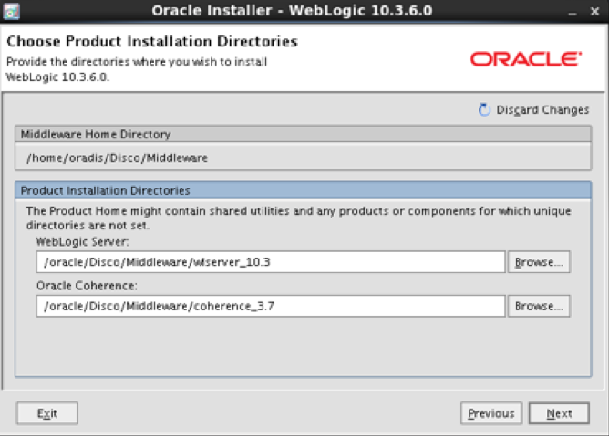
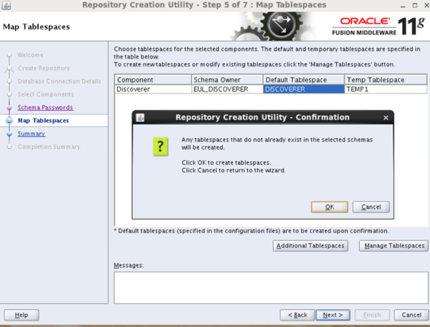
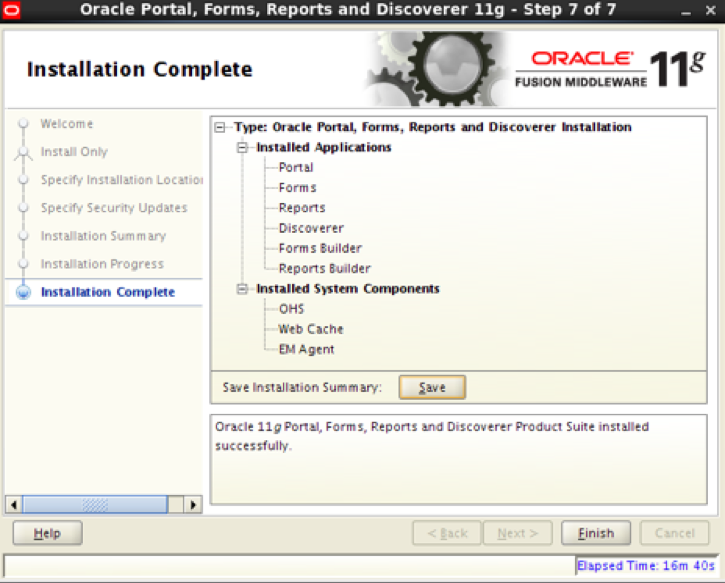
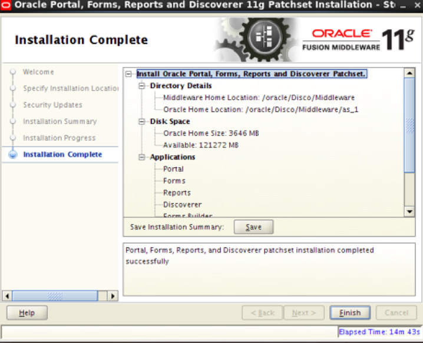
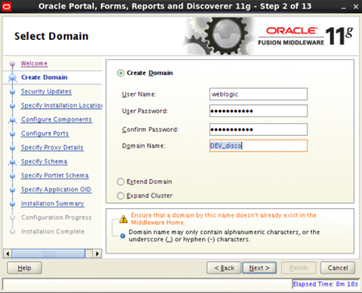
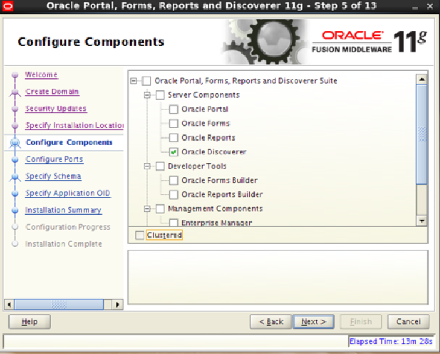
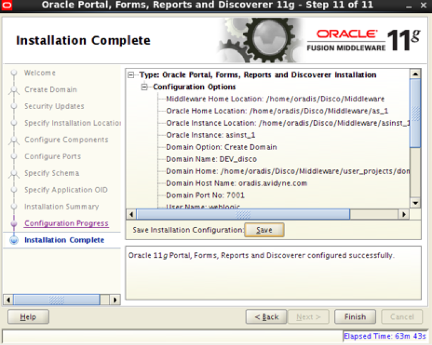

Originally published by Tricore: May 17, 2017

Oracle&reg; Business Intelligence Discoverer is a toolset for ad hoc querying,
reporting, data analysis, and web publishing for the Oracle database environment.

<!--more-->

### Introduction

This two-part blog series covers the steps required to install or upgrade
Discoverer within an existing E-Business Suite (EBS) R12 instance. Part 1
discusses the installation of the software required for the Discoverer 11.1.1.7
upgrade.

**Note**: Discoverer 11g (11.1.1.7) is now certified with the Oracle EBS Release.
Discoverer 11.1.1.7 (terminal discoverer version) is part of Oracle Fusion
Middleware 11g Release 1 Version 11.1.1.7.0, also known as FMW 11gR1 Patchset 6.

Certified E-Business Suite releases are:

-	EBS Release 11i 11.5.10.2 + ATG RUP 7 and higher

-	EBS Release 12.0.6 and higher

-	EBS Release 12.1.1 and higher

For more information about certification, see the following links:

-  https://www.oracle.com/technetwork/middleware/ias/downloads/fusion-certification-100350.html

-  https://www.oracle.com/technetwork/middleware/downloads/fmw-11gr1certmatrix.xls

**Note**: If you are using Red Hat&reg; Linux (RHEL), you must be on version 6 or
lower before you can install Discoverer 11.1.1.7.

### Installation of required software

Before installing or upgrading to Discoverer 11.1.1.7, download the following
software:

-	Oracle WebLogic 10.3.5 or 10.3.6 (Oracle Fusion Middleware 11.1.1.7.0 is
   certified with WebLogic Server versions 10.3.5 and 10.3.6)

-	Oracle Portal, Forms, Reports and Discoverer 11g 11.1.1.2

-	Oracle Portal, Forms, Reports and Discoverer 11g Patch Set 6 (11.1.1.7.0)
   (patch ID 16471668)

-	Repository Creation Utility (RCU) for creating the database schemas

#### Oracle WebLogic installation

Before proceeding, ensure that you are not using the default JDK (for 64bit OS).
Instead, use JDK 1.7.0_07 or a similar version.

Use the following steps for the Oracle WebLogic Server 11gR1 (10.3.6) installation.

1. Run the following command to start the installation:

    `<JDK_PATH>/bin/java -d64 -jar -Djava.io.tmpdir=<temp_dir_loc> ./wls1036_generic.jar -log=<loc/filename>`

2. Click **Next** on the **Welcome** screen.

3. Create the new Middleware home by specifying the location.

4. Provide Oracle support credentials (if required).

5. Choose the install type, either typical (recommended) or custom.

6. Select local JDK installed, as shown in the following image.

   

<ol start=7>
    <li>Choose the product installation directories. Specify the WebLogic server
   location and the  Oracle Coherence location, as shown in the following image.</li>
</ol>

   

<ol start=8>
    <li>Review the installation summary and size.</li>
</ol>

<ol start=9>
    <li>Review the installation log to check progress and verify completion.</li>
</ol>

<ol start=10>
    <li>Click <b>Done</b> after installation completed.</li>
</ol>

#### RCU installation

The RCU download package should be about 350 MB. This utility creates two
new users and three new tablespaces, which are used to store metadata for
Middleware and Discoverer.

Use the following steps for the installation process:

1. Click **Next** on the **Welcome** screen.

2. Choose **Create** to create the repository.

3. Provide the database connection details.

4. Select **Create new prefix**. Provide the prefix name and select the component,
   such as **Discoverer**, under the Portal & BI label.

5. Enter the schema password.

6. Ensure that the correct default and temporary (temp) tablespaces are showing.
   If the tablespaces are incorrect, modify them.  The following image shows
   this step:

   

<ol start=7>
    <li>Review the summary and click <b>Create</b>.</li>
</ol>

#### Discoverer installation 11.1.1.2

Use the following steps for the Discoverer installation:

1. Start the run installer. You can optionally use the ``-ignoreSysPreReqs``
   parameter.

2. Click **Next** on the **Welcome** screen.

3. Select the **Install Software** install type. Do not modify the configuration
   settings.

4. Specify the location for the Oracle Middleware home directory and the Oracle
   home directory.

5. Provide Oracle support details under **Security Updates**.

6. Review the installation summary and click on **Install**.

7. Review the logs to check on installation progress. When prompted, run ``root.sh``.

8. When installation is complete, review the details and click **Finish**, as
   shown in the following image:

   

####  Upgrade Discoverer 11.1.1.2 installation to 11.1.1.7

Use the following steps to upgrade Discoverer from version 11.1.1.2 to
11.1.1.7:

1. Start the run installer.

2. Click **Next** on the **Welcome** screen.

3. Provide details of Middleware home directory and the current Discoverer
   directory, where we installed 11.1.1.2 in the preceding section.

4. Provide the Oracle support details in **Security Updates**.

5. Review the summary and click **Install**.

6. Review the logs to check installation progress. When prompted, run ``root.sh``.

7. When installation is complete, review the details and click **Finish**, as
   shown in the following image:

   

#### Configure the Discoverer instance

Use the following steps to configure the Discoverer instance:

1. Run ``config.sh``.

2. Click **Next** on the **Welcome** screen.

3. Choose **Create domain** and provide the username (``weblogic``), password, and
   domain name, as shown in the following image:

   

<ol start=4>
    <li>Provide the Oracle support details in <b>Security Updates</b>.</li>
</ol>

<ol start=5>
    <li>Provide the WebLogic server location, the Oracle instance location, and the
   Oracle instance name.</li>
</ol>

<ol start=6>
    <li>Select the <b>Oracle Discoverer</b> component to configure, as shown in the
   following image:</li>
</ol>

   

<ol start=7>
    <li>Select <b>Auto port config</b> to configure ports.</li>
</ol>

<ol start=8>
    <li>Provide the connection string and schema details, which were created by using
   RCU, to specify the schema.</li>
</ol>

<ol start=9>
    <li>If you are using Application Object Identifier (OID), provide the hostname,
   port, username, and password to specify the OID. If you are not using OID,
        deselect the <b>Use Application level identity store</b> option.</li>
</ol>

<ol start=10>
    <li>Review the summary and click <b>Configure</b>.</li>
</ol>

<ol start=11>
    <li>Review the logs and <b>Status</b> tab on the <b>Installer</b> screen to check
        installation progress. Click <b>Next</b> when it finishes.</li>
</ol>

<ol start=12>
    <li>Review the installation details and click <b>Finish</b>, as shown in the
    following image:</li>
</ol>

    

### Conclusion

Using the preceding information, you can install Discoverer 11.1.1.7 and the
various required components on RHEL 6. Part 2 of this blog series has more
information on how to configure the Discoverer instance for Oracle R12 instances.

See [Part 2](https://developer.rackspace.com/blog/upgrading-oracle-business-intelligence-discoverer-part-2/) for the rest of this series.

Use the Feedback tab to make any comments or ask questions.
