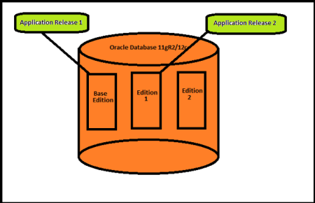

Originally published by Tricore: May 5, 2017

This blog covers some basic concepts of Edition Based Redefinition (EBR) and how to use it to support an applications upgrade, which can reduce downtime.

<!--more-->

### Introduction

In the earlier releases, it was not possible to upgrade database objects while these were being actively accessed by
applications. With the EDR featured in Oracle Database 11g Release 2, this became possible without any downtime or with downtime reduced to only the application services bounce.

#### Edition overview

An *edition* is a private environment in which you create the new versions of database objects or redefine objects without actually changing the current definition of objects being used by application users.

Application users can continue to use the old versions of objects while the new versions are being added. After the new or
child editions are added, you can make the new edition the default so that all users can use it. Starting in 11gR2, every database has a default edition named **ora$base** and multiple editions can exist in a database simultaneously.

### Editionable and non-editionable objects

The object types that can be versioned or redefined by using EBR are called *editionable* objects. All other object types are *non-editionable*.

Editionable objects include the following object types:

  - SYNONYM
  - VIEW
  - FUNCTION
  - LIBRARY
  - PROCEDURE
  - PACKAGE and PACKAGE BODY
  - TRIGGER
  - TYPE and TYPE BODY

Non-editionable objects include the following object types:

  - TABLES
  - MVIEWS
  - PUBIC SYNONYMS

Based on these types, there are some limitations for EBR object types, such as:

 - A non-editioned object cannot depend on an editioned object.
 - A public synonym cannot refer to an editioned object.
 - A materialized view cannot depend on an editioned view.
 - A function-based index cannot depend on an editioned function.

### Editioning views

The TABLE is a non-editionable data type, however in a real upgrade scenario, you might need to modify the table structure. This is where *editioning views* comes into the picture. Editioning views allow you to treat the base table as if it is editioned, which means that you can create an editioned view that is similar to a base table with a modified definition. However, you can't add indexes and constraints to an editioned view. You can add indexes and constraints only to a base table. Editioning views can be read-only or read-write.

### Cross-editioned triggers

As the name suggests, *cross-editioned triggers* are used when you need to maintain data consistency between two different editions. For example, if users are using an application object in a current or online edition and the object is being modified or redefined by patching in another child edition, then cross-editioned triggers are used to maintain data consistency between the two editions.

There are two types of cross-editioned triggers: forward and reverse. Forward cross-editioned triggers move data from columns used by the old edition to columns used by the new edition, whereas reverse cross-editioned triggers do the opposite. Cross-editioned triggers are temporary and should be removed after the restructured tables are available to all users.

### Use EBR to upgrade an application

An application must meet these minimum requirements before it can use the EBR feature:

  - The schema or database user should be editions-enabled;
  - The application is prepared to use editioning views.

#### Edition-enable a schema or database user

You can edition-enable a user when you create it, or by using `ALTER USER` after the user is created. The EDITIONS&#95;ENABLED column of the static data dictionary view for DBA_&#95;USERS or USER&#95;USERS shows which users have editions enabled.

    ALTER USER user_name ENABLE EDITIONS;

#### Prepare the application to use editioning views

An application that uses one or more tables must cover each table with an editioning view. An editioning view covers a table so that it points to the base table. Use the following steps to prepare an application for EBR.

**Note**: These are first time tasks that might take some time to prepare the application to use editioning views but will later minimize downtime once the application is ready for EBR.

1. Rename the table so you can assign its current name to its editioning view. You can also rename the columns, but this is optional.
2. Create the editioning view with the same name of the original table.
3. If triggers were used on the original tables, remove them and then recreate them on the editioning view.
4. Revoke the privileges from all users on the original table and then grant the same privilege for the editioning view.
5. Ensure that editions are enabled for the users who use any private synonyms to the original table, and that the private synonyms are recreated for the editioning view.

#### Upgrade the application by using EBR

After the application is prepared to use editioning views, use the following steps to upgrade the application by using EBR:

1. Create a new or child edition.
2. Make the new edition the session default edition.
3. Make the necessary changes to the objects of the application.
4. Ensure that all objects are valid and that changes are working as expected.
5. Make the upgraded application available to all users.
6. Retire the old edition.

### DBA tasks for EBR

Although application developers are the primary owners for upgrading an application by using EBR, some edition-related tasks that require DBA privileges might require some help, including the following tasks:

  - Grant or revoke privileges to create, alter, and drop editions. For example, `CREATE EDITION` and `DROP EDITION`.
  - Enable editions for a schema or user. For example, `ALTER USER user_name ENABLE EDITIONS;`
  - Set the database default edition. For example, `ALTER DATABASE DEFAULT EDITION = edition_name;`
  - Set the edition attribute of a database service. This can be done by using the `dbms_service` package or by using `srvctl` in the case of RAC.

### View information about editions

There are multiple ways to view information about editions from dictionary tables. The following views show information about editions directly:

  - DBA&#95;EDITIONS
  - DBA&#95;EDITION&#95;COMMENTS
  - DBA&#95;EDITIONING&#95;VIEWS
  - DBA&#95;EDITIONING&#95;VIEWS&#95;AE

The following views have a column which shows information about editions for those views:

  - DBA&#95;OBJECTS
  - DBA&#95;OBJECTS&#95;AE
  - DBA&#95;ERRORS
  - DBA&#95;ERRORS&#95;AE
  - DBA&#95;USERS
  - DBA&#95;SERVICES

### Conclusion

Using EBR can greatly reduce application downtime if implemented properly. Oracle E-Business Suite 12.2 is a good example of an application that uses EBR to reduce patching and upgrade downtime. EBR is not limited to Oracle Standard products and can be implemented on custom or legacy applications with proper planning.

Use the Feedback tab to make any comments or ask questions.