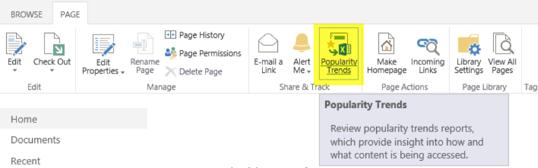
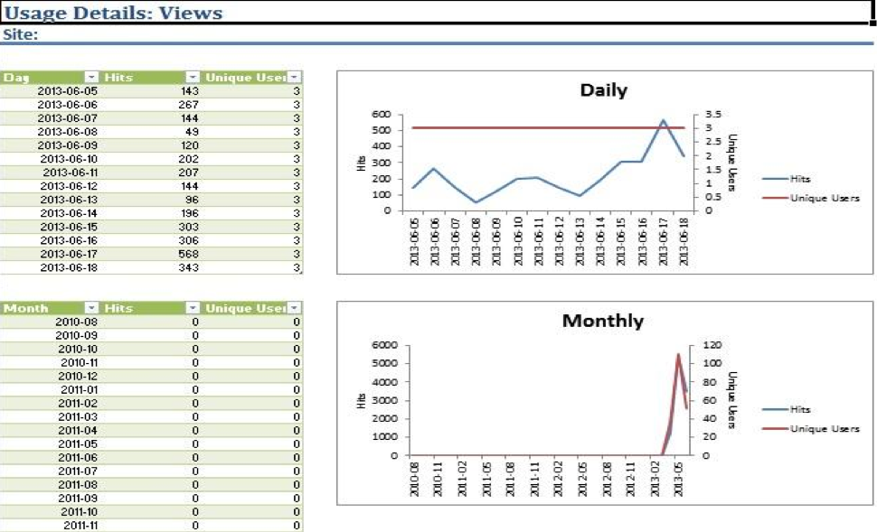
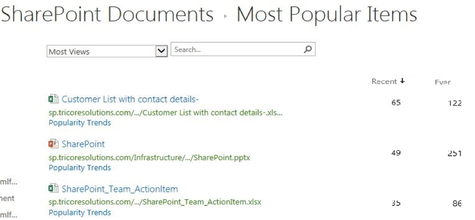

Popularity Trends is a feature in SharePoint Server 2013 that enhances
search and web analytics services by offering a ready-to-use solution.

<!--more-->

### Introduction

When you click **Popularity Trends** on the SharePoint site ribbon, an analytics
usage report is generated in Excel&reg; format. This report, which is available
in both table and chart formats, shows the number of hits and unique users in a
month.

### Usage reports

Usage reports are available in the following two types:

  - Popularity Trends
  - Most popular items

#### Popularity Trends usage reports

This Excel report provides weekly, monthly, and daily usage statistics for
users and hits.

You can pull reports from every level in a site. The available levels are site
collection, site, library, and list items.

To generate a report, choose a file and click on **Popularity Trends** as shown
in the following image:

The Popularity Trends feature helps you to understand item usage and to identify
which file, page, or item to which a user has access. Based on these reports,
you can initiate a cleaning process and remove unwanted, older content from a
SharePoint site.

The following example shows a usage report generated by this feature:

#### Most popular items usage reports

This feature enhances search results and shows the most popular items at
the top of the search results list, especially when you have multiple files or
items with the same names, as shown in the following image:

The two default columns for search results are **Recent** and **Ever**.

The **Recent** tab shows the access hit count for the last 14 days, and
the **Ever** tab shows the total number of historical access hits. You can
sort either of the columns to understand the usage of files and items.

### Limitations of Popularity Trends

Although it is a very useful feature of SharePoint Server, Popularity Trends
has the following limitations:

  - You need Microsoft&reg; Excel to generate this usage report. If you do not
    have Excel installed on your machine, you must save the report and then copy
    it to another device on which Excel is installed.
  - Two usage reports cannot be opened at the same time because the default
    report name is *Usage.xlsx*. If you try to open a second file, you will get
    the error message, "Sorry, Excel cannot open two workbooks with the same
    name at the same time".
  - The feature gives you an option to choose multiple files for your report,
    but it fetches data from only one file.
  - The feature gives you an option to select a folder, but it doesn’t fetch
    any data for the folder or its contents. The folder’s report shows zero hits
    and zero unique users.

### Conclusion

Despite these flaws, Popularity Trends is a very useful feature that provides
meaningful search results and usage reports for most accessed content. However,
if you want to monitor in real-time, these reports cannot compete with the work
done by the third party analytic tools.  Still, the feature makes our search
results smarter than before.

It would be great if, instead of just focusing on making the search functionality
smarter, this feature could be enhanced to help SharePoint users work smarter by
monitoring real-time usage and by enabling sorting and data drill-down
functionality based on different parameters. In the future, we expect enhanced
versions to include services like these.

Use the Feedback tab to make any comments or ask questions.

