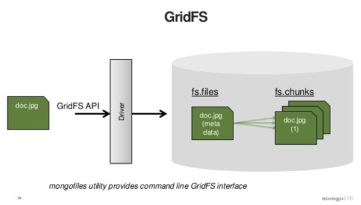
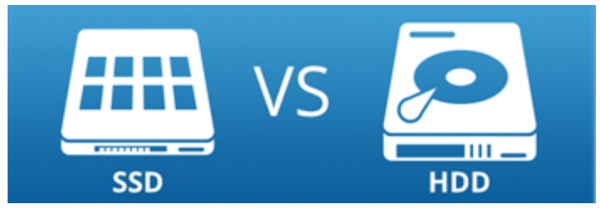

Originally published by Tricore: Aug 2, 2017

While it's easy to get started with MongoDB, more complex issues emerge
when you're building applications. You may find yourself wondering things
like:

- How do I re-sync a replica member in replica set?
- How can I recover MongoDB after a crash?
- When should I use MongoDB's GridFS specification to store and retrieve files?
- How do I fix corrupted data?

This blog post shares a few tips for handling these situations when
you're using MongoDB.

<!--more-->

### Tip 1: Don't depend on the repair command to recover your data

If your database crashes and you're not running with the ``–journal`` flag,
don't use that server’s data.

MongoDB's ``repair`` command goes through every document it can find and makes
a clean copy of it. However, keep in mind that this process is time-consuming,
uses a lot of disk space (the same amount of space that's currently being
used), and skips any corrupted records. Because MongoDB’s replication process
can't fix corrupted data, you'll need to be sure to wipe the possibly-corrupt
data before re-syncing.

### Tip 2: Resync a member of a replica set

To resync a member of a replica set, ensure that at least one secondary
member and one primary member are up and running. Then, ensure that you're
logged in as the user named Oracle and stop the MongoDB service.

Log in as the user named MongoDB and move all of the data files in the backup
folder so that you can restore them if you run into a problem. If the old
files are present in the backup folder, you can remove them. If you're not
sure where to find the data files, take a look in ``/etc/mongod.conf``.
As the user named Oracle, start the MongoDB service.

Log in to the database to validate. You don't need to authenticate in order to
access the database until the member is synced in the replica set.

After the replication process is complete, the status will change from
``STARTUP2`` to ``SECONDARY``.

### Tip 3: Don’t use GridFS for small, binary data

MongoDB uses the GridFS specification to store and retrieve large files. In
essence, GridFS breaks up large binary objects before storing them in a
database. GridFS requires two queries: one to fetch a file’s metadata and one
to fetch its contents. Therefore, if you use GridFS to store small files,
you're doubling the number of queries that your application has to perform.

**Source: https://www.slideshare.net**

GridFS is designed to store big data, meaning data that's too large to fit
inside a single document. As a rule of thumb, anything that's too big to load
in a client probably isn't something that you want to load all at once onto a
server. The alternative is streaming. Anything you plan to stream to a
client is a good candidate for GridFS.

### Tip 4: Minimize disk access

Developers know that accessing data from RAM is fast and accessing data
from a disk is slow.

While you might be aware that minimizing the number of disk accesses is a great
optimization technique, you might not know how to accomplish this task.

One way is to use a solid-state drive (SSD). SSDs perform many tasks much
faster than traditional hard disk drives (HDDs) do. They also work very well
with MongoDB. On the other hand, they're often smaller and more expensive.

The following image compares SSDs and HDDs.

**Source: https://www.serverintellect.com**

The other way to reduce the number of disk accesses is to add more RAM.
However, this approach will only take you so far, because eventually your RAM
won't be able to accommodate the size of your data.

The question is, how do we store terabytes or petabytes of data on disk,
program an application that will mostly access frequently-requested data in
memory, and move data from disk to memory as infrequently as possible?

If you access all of your data randomly in real time, the answer is that
you'll need a lot of RAM. However, most applications don’t work this way.
Recent data is accessed more often than older data, certain users are more
active than others, and certain regions have more customers than others.
Applications that fit this description can be designed to keep certain
documents in memory and access disk very infrequently.

### Tip 5: Start up MongoDB normally after a database crash

If you run journaling and your system crashes in a recoverable way,
you can restart the database normally. Ensure that you’re using all of your
normal options, especially ``-- dbpath`` (so it can find the journal files) and
``--journal``.

MongoDB will fix your data automatically before it begins to accept
connections. This process can take a few minutes for large data sets, but much
less time than it typically takes to run repairs on large data sets.

Journal files are stored in the ``journal`` directory. Do not delete these
files.

### Tip 6: Compact the database by using the repair command

The repair command essentially performs a ``mongodump`` and then a
``mongorestore``, making a clean copy of your data. In the process, it also
removes any empty “holes” in your data files.

The repair command blocks operation and requires twice the disk space that
your database is current running. However, if you have another machine, you
can perform the same process manually by using ``mongodump`` and
``mongorestore``.

To complete the process manually, use the following steps:

1. Step down the Hyd1 machine and ``fsync`` and ``lock``:

         rs.stepDown()
         db.runCommand({fsync : 1, lock : 1})

2. Dump the file to Hyd2:

         Hyd2$ mongodump --host Hyd1

3. Make a copy of the data file in Hyd1, so that you still have it as a
   backup. Then, delete the original data file and restart Hyd1 with empty
   data.

4. Restore it from Hyd2. To restore the data file, enter the following
   command:

         Hyd2$ mongorestore --host Hyd1 --port 10000 # specify port if it's not 27017

### Conclusion

These changes have boosted our MongoDB performance significantly. If you're
planning to use MongoDB, you might want to bookmark this article, then come
back to it and check off each tip the next time you start a new project.

In [Part 2](https://developer.rackspace.com/blog/mongodb2/) of this
two-part series, we'll share some tips that help large enterprises properly
design, optimize, and implement useful MongoDB features.

Use the Feedback tab to make any comments or ask questions.
